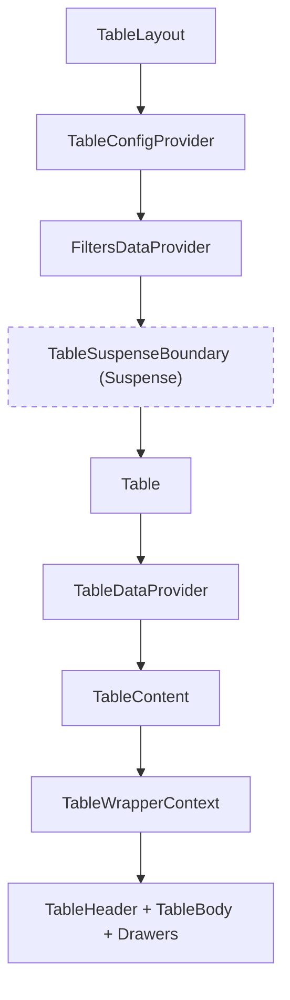
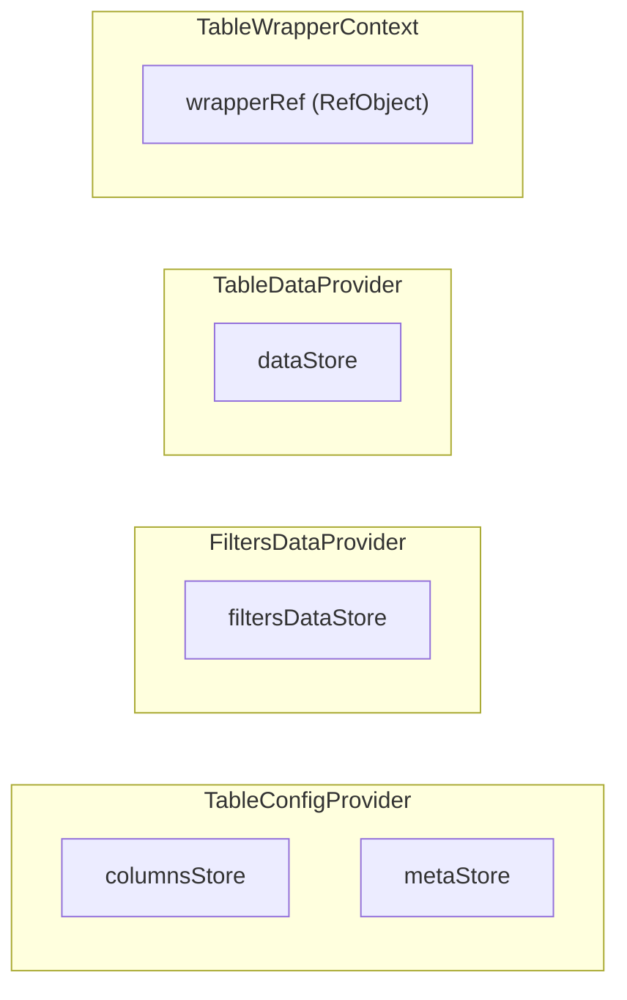
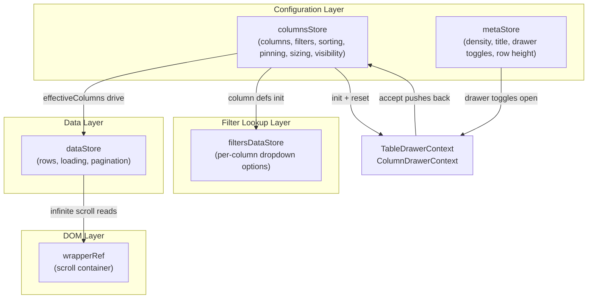

# Table Contexts Architecture

Four context providers that together manage all table state. Each context
owns one or more external stores (except TableWrapper which holds a ref).

## File Structure

```
contexts/
├── index.ts                    → Barrel: FiltersDataProvider, TableConfigProvider, TableDataProvider
│
├── FiltersData/                → Filter lookup data per column (survives Suspense)
│   ├── FiltersDataContext.*     → Context, Provider, Types
│   └── filters/                → 1 store, 2 actions, 1 selector, 1 util
│
├── TableConfig/                → Column settings + UI meta (dual-store)
│   ├── TableConfigContext.*     → Context, Provider, Types
│   ├── columns/                → 1 store, 10 actions, 12 selectors
│   ├── meta/                   → 1 store, 3 actions, 11 selectors
│   └── utils/                  → getInitialColumnsState, getInitialMetaState
│
├── TableData/                  → Row data + loading + pagination
│   ├── TableDataContext.*       → Context, Provider, Types
│   ├── data/                   → 1 store, 1 action, 4 selectors
│   └── utils/                  → getInitialDataState
│
└── TableWrapper/               → Ref-based context for wrapper DOM access
    ├── TableWrapperContext.*    → Context, Types
    └── useTableWrapperRef      → Hook to consume the ref
```

## Provider Nesting



**Why this order matters:**

- **TableConfigProvider** is outermost — column definitions and meta config
  are stable across data fetches
- **FiltersDataProvider** sits above Suspense — filter dropdown options survive
  when the Suspense key changes during sort/filter navigations
- **TableDataProvider** sits inside Suspense — row data is re-created on
  each navigation via the resolved promise
- **TableWrapperContext** is innermost — needs the rendered wrapper `<div>` ref

## Store Overview



## Context → Store Summary

| Context        | Store(s)                     | State Pattern                            | Hook Count               |
| -------------- | ---------------------------- | ---------------------------------------- | ------------------------ |
| `TableConfig`  | `columnsStore` + `metaStore` | Dual `TStore` + `useSyncExternalStore`   | 10 + 12 col, 3 + 11 meta |
| `FiltersData`  | `filtersDataStore`           | Single `TStore` + `useSyncExternalStore` | 2 actions, 1 selector    |
| `TableData`    | `dataStore`                  | Single `TStore` + `useSyncExternalStore` | 1 action, 4 selectors    |
| `TableWrapper` | — (ref only)                 | `RefObject<HTMLDivElement>`              | 1 hook                   |

## Cross-Context Data Flow



## Detailed Architecture

| Context      | Details                                         |
| ------------ | ----------------------------------------------- |
| FiltersData  | [ARCHITECTURE.md](FiltersData/ARCHITECTURE.md)  |
| TableConfig  | [ARCHITECTURE.md](TableConfig/ARCHITECTURE.md)  |
| TableData    | [ARCHITECTURE.md](TableData/ARCHITECTURE.md)    |
| TableWrapper | [ARCHITECTURE.md](TableWrapper/ARCHITECTURE.md) |
