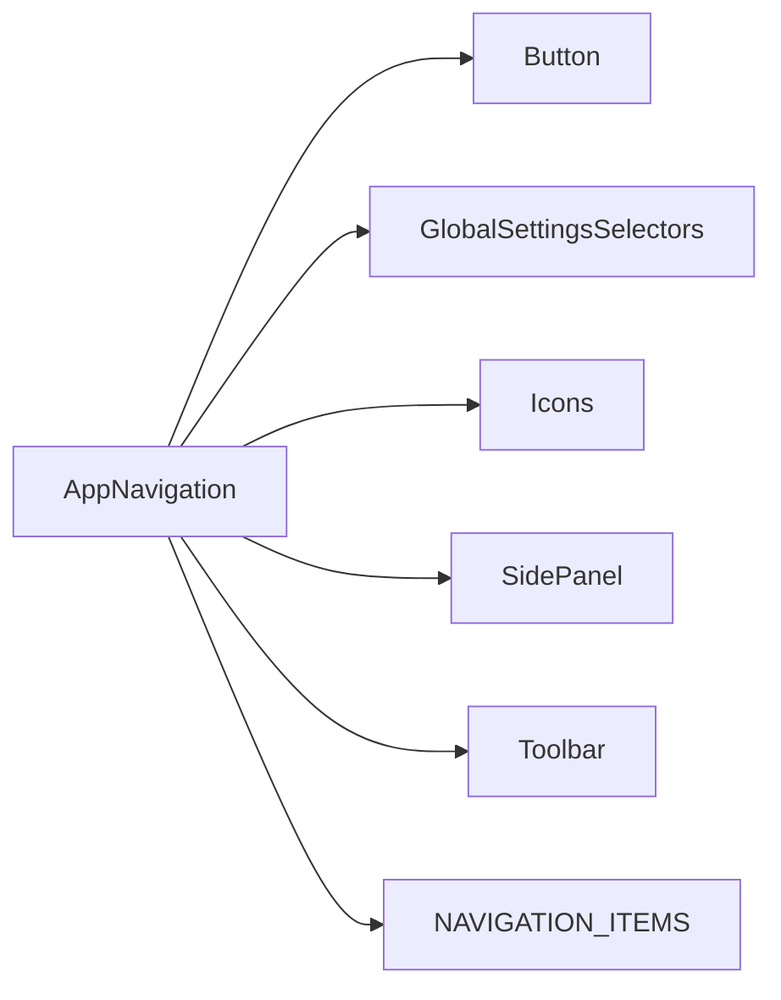
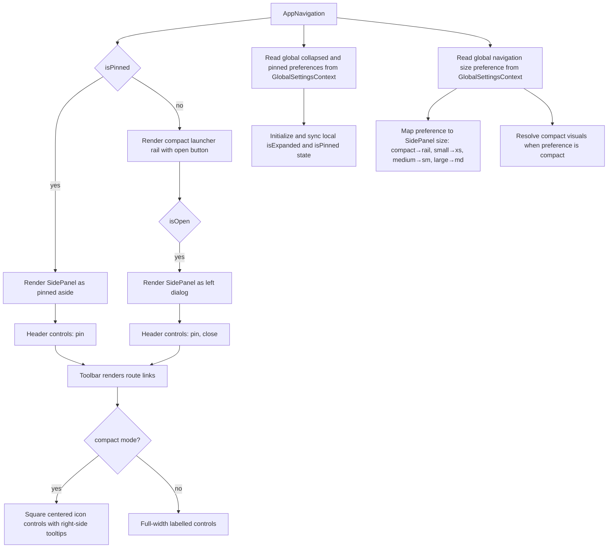

# AppNavigation Architecture

Application-owned sidebar navigation shell. It composes existing design-system
components rather than introducing a second navigation primitive.

## File Structure

```
AppNavigation/
├── index.ts                         → Barrel export
├── AppNavigation.component.tsx      → Sidebar state and render composition
├── AppNavigation.constants.tsx      → Single editable route item registry
├── AppNavigation.stylex.ts          → Layout-only StyleX styles
├── AppNavigation.types.ts           → Props and local variant types
└── ARCHITECTURE.md                  → This document
```

## Dependencies



## Render Flow



## Props

| Prop              | Type      | Default | Description                           |
| ----------------- | --------- | ------- | ------------------------------------- |
| `defaultIsPinned` | `boolean` | `true`  | Initial pinned/unpinned sidebar state |

## Route Items

Add, remove, or reorder sidebar links in `AppNavigation.constants.tsx`. The
constant is typed as `readonly ToolbarItemConfig[]`, so every item is rendered
through the existing `Toolbar` and `NavLink` contracts.

## Compact Mode

Compact mode is controlled by the global navigation size preference. When set to
`compact`, `AppNavigation` uses `SidePanel` rail width, passes `isCompact` to
`Toolbar`, and renders icon-only controls with tooltips.

## Initial Pin and Expansion State

`AppNavigation` derives initial and hydrated runtime state from global
navigation preferences:

- `collapsed: 'collapsed'` starts the panel collapsed (`isExpanded = false`).
- `pinned: 'unpinned'` starts the panel as unpinned (`isPinned = false`).
- Missing values fall back to defaults (`expanded`, and `defaultIsPinned`).

The component also synchronizes `isExpanded` and `isPinned` when global
preferences change (for example, after accepting changes in Settings).
