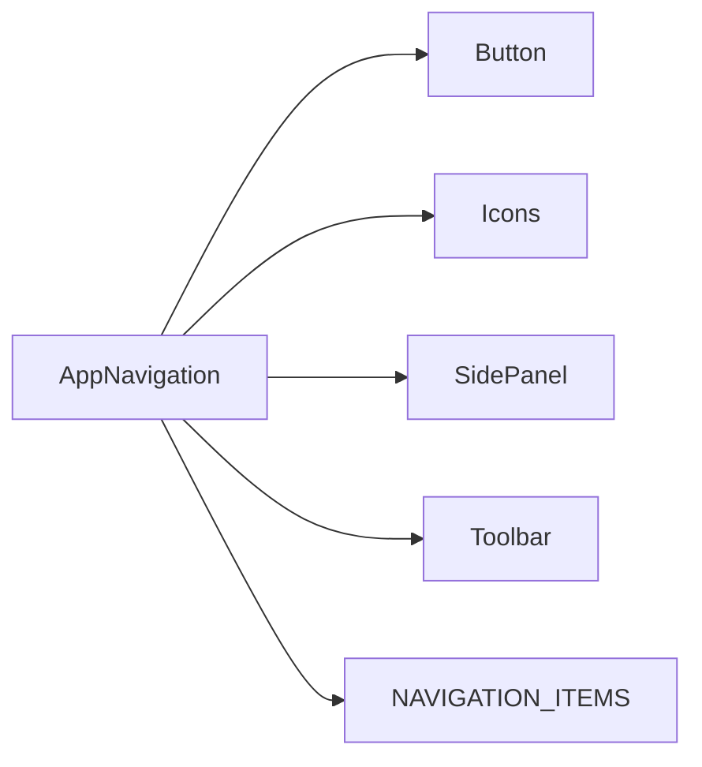
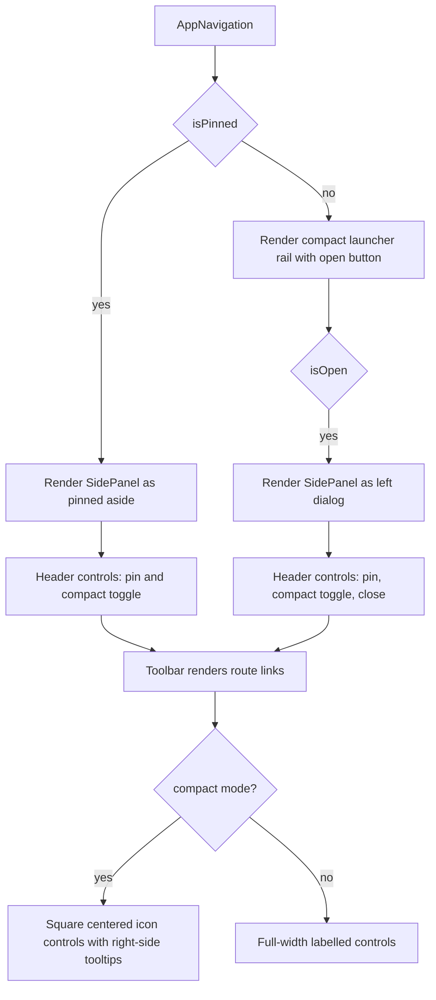

# AppNavigation Architecture

Application-owned sidebar navigation shell. It composes existing design-system
components rather than introducing a second navigation primitive.

## File Structure

```
AppNavigation/
├── index.ts                         → Barrel export
├── AppNavigation.component.tsx      → Sidebar state and render composition
├── AppNavigation.constants.tsx      → Single editable route item registry
├── AppNavigation.stylex.ts          → Layout-only StyleX styles
├── AppNavigation.types.ts           → Props and local variant types
└── ARCHITECTURE.md                  → This document
```

## Dependencies



## Render Flow



## Props

| Prop              | Type      | Default | Description                                     |
| ----------------- | --------- | ------- | ----------------------------------------------- |
| `defaultIsPinned` | `boolean` | `true`  | Initial pinned/unpinned sidebar state           |
| `defaultMode`     | `Mode`    | `full`  | Initial width mode: full labels or compact rail |

## Route Items

Add, remove, or reorder sidebar links in `AppNavigation.constants.tsx`. The
constant is typed as `readonly ToolbarItemConfig[]`, so every item is rendered
through the existing `Toolbar` and `NavLink` contracts.

## Compact Mode

Compact mode uses `SidePanel`'s `rail` size and passes `isCompact` to
`Toolbar`. The launcher button, header controls, route links, and theme toggle
all use the same 2.5rem square control width and expose their labels through
tooltips.
