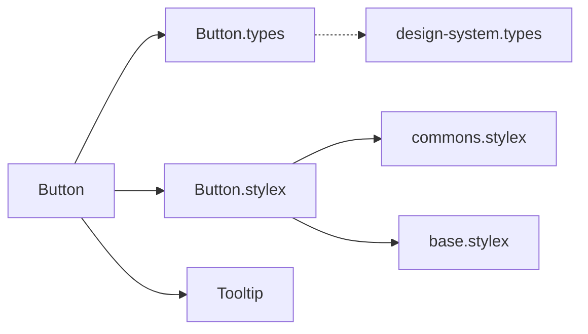
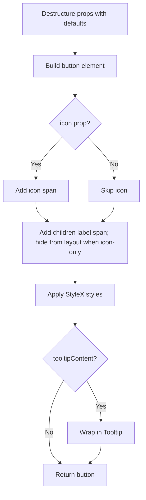
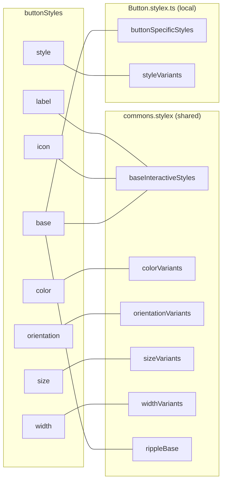

# Button Component Architecture

## File Structure

```
Button/
├── index.ts                 → Barrel export: { Button }
├── Button.component.tsx     → Component logic & render
├── Button.types.ts          → ButtonProps (extends native <button>)
└── Button.stylex.ts         → Style composition from shared design tokens
```

## Dependencies



## Render Flow



## Props

`ButtonProps` extends `ComponentPropsWithoutRef<'button'>` plus:

| Prop               | Type                             | Default      |
| ------------------ | -------------------------------- | ------------ |
| `color`            | `DesignSystemColor`              | `'primary'`  |
| `customStylex`     | `StyleXStyles`                   | —            |
| `icon`             | `ReactNode`                      | —            |
| `isBusy`           | `boolean`                        | `false`      |
| `isIconOnly`       | `boolean`                        | `false`      |
| `isDisabled`       | `boolean`                        | `false`      |
| `orientation`      | `DesignSystemOrientation`        | `'vertical'` |
| `size`             | `DesignSystemSize`               | `'md'`       |
| `tooltipContent`   | `ReactNode`                      | —            |
| `tooltipPlacement` | `top \| bottom \| left \| right` | `'top'`      |
| `variant`          | `DesignSystemStyle`              | `'solid'`    |
| `width`            | `DesignSystemWidth`              | `'full'`     |

### Design System Enums

| Type                      | Values                                                                                    |
| ------------------------- | ----------------------------------------------------------------------------------------- |
| `DesignSystemColor`       | `primary`, `secondary`, `success`, `warning`, `error`, `ghost`, `outline`, `danger-ghost` |
| `DesignSystemSize`        | `mini`, `sm`, `md`, `lg`, `embedded`                                                      |
| `DesignSystemStyle`       | `solid`, `flat`, `elevated`                                                               |
| `DesignSystemOrientation` | `horizontal`, `vertical`                                                                  |
| `DesignSystemWidth`       | `auto`, `full`                                                                            |

## Style Composition

`buttonStyles` in `Button.stylex.ts` is a composed object. Most styles come from shared
design tokens in `commons.stylex`; only button-specific overrides are defined locally.



**Local-only styles** (`buttonSpecificStyles`):

- `cursor: pointer` (default) / `not-allowed` (disabled)
- `iconOnly`: removes the gap and centers icon content
- `labelHidden`: removes label text from visual layout for icon-only controls
- `opacity: 0.6` (disabled)
- `containerName: 'button'`

**Local-only variants** (`styleVariants`):

- `elevated` → `boxShadow: shadows.md`
- `flat` → `boxShadow: shadows.none`
- `solid` → `boxShadow: shadows.sm`

## Consumers

Used across **15+ components** including Modal, Table, Tag, Toolbar, VirtualList,
PinSideModal, and route-level components.
