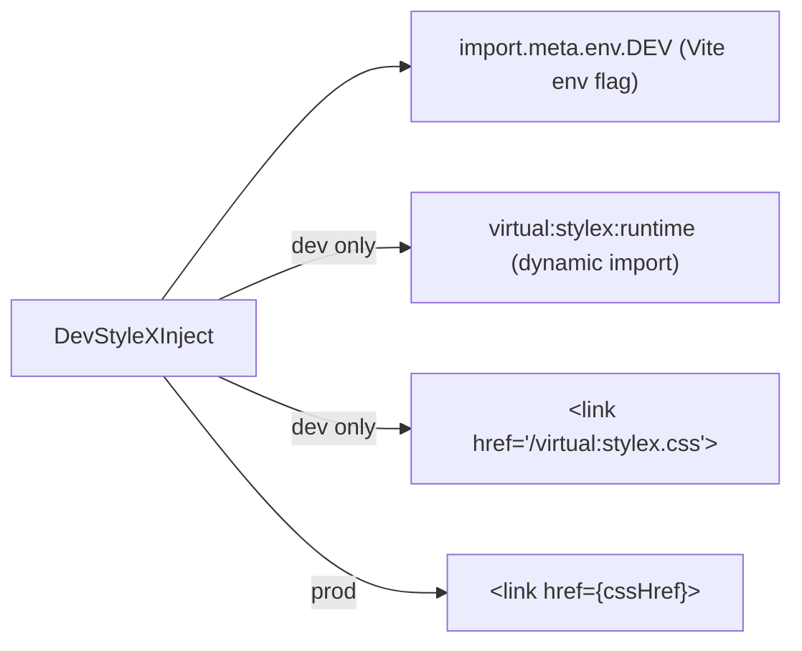
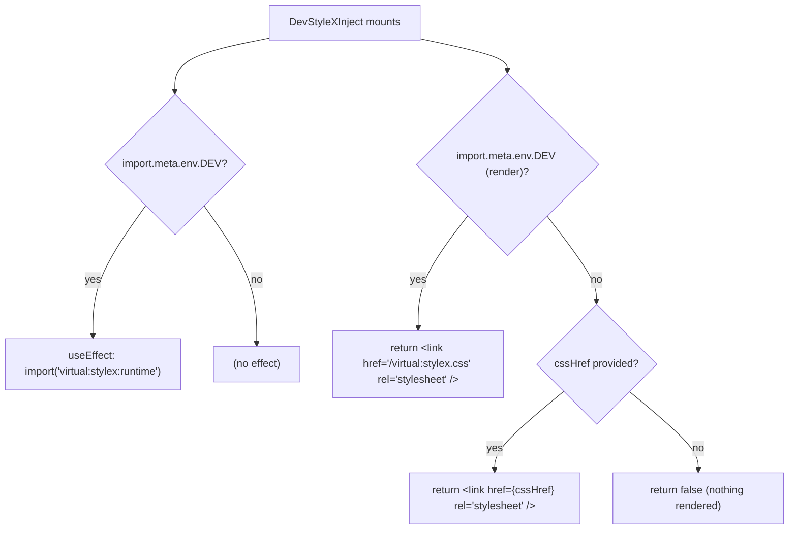

# DevStyleXInject Architecture

Development-only StyleX CSS injection shim that ensures StyleX styles are available in both dev (HMR) and production builds without leaking dev artefacts to prod.

## File Structure

```
DevStyleXInject/
├── index.ts                           → Barrel export
├── DevStyleXInject.component.tsx      → Conditional link/import logic
└── DevStyleXInject.types.ts           → { cssHref?: string }
```

## Dependencies



## Render / Effect Flow



## Environment Behaviour

| Environment          | `useEffect`                        | Rendered element                      |
| -------------------- | ---------------------------------- | ------------------------------------- |
| **Dev**              | `import('virtual:stylex:runtime')` | `<link href='/virtual:stylex.css' />` |
| **Prod**             | _(none)_                           | `<link href={cssHref} />` if provided |
| **Prod, no cssHref** | _(none)_                           | nothing                               |

## Why Two Steps in Dev

1. **`<link href='/virtual:stylex.css'>`** — injects the Vite virtual CSS module that StyleX generates at build time, so styles are present in the initial HTML.
2. **`import('virtual:stylex:runtime')`** — activates StyleX's HMR runtime so style changes are hot-reloaded without a full page reload.

Both are gated behind `import.meta.env.DEV` so Vite's tree-shaker eliminates them entirely in production bundles.

## Props

| Prop      | Type     | Required | Description                                                 |
| --------- | -------- | -------- | ----------------------------------------------------------- |
| `cssHref` | `string` | —        | Path to the production StyleX CSS file (e.g. `/stylex.css`) |

## Placement

Should be rendered **once** near the root of the app (e.g. inside the root layout), before any styled component trees:

```tsx
// app/root.tsx or equivalent
<DevStyleXInject cssHref="/assets/stylex.css" />
```
