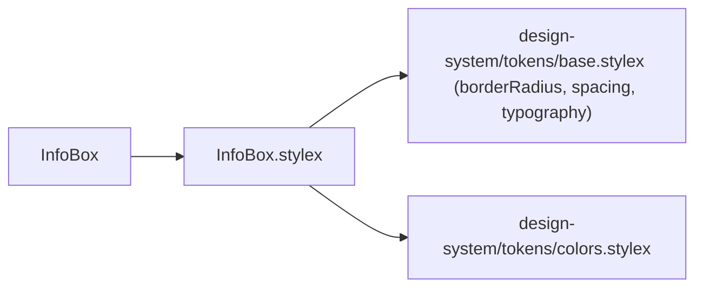
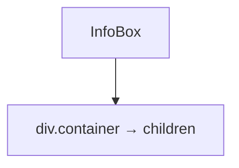

# InfoBox Architecture

Minimal styled container for informational messages, hints, and empty states.

## File Structure

```
InfoBox/
├── index.ts                  → Barrel export
├── InfoBox.component.tsx     → Single div wrapper
├── InfoBox.types.ts          → InfoBoxProps (extends ComponentPropsWithoutRef<'div'>)
└── InfoBox.stylex.ts         → container style (surface, text, padding, radius)
```

## Dependencies



## Render Structure



## Visual Style

| Token             | Value applied             |
| ----------------- | ------------------------- |
| `padding`         | `spacing.md`              |
| `borderRadius`    | `borderRadius.md`         |
| `backgroundColor` | `colors.surfaceSecondary` |
| `color`           | `colors.textSecondary`    |
| `fontSize`        | `typography.fontSizeSm`   |
| `lineHeight`      | `1.5`                     |

## Props

`InfoBoxProps` extends `ComponentPropsWithoutRef<'div'>` — all native `div` attributes (`className`, `onClick`, `data-*`, etc.) are valid and forwarded.

| Prop       | Type        | Description              |
| ---------- | ----------- | ------------------------ |
| `children` | `ReactNode` | Message text or elements |

## Design Intent

- **No variants or props beyond children** — intentionally minimal.
- Used for: empty search results (`VirtualList`), contextual hints, non-critical notices.
- Not for errors or destructive warnings — use a dedicated alert/banner component for those.

## Current Consumers

- `VirtualList` — "No options found" empty state
