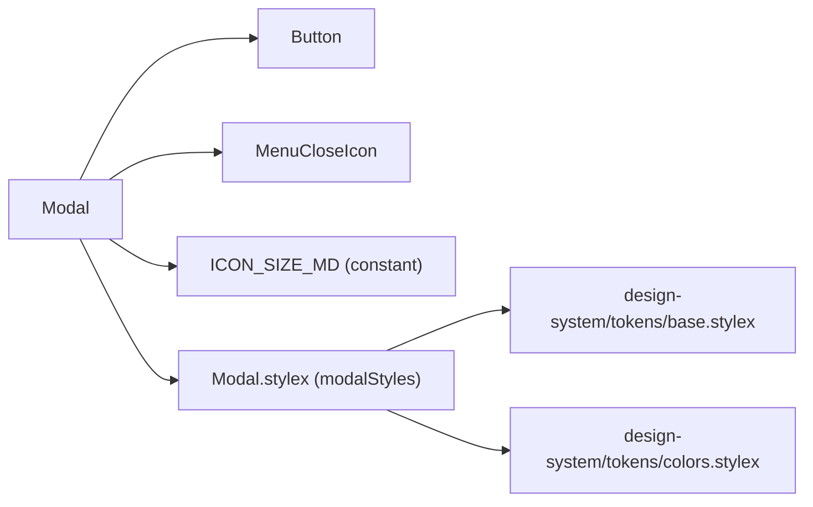
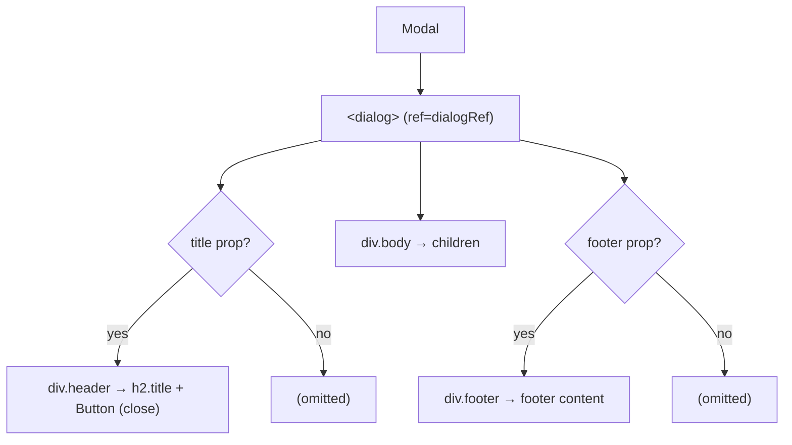
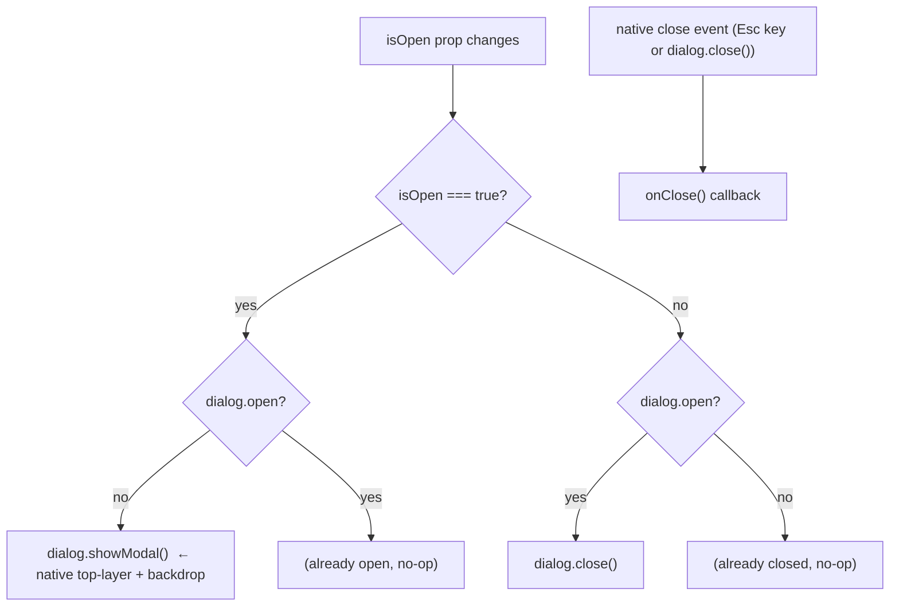

# Modal Architecture

Controlled dialog using the native `<dialog>` element with `showModal()` / `close()`, animated backdrop, header, scrollable body, and optional footer.

## File Structure

```
Modal/
├── index.ts                  → Barrel export
├── Modal.component.tsx       → Native dialog wrapper
├── Modal.types.ts            → ModalProps
└── Modal.stylex.ts           → dialog, backdrop, header, body, footer styles
```

## Dependencies



## Render Structure



## Open / Close Flow



Two separate `useEffect`s are used:

1. **Open/close effect** — syncs `isOpen` prop to `dialog.showModal()` / `dialog.close()`.
2. **Close-event effect** — listens for the native `close` event (fired on Esc key press) and calls `onClose()` to keep the parent in sync.

## Layout Sections

| Section | Condition        | Styles                             | Contents                        |
| ------- | ---------------- | ---------------------------------- | ------------------------------- |
| Header  | `title` present  | `padding.lg`, border-bottom        | `h2.title` + ghost close Button |
| Body    | always           | `padding.lg`, `overflowY: auto`    | `children`                      |
| Footer  | `footer` present | `padding.lg`, border-top, flex-end | `footer` slot (ReactNode)       |

## Sizing

| Constraint  | Value   |
| ----------- | ------- |
| `maxWidth`  | `480px` |
| `width`     | `90vw`  |
| `maxHeight` | `85vh`  |

## Props

| Prop       | Type         | Required | Description                                           |
| ---------- | ------------ | -------- | ----------------------------------------------------- |
| `children` | `ReactNode`  | ✓        | Scrollable body content                               |
| `isOpen`   | `boolean`    | ✓        | Controls `showModal()` / `close()`                    |
| `onClose`  | `() => void` | ✓        | Called when close button clicked or Esc pressed       |
| `title`    | `string`     | —        | Renders the header section with title + close button  |
| `footer`   | `ReactNode`  | —        | Renders the footer section (typically action buttons) |

## Accessibility

| Feature        | Implementation                                             |
| -------------- | ---------------------------------------------------------- |
| Focus trap     | Native `<dialog>` `showModal()` traps focus automatically  |
| Esc key        | Native `<dialog>` fires `close` event → `onClose()` called |
| Backdrop click | Not natively handled — add `onClick` on backdrop if needed |
| `aria-label`   | Close button has `aria-label='Close'`                      |

## Usage Pattern

```tsx
<Modal
  isOpen={isOpen}
  onClose={() => setIsOpen(false)}
  title="Confirm Action"
  footer={
    <>
      <Button color="outline" onClick={() => setIsOpen(false)}>
        Cancel
      </Button>
      <Button color="primary" onClick={handleConfirm}>
        Confirm
      </Button>
    </>
  }
>
  <p>Are you sure?</p>
</Modal>
```
