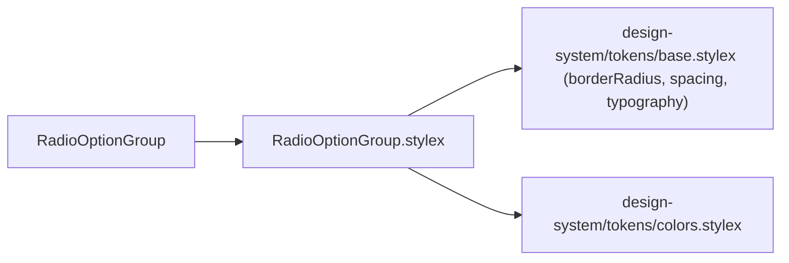
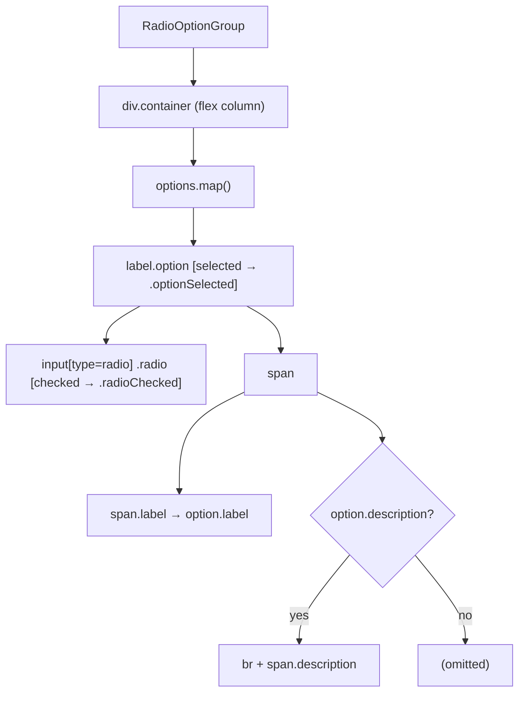
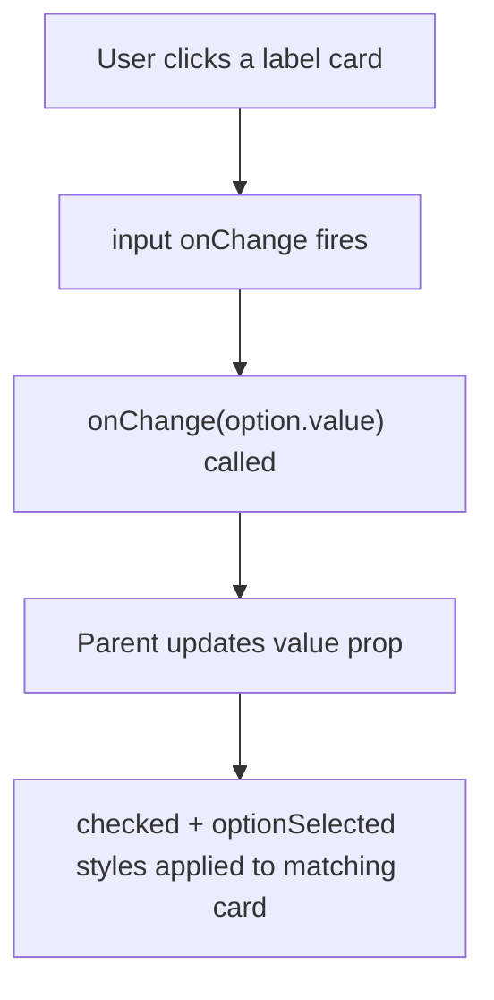

# RadioOptionGroup Architecture

Styled radio button group where each option is a clickable card with a label and optional description line.

## File Structure

```
RadioOptionGroup/
├── index.ts                              → Barrel export
├── RadioOptionGroup.component.tsx        → Fully controlled radio card list
├── RadioOptionGroup.types.ts             → RadioOption, RadioOptionGroupProps
└── RadioOptionGroup.stylex.ts            → Card, label, description, checked styles
```

## Dependencies



## Render Structure



## Selection Flow



The component is **fully controlled** — `value` is always the source of truth. There is no internal state.

## Visual States

| State     | Trigger                  | Style change                                                             |
| --------- | ------------------------ | ------------------------------------------------------------------------ |
| Default   | `value !== option.value` | `borderColor: borderSecondary`, transparent background                   |
| Selected  | `value === option.value` | `borderColor: brandPrimary`, `backgroundColor: brandPrimaryBackground`   |
| Radio dot | checked                  | `backgroundColor: brandPrimary`, inner white ring via `box-shadow inset` |

## Types

### `RadioOption`

| Field         | Type     | Required | Description                       |
| ------------- | -------- | -------- | --------------------------------- |
| `value`       | `string` | ✓        | Machine value submitted on change |
| `label`       | `string` | ✓        | Primary display text              |
| `description` | `string` | —        | Secondary helper text below label |

### `RadioOptionGroupProps`

| Prop       | Type                      | Description                                    |
| ---------- | ------------------------- | ---------------------------------------------- |
| `name`     | `string`                  | HTML `name` attribute shared across all radios |
| `options`  | `RadioOption[]`           | Ordered list of options to render              |
| `value`    | `string`                  | Currently selected value (controlled)          |
| `onChange` | `(value: string) => void` | Called with new value when selection changes   |

## Notes

- The custom radio dot uses `appearance: none` + `box-shadow: inset 0 0 0 3px white` to create the inner circle — no SVG or pseudo-elements needed.
- Each `<label>` wraps the `<input>` so the entire card is clickable without `htmlFor`.
- The radio's accessible name comes from the label text only; optional description text is attached separately via `aria-describedby`.
- Transition (`background-color 0.15s, border-color 0.15s`) is applied directly in StyleX for smooth selection feedback.
