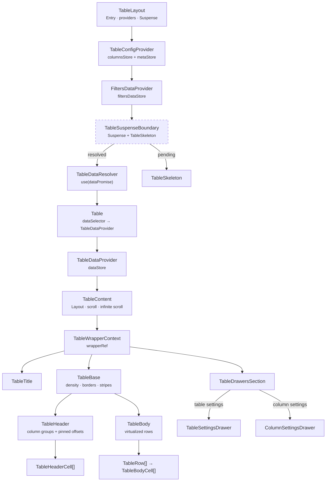
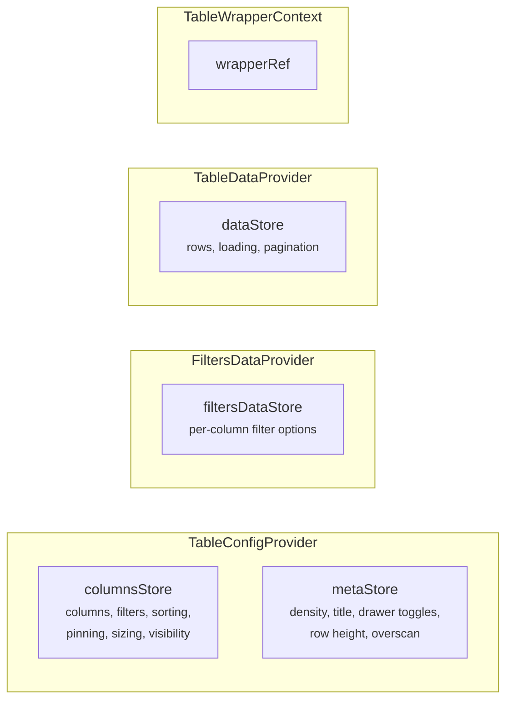
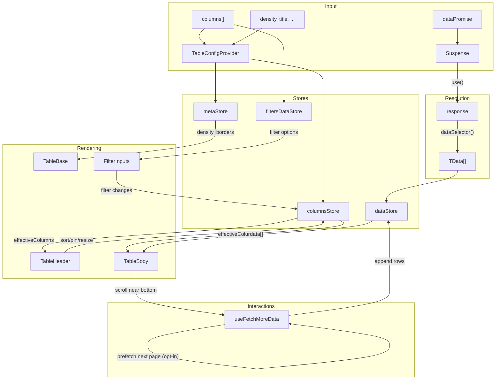
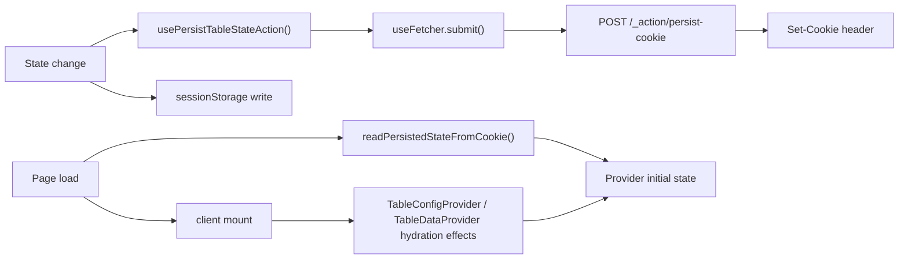

# Table Component Architecture

Feature-rich data table with virtualized rendering, column pinning, sorting,
filtering, infinite scroll, settings drawers, and cookie-based persistence.

## Entry Points

| Component     | Use Case                                                          |
| ------------- | ----------------------------------------------------------------- |
| `TableLayout` | Route-level: receives `dataPromise`, sets up providers + Suspense |
| `Table`       | Inner: receives resolved `response`, creates `TableDataProvider`  |

## Component Hierarchy



## File Structure Overview

```
Table/
├── Table.component.tsx            → Inner entry: data → TableDataProvider → TableContent
├── Table.test.tsx                 → Unit tests for response mapping and wrapper behavior
├── Table.types.ts                 → 25+ exported types (columns, state, props)
├── Table.constants.ts             → Defaults (row height, page size, thresholds)
├── Table.stylex.ts                → Flex wrapper styles
├── index.ts                       → Public barrel: Table, types
│
├── TableLayout/                   → Route-level entry with provider stack
├── TableContent/                  → Layout: title + scroll area + drawers
├── TableBase/                     → <table> with density/border/stripe styles
├── TableHeader/                   → <thead> → TableRow → TableHeaderCell[]
├── TableHeaderCell/               → Interactive <th>: sort, pin, resize, settings
├── TableBody/                     → Virtualised <tbody>: row windowing
├── TableBodyCell/                 → Auto-formatted <td> with type detection
├── TableRow/                      → Styled <tr> with stripe/header variants
├── SpacerRow/                     → Vertical virtual-scroll spacer <tr>
├── SpacerCell/                    → Horizontal virtual-scroll spacer <td>/<th>
├── TableTitle/                    → Title bar with icon + actions slot
├── TableCheckDisplay/             → Boolean checkbox display
├── TableSkeleton/                 → Loading placeholder (reuses Table)
├── TableSuspenseBoundary/         → Suspense wrapper + skeleton fallback
├── TableDataResolver/             → use(dataPromise) → children(response)
├── TableDrawersSection/           → Conditional drawer rendering
│
├── contexts/                      → 4 context providers (config, data, filters, wrapper)
├── ColumnSettingsDrawer/          → Per-column settings panel
├── TableSettingsDrawer/           → Table-wide settings panel (filters, sort, columns)
├── TableSettingsDrawerSkeleton/   → Legacy pinned loading shell (kept for reference; not used by drawer routing)
├── filters/                       → Filter input components (boolean, text, number, date, select)
├── hooks/                         → useColumnResize, useInfiniteScroll, usePersistTableStateAction
├── utils/                         → Column processing + persistence utilities
└── docs/                          → Supplementary architecture docs
```

## State Management

Four context providers with five external stores:



All stores use `useSyncExternalStore` for granular subscriptions.
See [contexts/ARCHITECTURE.md](contexts/ARCHITECTURE.md) for details.

## Data Flow



## Persistence

Table state uses dual-channel persistence:

- Cookies + URL for SSR/shareable state (filters, sorting, pinning, sizing, visibility)
- sessionStorage (tab-scoped) for per-tab working copies (drawer UI + data rows)



See [hooks/ARCHITECTURE.md](hooks/ARCHITECTURE.md) and
[utils/ARCHITECTURE.md](utils/ARCHITECTURE.md) for details.

## Detailed Architecture

| Area                        | Details                                                                                    |
| --------------------------- | ------------------------------------------------------------------------------------------ |
| Contexts                    | [contexts/ARCHITECTURE.md](contexts/ARCHITECTURE.md)                                       |
| TableLayout                 | [TableLayout/ARCHITECTURE.md](TableLayout/ARCHITECTURE.md)                                 |
| TableContent                | [TableContent/ARCHITECTURE.md](TableContent/ARCHITECTURE.md)                               |
| TableBase                   | [TableBase/ARCHITECTURE.md](TableBase/ARCHITECTURE.md)                                     |
| TableHeader                 | [TableHeader/ARCHITECTURE.md](TableHeader/ARCHITECTURE.md)                                 |
| TableHeaderCell             | [TableHeaderCell/ARCHITECTURE.md](TableHeaderCell/ARCHITECTURE.md)                         |
| TableBody                   | [TableBody/ARCHITECTURE.md](TableBody/ARCHITECTURE.md)                                     |
| TableBodyCell               | [TableBodyCell/ARCHITECTURE.md](TableBodyCell/ARCHITECTURE.md)                             |
| TableRow                    | [TableRow/ARCHITECTURE.md](TableRow/ARCHITECTURE.md)                                       |
| SpacerRow                   | [SpacerRow/ARCHITECTURE.md](SpacerRow/ARCHITECTURE.md)                                     |
| SpacerCell                  | [SpacerCell/ARCHITECTURE.md](SpacerCell/ARCHITECTURE.md)                                   |
| TableTitle                  | [TableTitle/ARCHITECTURE.md](TableTitle/ARCHITECTURE.md)                                   |
| TableCheckDisplay           | [TableCheckDisplay/ARCHITECTURE.md](TableCheckDisplay/ARCHITECTURE.md)                     |
| TableSkeleton               | [TableSkeleton/ARCHITECTURE.md](TableSkeleton/ARCHITECTURE.md)                             |
| TableSuspenseBoundary       | [TableSuspenseBoundary/ARCHITECTURE.md](TableSuspenseBoundary/ARCHITECTURE.md)             |
| TableDataResolver           | [TableDataResolver/ARCHITECTURE.md](TableDataResolver/ARCHITECTURE.md)                     |
| TableDrawersSection         | [TableDrawersSection/ARCHITECTURE.md](TableDrawersSection/ARCHITECTURE.md)                 |
| Filters                     | [filters/ARCHITECTURE.md](filters/ARCHITECTURE.md)                                         |
| Hooks                       | [hooks/ARCHITECTURE.md](hooks/ARCHITECTURE.md)                                             |
| Utils                       | [utils/ARCHITECTURE.md](utils/ARCHITECTURE.md)                                             |
| TableSettingsDrawer         | [TableSettingsDrawer/ARCHITECTURE.md](TableSettingsDrawer/ARCHITECTURE.md)                 |
| TableSettingsDrawerSkeleton | [TableSettingsDrawerSkeleton/ARCHITECTURE.md](TableSettingsDrawerSkeleton/ARCHITECTURE.md) |
| ColumnSettingsDrawer        | [ColumnSettingsDrawer/ARCHITECTURE.md](ColumnSettingsDrawer/ARCHITECTURE.md)               |
