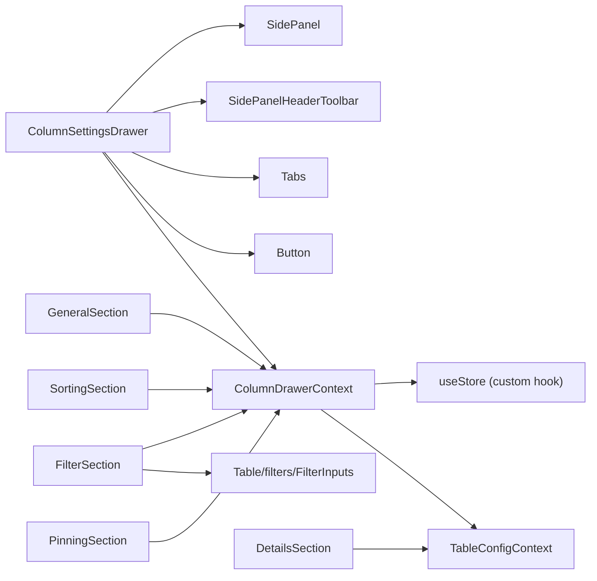
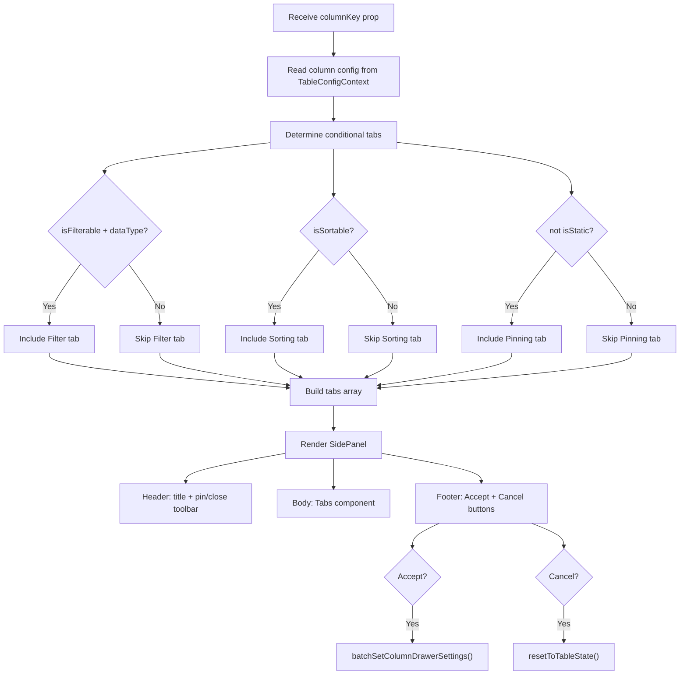

# ColumnSettingsDrawer Architecture

## File Structure

```
ColumnSettingsDrawer/
├── index.ts                              → Barrel export: ColumnSettingsDrawer + types
├── ColumnSettingsDrawer.component.tsx     → Root: SidePanel with tabbed sections
├── ColumnSettingsDrawer.test.tsx          → Unit tests for conditional tabs and footer actions
├── ColumnSettingsDrawer.types.ts          → Props: { columnKey }
│
├── ColumnDrawerContext/                   → Store-based context for drawer state
│   ├── ColumnDrawerContext.context.ts     → createContext
│   ├── ColumnDrawerContext.provider.tsx   → Provider: reads table state, creates store
│   ├── ColumnDrawerContext.types.ts       → ColumnDrawerState, ProviderProps, ContextValue
│   ├── useColumnDrawerContextValue.hook.ts → use(ColumnDrawerContext)
│   ├── useColumnsStore.hook.ts            → useSyncExternalStore + selector
│   │
│   ├── actions/                           → 9 action hooks (set/reset/clear)
│   │   ├── useBatchSetColumnDrawerSettings  → Push all drawer state to table
│   │   ├── useClearAllColumnDrawerSettings  → Clear all fields (optionally close drawer)
│   │   ├── useResetAllColumnDrawerSettings  → Reset all from table (optionally close drawer)
│   │   ├── useResetColumnFilter             → Reset filter from table
│   │   ├── useResetColumnPinning            → Reset pinning from table
│   │   ├── useResetColumnSorting            → Reset sorting from table
│   │   ├── useSetColumnFilter               → Set filter value
│   │   ├── useSetColumnPinning              → Set pinning side
│   │   ├── useSetColumnSizing               → Set width
│   │   └── useSetColumnSorting              → Set sort direction
│   │
│   ├── selectors/                         → 3 selector hooks (read drawer state)
│   │   ├── useGetColumnFilter
│   │   ├── useGetColumnPinning
│   │   └── useGetColumnSorting
│   │
│   └── utils/
│       ├── getInitialColumnsState.util.ts → Build initial state shape
│       └── getTableColumnDrawerState.util.ts → Map table snapshot to drawer state
│
├── GeneralSection/                        → Column width presets + clear/reset all
│   ├── GeneralSection.component.tsx
│   ├── GeneralSection.types.ts
│   ├── GeneralSection.stylex.ts
│   └── index.ts
│
├── FilterSection/                         → Column filter input
│   ├── FilterSection.component.tsx
│   ├── FilterSection.types.ts
│   ├── FilterSection.stylex.ts
│   ├── index.ts
│   └── FilterSectionToolbar/             → Clear/reset filter (toolbar + footer variants)
│
├── SortingSection/                        → Sort direction toggle (asc/desc)
│   ├── SortingSection.component.tsx
│   ├── SortingSection.types.ts
│   ├── SortingSection.stylex.ts
│   ├── index.ts
│   └── SortingSectionToolbar/            → Clear/reset sorting (toolbar + footer variants)
│
├── PinningSection/                        → Pin left/right toggle
│   ├── PinningSection.component.tsx
│   ├── PinningSection.types.ts
│   ├── PinningSection.stylex.ts
│   ├── index.ts
│   └── PinningSectionToolbar/            → Clear/reset pinning (toolbar + footer variants)
│
└── DetailsSection/                        → Read-only column metadata display
    ├── DetailsSection.component.tsx
    ├── DetailsSection.types.ts
    ├── DetailsSection.stylex.ts
    ├── index.ts
    └── utils/
        └── getBadgeStyle.util.ts          → Yes/No/None badge color mapping
```

## Dependencies



## Render Flow



## State Management: ColumnDrawerContext

Store-based context pattern using `useStore` + `useSyncExternalStore` with
9 action hooks and 3 selector hooks.

See [ColumnDrawerContext/ARCHITECTURE.md](ColumnDrawerContext/ARCHITECTURE.md) for full details.

**Key flows**:

- **Accept**: `useBatchSetColumnDrawerSettings` reads all drawer state and pushes it to
  `TableConfigContext` via `useBatchSetColumnSettings`
- **Cancel**: `useResetAllColumnDrawerSettings(true)` reads current table state back into
  the drawer store and closes the drawer while restoring table-settings visibility from
  `wasTableSettingsOpenBeforeColumnSettings` snapshot in `metaStore`

## Tab Sections

All sections follow a consistent pattern: they use SidePanel sub-components for layout,
read/write state through ColumnDrawerContext actions and selectors, and use shared
`drawerSection.stylex` tokens for styling.

| Section          | Tab Condition              | Features                                                  | Details                                           |
| ---------------- | -------------------------- | --------------------------------------------------------- | ------------------------------------------------- |
| `GeneralSection` | Always shown               | Width presets (min/max/default), clear/reset all settings | [ARCHITECTURE.md](GeneralSection/ARCHITECTURE.md) |
| `FilterSection`  | `isFilterable && dataType` | FilterInputs component, clear/reset filter                | [ARCHITECTURE.md](FilterSection/ARCHITECTURE.md)  |
| `SortingSection` | `isSortable`               | Asc/desc toggle, clear/reset sorting                      | [ARCHITECTURE.md](SortingSection/ARCHITECTURE.md) |
| `PinningSection` | `!isStatic`                | Pin left/right toggle, clear/reset pinning                | [ARCHITECTURE.md](PinningSection/ARCHITECTURE.md) |
| `DetailsSection` | Always shown               | Read-only metadata display (label, key, dataType, etc.)   | [ARCHITECTURE.md](DetailsSection/ARCHITECTURE.md) |

### Section Toolbar Pattern

Filter, Sorting, and Pinning sections each have a `*SectionToolbar` sub-component
that renders in two variants controlled by a `variant` prop:

| Variant     | Placement              | Button Style            | Shows Labels?  |
| ----------- | ---------------------- | ----------------------- | -------------- |
| `'toolbar'` | SidePanelSectionHeader | `ghost`, `mini`, `auto` | No (icon only) |
| `'footer'`  | Below the section      | `outline`, `sm`, `full` | Yes            |

Each toolbar provides **Clear** (set to undefined) and **Reset** (restore from table state) actions.

## Consumers

Used in `TableDrawersSection` which wraps it with `ColumnDrawerProvider`:

```
<ColumnDrawerProvider columnKey={columnKey}>
  <ColumnSettingsDrawer columnKey={columnKey} />
</ColumnDrawerProvider>
```
