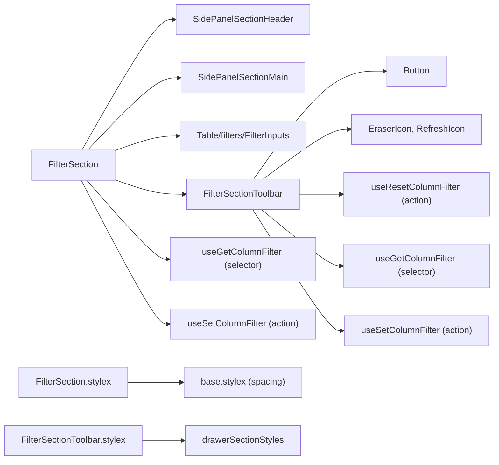
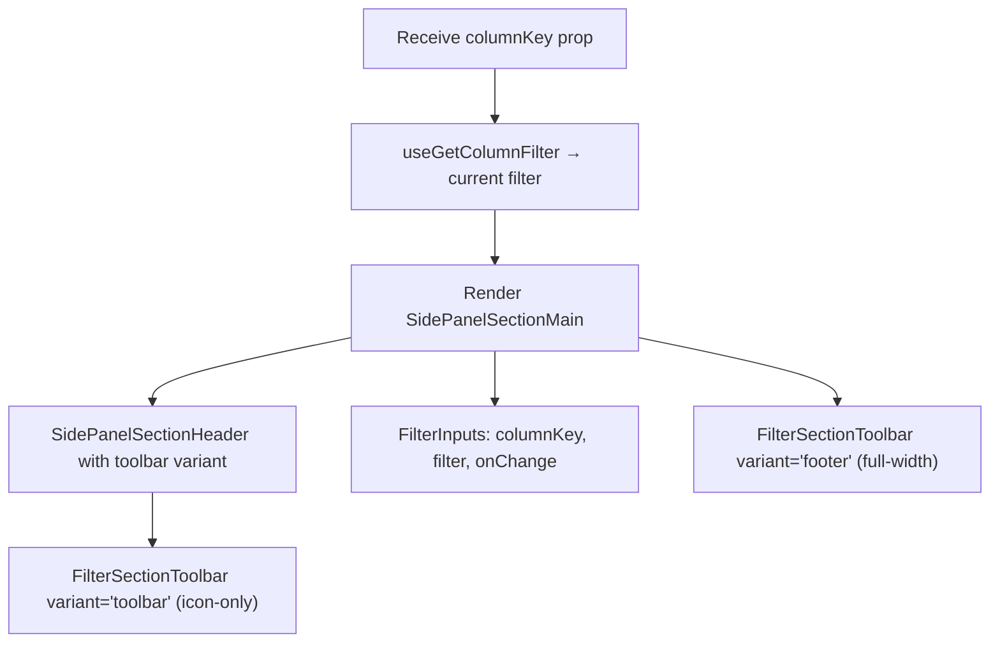
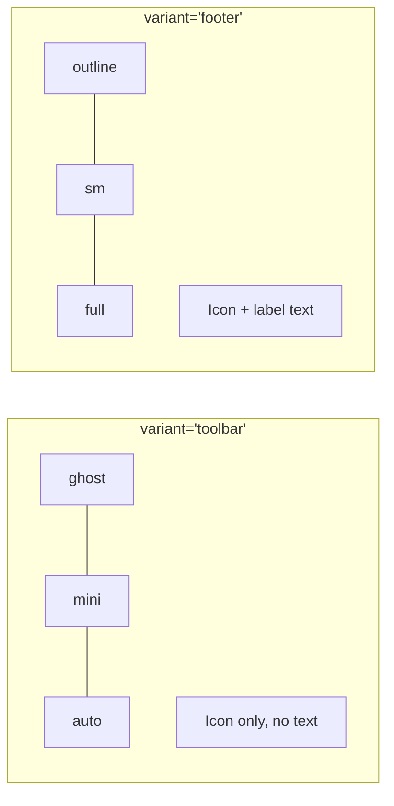

# FilterSection Architecture

Column filter input with clear/reset toolbar. Delegates filtering UI to the
shared `FilterInputs` component from `Table/filters/`.

## File Structure

```
FilterSection/
├── index.ts                       → Barrel export
├── FilterSection.component.tsx    → Filter input + toolbar (header + footer)
├── FilterSection.types.ts         → Props: { columnKey }
├── FilterSection.stylex.ts        → Custom flex layout (not drawerSectionStyles)
│
└── FilterSectionToolbar/
    ├── index.ts                   → Barrel export
    ├── FilterSectionToolbar.component.tsx → Clear/reset filter buttons
    ├── FilterSectionToolbar.types.ts     → { variant?: 'footer' | 'toolbar' }
    └── FilterSectionToolbar.stylex.ts    → Delegates to drawerSectionStyles
```

## Dependencies



## Render Flow



## Toolbar Dual-Variant Pattern

The `FilterSectionToolbar` renders in two locations with different visual styles:



| Button       | Action                             | Disabled When |
| ------------ | ---------------------------------- | ------------- |
| Clear Filter | `setColumnFilter(undefined)`       | No filter set |
| Reset Filter | `resetColumnFilter()` (from table) | Never         |

## Props

| Prop        | Type             | Description       |
| ----------- | ---------------- | ----------------- |
| `columnKey` | `DataKey<TData>` | Column identifier |
