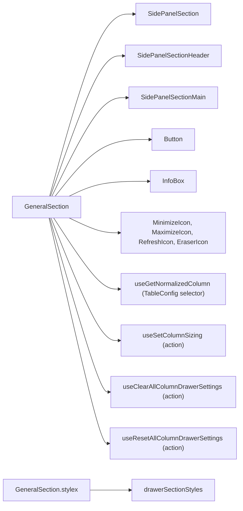
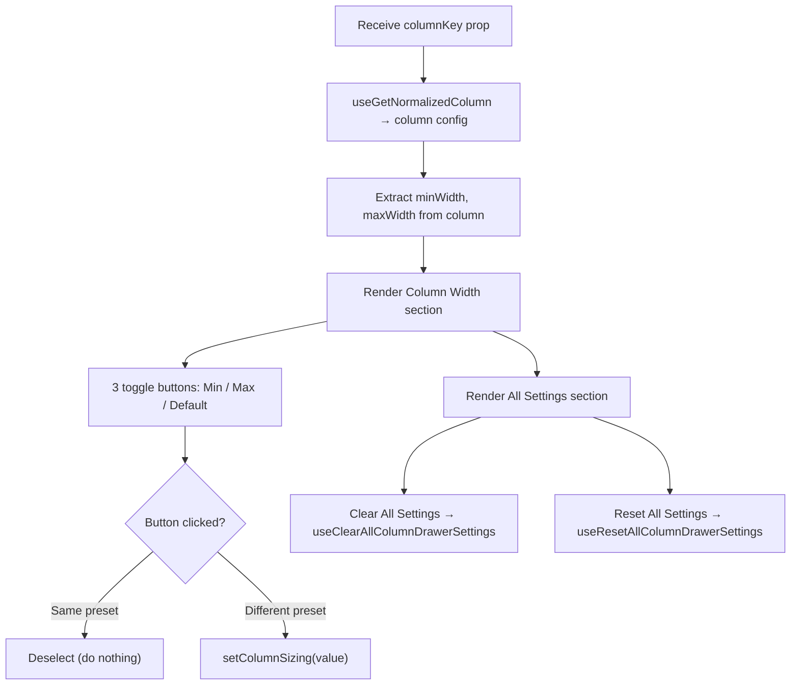

# GeneralSection Architecture

Column width presets and global clear/reset controls for all drawer settings.

## File Structure

```
GeneralSection/
├── index.ts                       → Barrel export
├── GeneralSection.component.tsx   → Width presets + clear/reset all
├── GeneralSection.types.ts        → Props + WidthPreset type
└── GeneralSection.stylex.ts       → Delegates to drawerSectionStyles.list
```

## Dependencies



## Render Flow



## Props

| Prop        | Type             | Description       |
| ----------- | ---------------- | ----------------- |
| `columnKey` | `DataKey<TData>` | Column identifier |

## Local State

| State            | Type                                                       | Purpose                                              |
| ---------------- | ---------------------------------------------------------- | ---------------------------------------------------- |
| `selectedPreset` | `WidthPreset` (`'min' \| 'max' \| 'default' \| undefined`) | Track which width button is active (toggle behavior) |

## Sections Rendered

| Section      | Header         | Controls                                 |
| ------------ | -------------- | ---------------------------------------- |
| Column Width | "Column Width" | Set to Min, Set to Max, Reset to Default |
| _(InfoBox)_  | —              | Explanatory text                         |
| All Settings | "All Settings" | Clear All Settings, Reset All Settings   |
