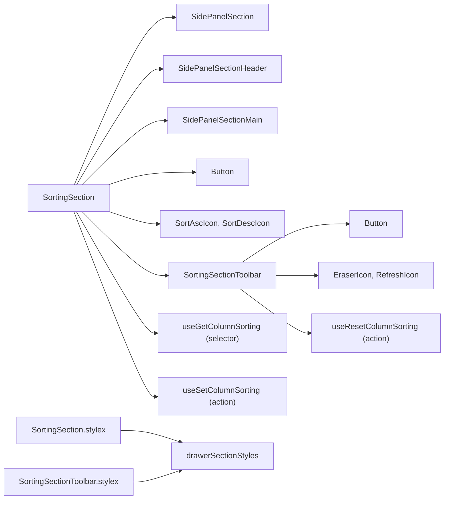
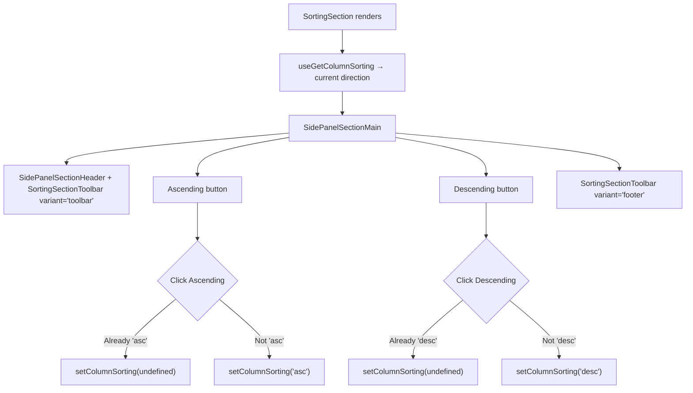

# SortingSection Architecture

Sort direction toggle (ascending/descending) with clear/reset toolbar.

## File Structure

```
SortingSection/
├── index.ts                        → Barrel export
├── SortingSection.component.tsx    → Asc/desc toggle buttons
├── SortingSection.types.ts         → Props: Record<string, never>
├── SortingSection.stylex.ts        → Delegates to drawerSectionStyles.list
│
└── SortingSectionToolbar/
    ├── index.ts                    → Barrel export
    ├── SortingSectionToolbar.component.tsx → Clear/reset sorting buttons
    ├── SortingSectionToolbar.types.ts     → { variant?: 'footer' | 'toolbar' }
    └── SortingSectionToolbar.stylex.ts    → Delegates to drawerSectionStyles
```

## Dependencies



## Render Flow



## Toolbar Dual-Variant Pattern

| Variant     | Placement              | Button Style            | Labels?        |
| ----------- | ---------------------- | ----------------------- | -------------- |
| `'toolbar'` | SidePanelSectionHeader | `ghost`, `mini`, `auto` | No (icon only) |
| `'footer'`  | Below toggle buttons   | `outline`, `sm`, `full` | Yes            |

| Button        | Action                              | Disabled When  |
| ------------- | ----------------------------------- | -------------- |
| Clear Sorting | `setColumnSorting(undefined)`       | No sorting set |
| Reset Sorting | `resetColumnSorting()` (from table) | Never          |

## Props

Takes no props (`Record<string, never>`). All state is read from `ColumnDrawerContext`.
