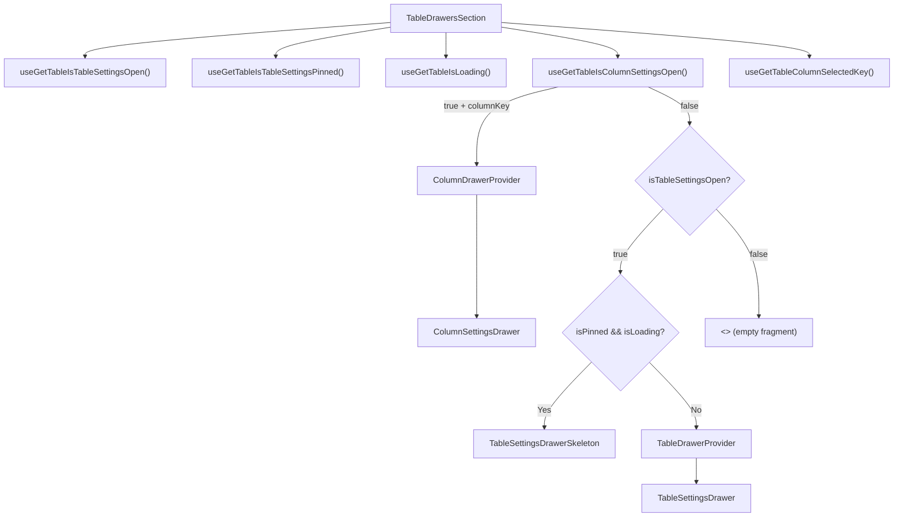

# TableDrawersSection Architecture

Conditional renderer for table-level and column-level settings drawers.
Reads meta state to decide which drawer to show, and wraps each in its
own context provider.

## File Structure

```
TableDrawersSection/
├── TableDrawersSection.component.tsx   → Conditional drawer rendering
├── TableDrawersSection.test.tsx        → Unit tests for drawer selection and provider wiring
└── index.ts                            → Barrel export
```

## Render Logic



## Precedence Rule

When both drawers are requested at the same time, **column settings wins**.
This allows per-column settings to temporarily override table settings,
including when table settings is pinned.

## Context Providers

Each drawer gets its own provider so the drawer-local store is only
created when the drawer is open:

- **TableDrawerProvider** → wraps `TableSettingsDrawer`
- **ColumnDrawerProvider** → wraps `ColumnSettingsDrawer` with `columnKey`

During loading fallback, a pinned table-settings drawer skips `TableDrawerProvider`
and renders `TableSettingsDrawerSkeleton` instead. This keeps the pinned drawer
width and structure visible during refresh without mounting the full tabbed drawer.
