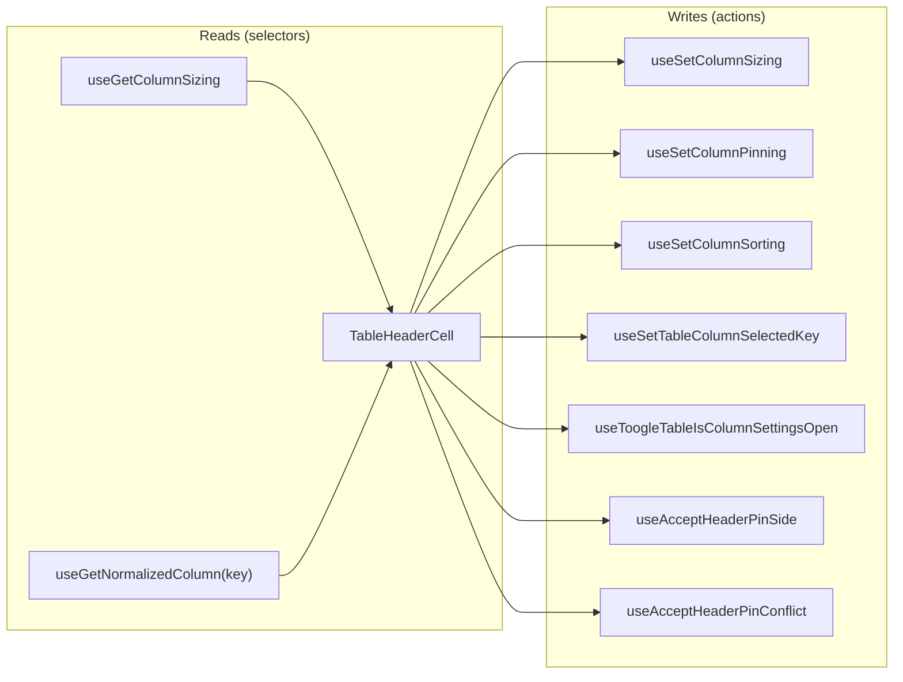
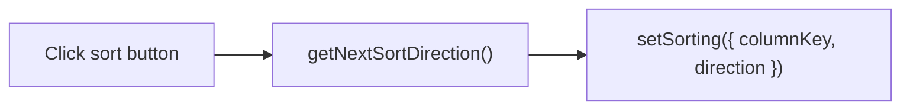
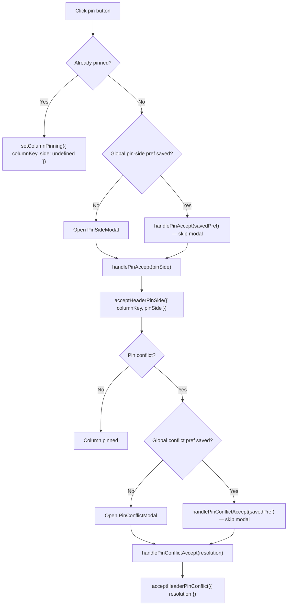

# TableHeaderCell Architecture

Interactive column header cell with sorting, pinning, resizing, and
column settings controls. The most complex cell component in the table.

## File Structure

```
TableHeaderCell/
├── TableHeaderCell.component.tsx   → <th> with sort/pin/resize/settings controls
├── TableHeaderCell.types.ts        → TableHeaderCellProps (columnKey, pinInfo)
├── TableHeaderCell.stylex.ts       → Pinned positioning, resize handle, shimmer
├── index.ts                        → Barrel export
│
├── SortIcon/
│   ├── SortIcon.tsx                → Renders asc/desc/neutral icon
│   ├── SortIcon.types.ts           → SortIconProps (direction)
│   └── index.ts
│
└── utils/
    ├── getNextSortDirection.util.ts → Cycle: undefined → asc → desc → undefined
    ├── getPinnedStyle.util.ts       → Returns left/right pinned StyleX
    ├── getShadowStyle.util.ts       → Returns shadow separator StyleX
    └── index.ts
```

## Props

| Prop           | Type                | Description                    |
| -------------- | ------------------- | ------------------------------ |
| `columnKey`    | `DataKey<TData>`    | Column identifier              |
| `hasSettings`  | `boolean`           | Show settings (gear) button    |
| `pinInfo`      | `PinnedColumnInfo?` | Pin side, offset, shadow flags |
| `customStylex` | `StyleXStyles?`     | Override styles                |

## Context Dependencies



## Interactions

### Sort



Cycles through `undefined → asc → desc → undefined`.

### Pin



Runtime prompt selections in this component resolve the current pinning action only and do not persist global preferences.

### Resize

Uses `useColumnResize` hook with RAF-throttled mouse tracking.
Double-click on resize handle resets column to auto width.

### Settings

Opens `ColumnSettingsDrawer` by setting the selected column key
and setting `isColumnSettingsOpen = true` while forcing
`isTableSettingsOpen = false` in meta state, so per-column
settings takes precedence over table settings.

## Loading State

Header cells receive `isLoadingState` from `TableHeader` and render their local
shimmer overlay without subscribing to loading state individually.
