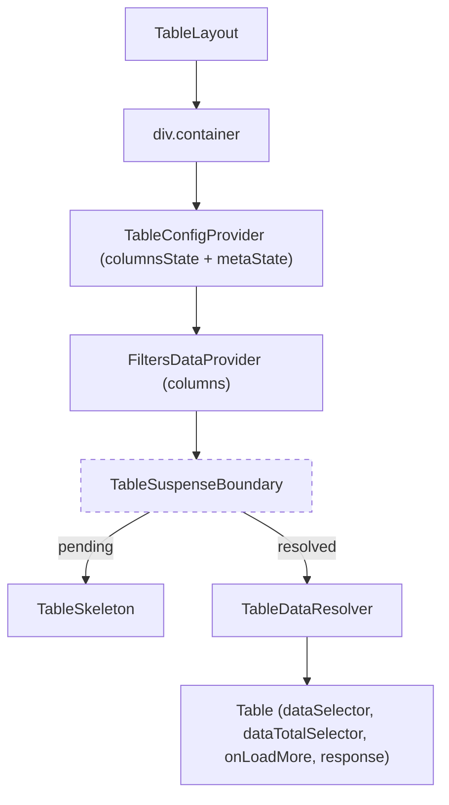

# TableLayout Architecture

Top-level entry point for route-based table usage. Sets up all context
providers, wraps data fetching in Suspense, and renders the `Table`
component with resolved data.

## File Structure

```
TableLayout/
├── TableLayout.component.tsx   → Provider stack + Suspense + Table
├── TableLayout.types.ts        → TableLayoutProps (columns, dataPromise, config, ...)
├── TableLayout.stylex.ts       → Container styles
├── createLazyTableLayout.ts    → Optional lazy loader factory (direct import only)
└── index.ts                    → Barrel export
```

## Public API

- `index.ts` exports only `TableLayout` and `TableLayoutProps`.
- `createLazyTableLayout` must be imported directly from
  `./createLazyTableLayout` to avoid mixing static and dynamic imports of
  `TableLayout.component.tsx` in the same barrel path.

## Provider Stack



## Props

| Prop                   | Type                        | Required | Description                              |
| ---------------------- | --------------------------- | -------- | ---------------------------------------- |
| `columns`              | `TableColumn<TData>[]`      | Yes      | Column definitions                       |
| `dataPromise`          | `Promise<TResponse>`        | Yes      | Async data source                        |
| `dataSelector`         | `(r: TResponse) => TData[]` | Yes      | Extract rows from response               |
| `title`                | `string`                    | Yes      | Table display title                      |
| `persistenceKey`       | `string`                    | Yes      | Cookie/URL persistence namespace         |
| `suspenseKey`          | `string?`                   | No       | Key to reset Suspense boundary           |
| `columnOrder`          | `ColumnOrderState?`         | No       | Initial column order                     |
| `columnPinning`        | `ColumnPinningState?`       | No       | Initial pinning                          |
| `columnSizing`         | `ColumnSizingState?`        | No       | Initial column widths                    |
| `columnVisibility`     | `ColumnVisibilityState?`    | No       | Initially hidden columns                 |
| `filters`              | `ColumnFiltersState?`       | No       | Active filters                           |
| `sorting`              | `SortingState?`             | No       | Active sorting                           |
| `density`              | `TableDensity`              | No       | Default: `comfortable`                   |
| `isBordered`           | `boolean`                   | No       | Default: `true`                          |
| `isStriped`            | `boolean`                   | No       | Default: `true`                          |
| `onLoadMore`           | Infinite scroll callback    | No       | Fetch next page                          |
| `dataTotalSelector`    | `(r: TResponse) => number`  | No       | Extract total row count                  |
| `defaultColumnPinning` | `ColumnPinningState?`       | No       | Fallback pinning when no persisted state |

## suspenseKey Behavior

`suspenseKey` is now a legacy compatibility prop and is ignored by
`TableLayout`. Query transitions no longer force Suspense remounts,
which allows current rows to stay mounted while in-table loading shimmer
is shown.

`TableSkeleton` remains the fallback for first load and hard pending
states where Suspense genuinely has no resolved content yet.
