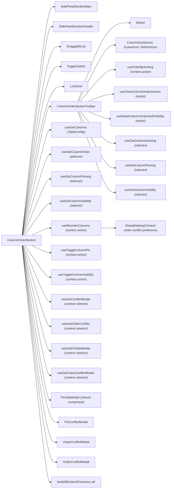
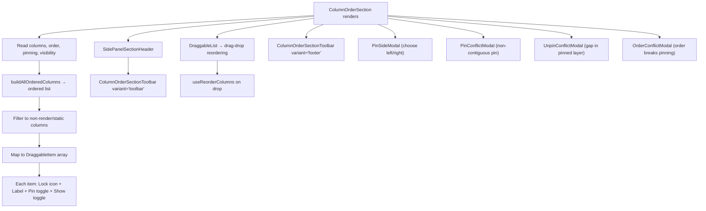
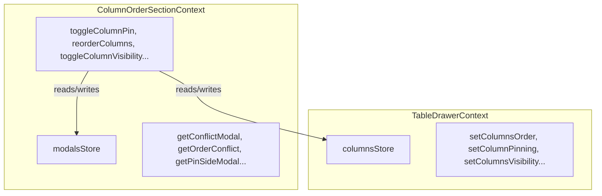

# ColumnOrderSection Architecture

Column reordering, visibility toggling, and pinning with drag-and-drop.
Uses a nested ColumnOrderSectionContext to manage complex conflict resolution modals.

## File Structure

```
ColumnOrderSection/
├── index.ts                              → Barrel export
├── ColumnOrderSection.component.tsx       → DraggableList + modals
├── ColumnOrderSection.types.ts            → Conflict resolution types
├── ColumnOrderSection.stylex.ts
│
├── ColumnOrderSectionContext/            → Nested context for modal state
│   └── (see ColumnOrderSectionContext/ARCHITECTURE.md)
│
├── ColumnOrderSectionToolbar/            → Order/clear/reset actions
│   ├── index.ts
│   ├── ColumnOrderSectionToolbar.component.tsx
│   ├── ColumnOrderSectionToolbar.types.ts   → { variant? }
│   └── ColumnOrderSectionToolbar.stylex.ts
│
├── OrderConflictModal/                   → Order/pin conflict resolution
│   ├── index.ts
│   ├── OrderConflictModal.component.tsx   → Radio options for resolution
│   ├── OrderConflictModal.types.ts
│   └── OrderConflictModal.stylex.ts
│
├── PinConflictModal/                     → Pin contiguity conflict resolution
│   ├── index.ts
│   ├── PinConflictModal.component.tsx
│   ├── PinConflictModal.types.ts
│   └── PinConflictModal.stylex.ts
│
├── UnpinConflictModal/                   → Unpin gap conflict resolution
│   ├── index.ts
│   ├── UnpinConflictModal.component.tsx
│   ├── UnpinConflictModal.types.ts
│   └── UnpinConflictModal.stylex.ts
│
└── utils/                                → Pin/order conflict utilities
    ├── index.ts
    ├── applyPin.util.ts                   → Apply pin respecting static columns
    ├── buildAllOrderedColumns.util.ts     → Build complete ordered column list
    ├── detectPinOrderConflict.util.ts     → Detect order/pinning conflicts
    ├── getIsContiguousPin.util.ts         → Check pin contiguity
    ├── insertAdjacentToPinnedGroup.util.ts → Insert next to pinned group
    ├── recalculatePinSides.util.ts        → Reassign left/right after reorder
    ├── resolveClosestEdgeSide.util.ts     → Resolve 'closest-edge' to side
    ├── resolvePinOrderConflict.util.ts    → Apply conflict resolution strategy
    └── restoreStaticColumnOrder.util.ts   → Restore static columns to positions
```

## Dependencies



## Render Flow



## Dual Context Architecture



The ColumnOrderSection uses **two nested contexts**:

- **TableDrawerContext**: column state (order, pinning, visibility)
- **ColumnOrderSectionContext**: modal state (conflict resolution flows)

Actions in ColumnOrderSectionContext read/write to both stores.

## Toolbar Dual-Variant Pattern

| Variant     | Placement              | Button Style            | Labels?        |
| ----------- | ---------------------- | ----------------------- | -------------- |
| `'toolbar'` | SidePanelSectionHeader | `ghost`, `mini`, `auto` | No (icon only) |
| `'footer'`  | Below DraggableList    | `outline`, `sm`, `full` | Yes            |

| Button                     | Action                            | Disabled When             |
| -------------------------- | --------------------------------- | ------------------------- |
| Order by Sorting           | `orderBySorting()`                | No sorting exists         |
| Clear Visibility & Pinning | `clearColumnOrderSection()`       | No pinning or hidden cols |
| Reset Order & Visibility   | `resetColumnOrderAndVisibility()` | Never                     |

## Utility Functions

| Utility                        | Purpose                                                                         |
| ------------------------------ | ------------------------------------------------------------------------------- |
| `applyPin`                     | Add column to pin side, respecting static positions                             |
| `buildAllOrderedColumns`       | Merge columnOrder with remaining columns                                        |
| `createDraggableItems`         | Maps ordered columns to draggable entries and delegates row content rendering   |
| `derivePinSideResolutionState` | Resolve pin-side choice to direct update or conflict, shared by drawer + header |
| `detectPinOrderConflict`       | Check if new order breaks pin contiguity                                        |
| `getIsContiguousPin`           | Check if pin side maintains contiguity                                          |
| `getPinnedEntries`             | Flatten left/right pinning into keyed entries                                   |
| `insertAdjacentToPinnedGroup`  | Place column next to its pin group                                              |
| `pinAllBetween`                | Pin all columns between edge and target column                                  |
| `recalculatePinSides`          | Reassign left/right based on position after reorder                             |
| `resolveClosestSide`           | Pick nearest pin side from edge distances                                       |
| `resolveClosestEdgeSide`       | Convert 'closest-edge' to actual 'left' or 'right'                              |
| `resolvePinConflictState`      | Shared pin-conflict resolution to next `{ columnOrder, columnPinning }`         |
| `resolvePinOrderConflict`      | Apply one of three order/pin conflict resolutions                               |
| `resolveToggleColumnPinIntent` | Resolves pin/unpin toggle intent into direct update vs modal/auto-accept action |
| `restoreStaticColumnOrder`     | Ensure static columns stay in their original positions                          |
| `restoreStaticPinnedColumns`   | Restores default pin side membership for static columns                         |
| `sortPinnedKeysByOrder`        | Sort pinned keys by latest column order                                         |
