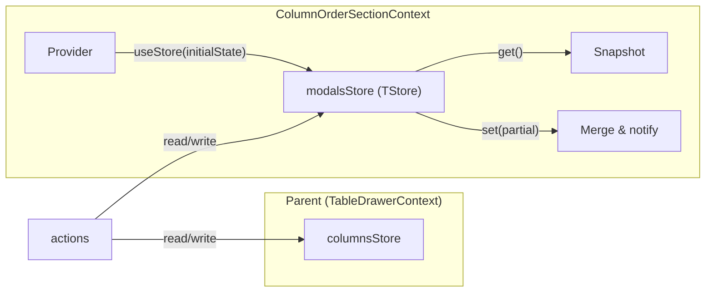
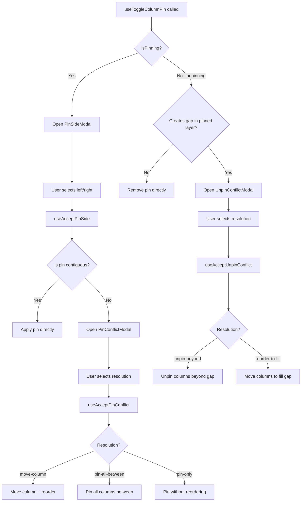
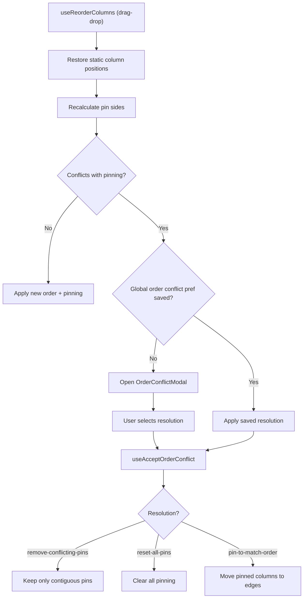

# ColumnOrderSectionContext Architecture

Store-based context that manages modal state for the ColumnOrderSection.
Handles complex pin/order conflict detection and resolution flows.

## File Structure

```
ColumnOrderSectionContext/
├── ColumnOrderSectionContext.context.ts       → createContext
├── ColumnOrderSectionContext.provider.tsx      → Provider: creates modalsStore
├── ColumnOrderSectionContext.types.ts          → Modal state types
├── ColumnOrderSectionContext.constants.ts      → Initial modal state defaults
├── index.ts                                    → Barrel export
├── useColumnOrderSectionContextValue.hook.ts   → use(ColumnOrderSectionContext)
├── useModalsStore.hook.ts                      → useSyncExternalStore + selector
│
├── actions/                                    → 12 hooks that write to the store
│   ├── actions/utils/resolveOrderConflictUpdate.util.ts → Shared apply-vs-modal decision for reorder and order-by-sorting flows
│   ├── actions/utils/resolveToggleColumnPinUpdate.util.ts → Shared static-aware pin-toggle intent resolver for toggle pin flow
│   ├── actions/utils/resolveAcceptedOrderConflictState.util.ts → Shared final order/pinning resolver for accepted order conflicts
│   ├── actions/utils/resolveAcceptedPinSideUpdate.util.ts → Shared pin-side acceptance resolver for resolved-vs-conflict outcomes
│   ├── actions/utils/resolveAcceptedUnpinConflictState.util.ts → Shared unpin-conflict resolution for pinning-only vs reorder outcomes
│   ├── useAcceptPinSide                        → Accept pin side selection
│   ├── useAcceptPinConflict                    → Resolve pin contiguity conflict
│   ├── useAcceptUnpinConflict                  → Resolve unpin gap conflict
│   ├── useAcceptOrderConflict                  → Resolve order/pin conflict
│   ├── useCancelPinSide                        → Close PinSideModal
│   ├── useCancelPinConflict                    → Close PinConflictModal
│   ├── useCancelUnpinConflict                  → Close UnpinConflictModal
│   ├── useCancelOrderConflict                  → Close OrderConflictModal
│   ├── useOrderBySorting                       → Reorder columns by sorting
│   ├── useReorderColumns                       → Drag-drop reorder handler
│   ├── useToggleColumnPin                      → Toggle pin (opens modals)
│   └── useToggleColumnVisibility               → Toggle column visibility
│
├── selectors/                                  → 4 hooks that read from the store
│   ├── useGetConflictModal
│   ├── useGetOrderConflict
│   ├── useGetPinSideModal
│   └── useGetUnpinConflictModal
│
└── utils/
    └── getInitialModalsState.util.ts           → Default modal state factory
```

## Store Pattern



## Modal State Shape

```typescript
ColumnOrderSectionModalsState = {
  pinSideModal: {
    columnKey: string;
    columnLabel: string;
    isOpen: boolean;
  };
  conflictModal: {                       // Pin contiguity conflict
    columnKey: string;
    columnLabel: string;
    isOpen: boolean;
    side: 'left' | 'right';
  };
  unpinConflictModal: {                  // Unpin gap conflict
    columnKey: string;
    columnLabel: string;
    isOpen: boolean;
    side: 'left' | 'right';
  };
  orderConflict: {                       // Order/pin conflict
    description: string;
    isOpen: boolean;
    pendingOrder: ColumnOrderState;
    pendingPinning: ColumnPinningState;
  };
};
```

## Pin/Unpin Flow



## Reorder Flow



## Conflict Resolution Types

| Conflict Type      | Modal                | Resolutions                                                       |
| ------------------ | -------------------- | ----------------------------------------------------------------- |
| Pin side selection | `PinSideModal`       | `left` or `right`                                                 |
| Pin contiguity     | `PinConflictModal`   | `move-column`, `pin-all-between`, `pin-only`                      |
| Unpin gap          | `UnpinConflictModal` | `unpin-beyond`, `reorder-to-fill`                                 |
| Order/pin conflict | `OrderConflictModal` | `remove-conflicting-pins`, `reset-all-pins`, `pin-to-match-order` |

## Shared Action Utility

`useReorderColumns` and `useOrderBySorting` now share a pure action utility,
`resolveOrderConflictUpdate`, to decide whether a proposed order can be applied
directly or must open/auto-accept the order conflict flow.

`useToggleColumnPin` now delegates static-column short-circuit and pin-toggle
intent resolution to `resolveToggleColumnPinUpdate`.

`useAcceptOrderConflict` now delegates the final static-order/static-pinning
composition step to `resolveAcceptedOrderConflictState`.

`useAcceptPinSide` now delegates pin-side acceptance branching to
`resolveAcceptedPinSideUpdate`.

`useAcceptUnpinConflict` now delegates unpin-conflict state transitions to
`resolveAcceptedUnpinConflictState`.
