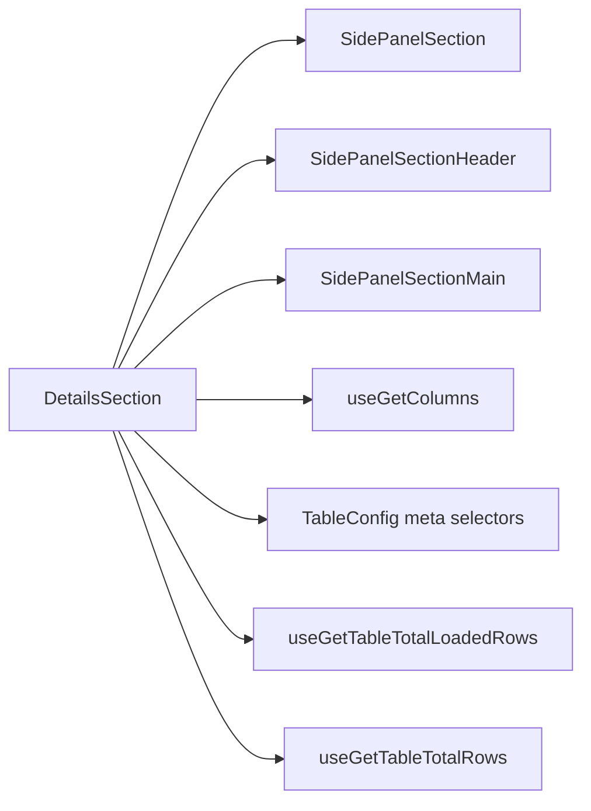
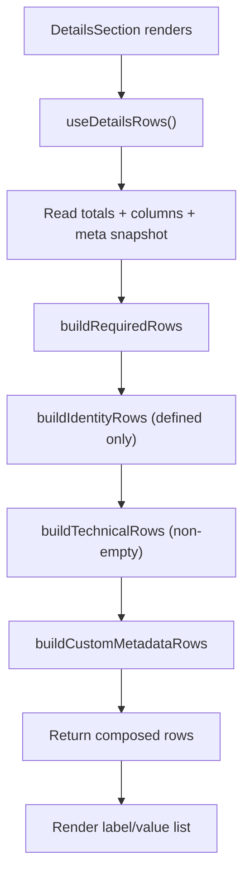

# DetailsSection Architecture

Read-only metadata view for the table settings drawer.
Shows core table metrics (total records, loaded rows, column count),
identity fields (title, table name, schema name), and optional technical/custom metadata.

## File Structure

```
DetailsSection/
├── index.ts                         → Barrel export
├── DetailsSection.component.tsx     → Thin renderer (consumes useDetailsRows)
├── DetailsSection.types.ts          → DetailsRow type
├── DetailsSection.stylex.ts         → Label/value row styles
├── DetailsSection.test.tsx          → Required + optional rendering tests
├── hooks/
│   ├── useDetailsRows.hook.ts       → Composes ordered rows from grouped meta
│   ├── useDetailsIdentityMeta.hook.ts → Identity + locale + metadata reads
│   └── useDetailsConfigMeta.hook.ts → Technical configuration reads
└── utils/
    ├── formatMetadataLabel.util.ts  → Humanize a raw metadata key
    ├── formatMetadataValue.util.ts  → Format a metadata value for display
    ├── resolveDetailsLocale.util.ts → Resolve explicit/browser locale
    ├── buildRequiredRows.util.ts    → Always-visible metric rows
    ├── buildIdentityRows.util.ts    → Optional title/table/schema rows
    ├── buildTechnicalRows.util.ts   → Technical config rows (non-empty)
    └── buildCustomMetadataRows.util.ts → Rows from additionalMetadata map
```

> `useDetailsRows` reads two grouped meta hooks (identity + config) plus the
> data/columns selectors, keeping each hook's subscription count low while
> preserving granular store subscriptions.

## Dependencies



## Render Flow



## Row Groups

| Group            | Source                                          | Rules                                      |
| ---------------- | ----------------------------------------------- | ------------------------------------------ |
| Required metrics | data selectors + columns selector               | Always shown                               |
| Identity         | meta state (`title`, `tableName`, `schemaName`) | Shown only when defined                    |
| Technical        | meta state flags and numeric settings           | Always shown when value exists             |
| Custom metadata  | `additionalMetadata` map                        | `null`/`undefined` omitted, keys humanized |
