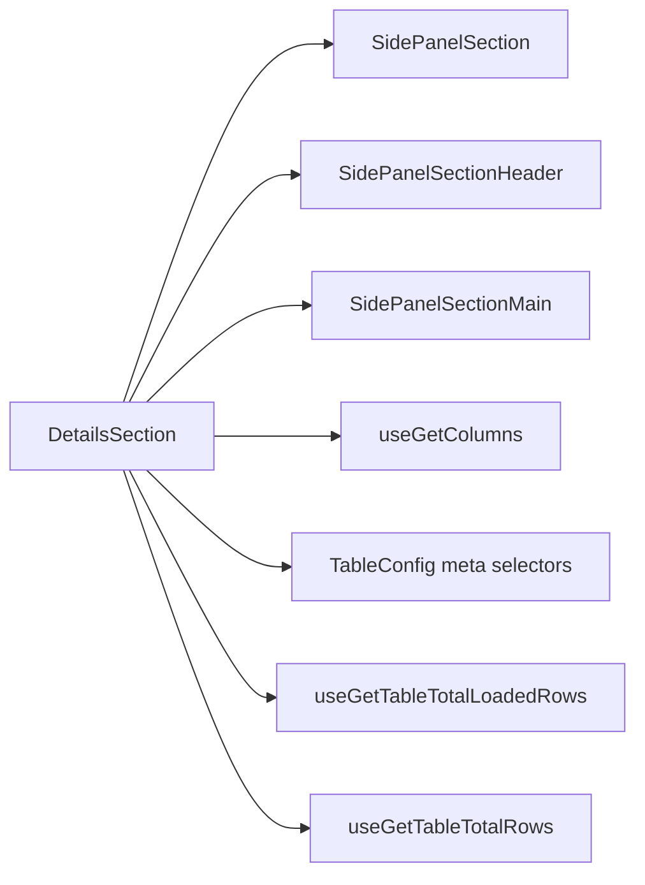
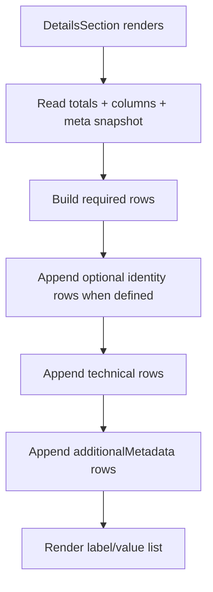

# DetailsSection Architecture

Read-only metadata view for the table settings drawer.
Shows core table metrics (total records, loaded rows, column count),
identity fields (title, table name, schema name), and optional technical/custom metadata.

## File Structure

```
DetailsSection/
├── index.ts                         → Barrel export
├── DetailsSection.component.tsx     → Metadata renderer
├── DetailsSection.types.ts          → DetailsRow type
├── DetailsSection.stylex.ts         → Label/value row styles
└── DetailsSection.test.tsx          → Required + optional rendering tests
```

## Dependencies



## Render Flow



## Row Groups

| Group            | Source                                          | Rules                                      |
| ---------------- | ----------------------------------------------- | ------------------------------------------ |
| Required metrics | data selectors + columns selector               | Always shown                               |
| Identity         | meta state (`title`, `tableName`, `schemaName`) | Shown only when defined                    |
| Technical        | meta state flags and numeric settings           | Always shown when value exists             |
| Custom metadata  | `additionalMetadata` map                        | `null`/`undefined` omitted, keys humanized |
