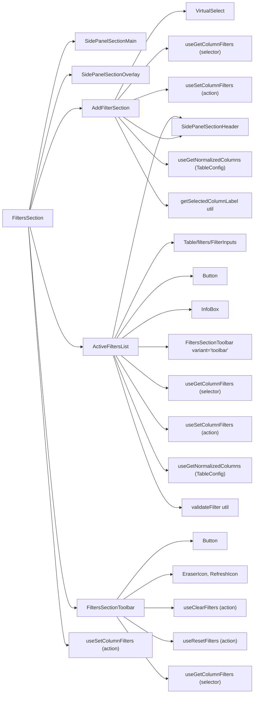
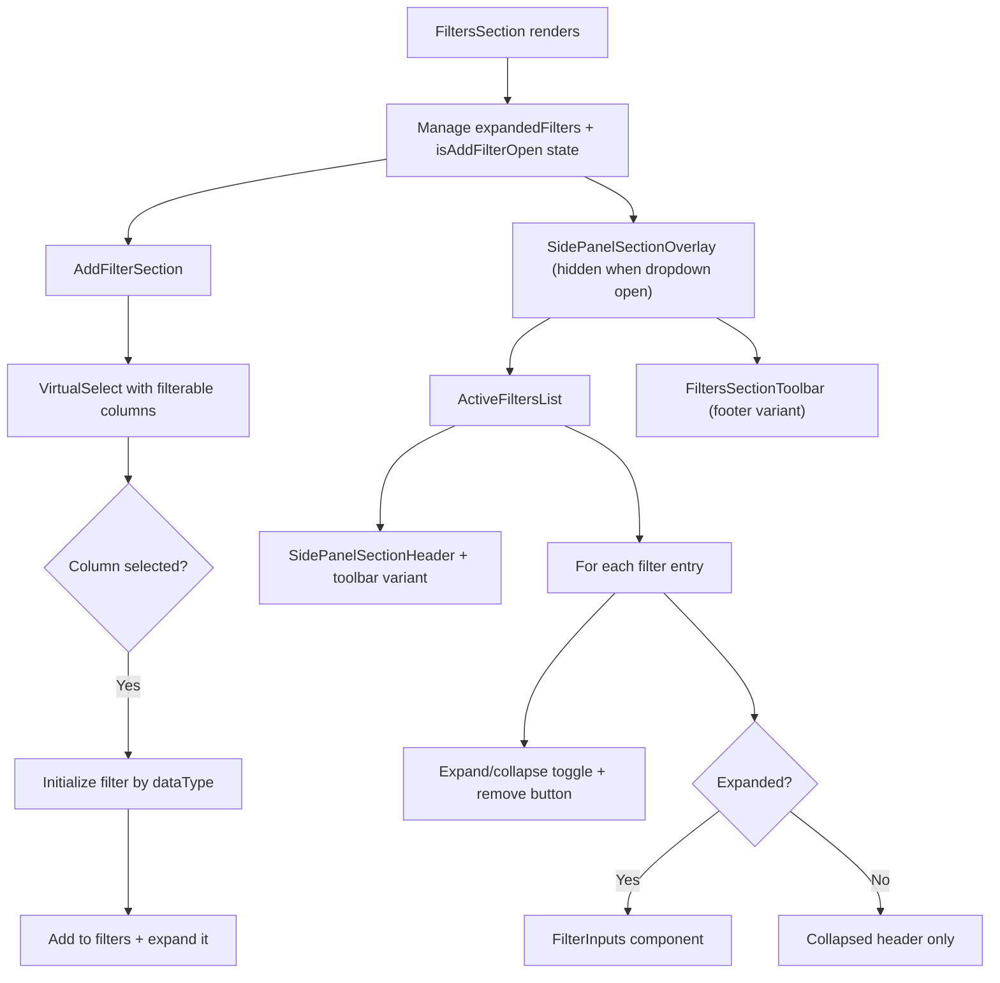

# FiltersSection Architecture

Multi-filter management with add/remove/expand/collapse and validation.
Orchestrates AddFilterSection, ActiveFiltersList, and FiltersSectionToolbar.

## File Structure

```
FiltersSection/
├── index.ts                            → Barrel export
├── FiltersSection.component.tsx         → Orchestrator: manages expandedFilters state
├── validateFilter.util.ts              → Filter validation by type/operator
│
├── AddFilterSection/                   → Dropdown to add new filters
│   ├── index.ts
│   ├── AddFilterSection.component.tsx   → VirtualSelect for column selection
│   ├── AddFilterSection.types.ts        → Props: expandedFilters + callbacks
│   ├── AddFilterSection.stylex.ts
│   └── utils/
│       ├── index.ts
│       └── getSelectedColumnLabel.util.ts → Label with "⚠️ (filtered)" suffix
│
├── ActiveFiltersList/                  → Expandable list of active filters
│   ├── index.ts
│   ├── ActiveFiltersList.component.tsx  → Filter items with expand/collapse + remove
│   ├── ActiveFiltersList.types.ts       → Props: expandedFilters + callbacks
│   └── ActiveFiltersList.stylex.ts
│
└── FiltersSectionToolbar/              → Clear/reset filter buttons
    ├── index.ts
    ├── FiltersSectionToolbar.component.tsx  → Dual-variant clear/reset buttons
    ├── FiltersSectionToolbar.types.ts      → { onClearAll?, variant? }
    └── FiltersSectionToolbar.stylex.ts
```

## Dependencies



## Render Flow



## Component Responsibilities

| Component               | Manages                     | Uses From Context                            |
| ----------------------- | --------------------------- | -------------------------------------------- |
| `FiltersSection`        | `expandedFilters`, `isOpen` | `useSetColumnFilters`                        |
| `AddFilterSection`      | Column selection dropdown   | `useGetColumnFilters`, `useSetColumnFilters` |
| `ActiveFiltersList`     | Expand/collapse, remove     | `useGetColumnFilters`, `useSetColumnFilters` |
| `FiltersSectionToolbar` | Clear/reset actions         | `useClearFilters`, `useResetFilters`         |

## Filter Validation (validateFilter.util.ts)

| Data Type     | Valid When                                          |
| ------------- | --------------------------------------------------- |
| `boolean`     | Always valid                                        |
| `date`        | Has value; "between" needs both values              |
| `select`      | Has at least one selection                          |
| `multiSelect` | Has at least one selection                          |
| `number`      | Has at least one value; "between" validates both    |
| `text`        | Some operators (equals, notEquals) don't need value |

## Toolbar Dual-Variant Pattern

| Variant     | Placement                | Button Style            | Labels?        |
| ----------- | ------------------------ | ----------------------- | -------------- |
| `'toolbar'` | ActiveFiltersList header | `ghost`, `mini`, `auto` | No (icon only) |
| `'footer'`  | Below filter list        | `outline`, `sm`, `full` | Yes            |

| Button        | Action                          | Disabled When    |
| ------------- | ------------------------------- | ---------------- |
| Clear Filters | `clearFilters()` + `onClearAll` | No filters exist |
| Reset Filters | `resetFilters()` (from table)   | Never            |
