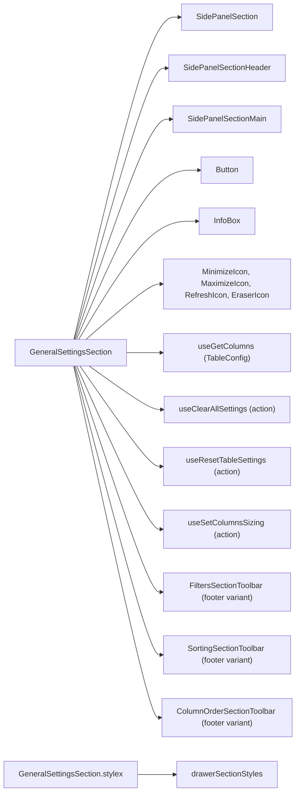
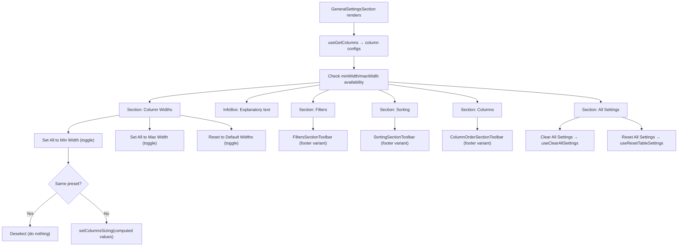
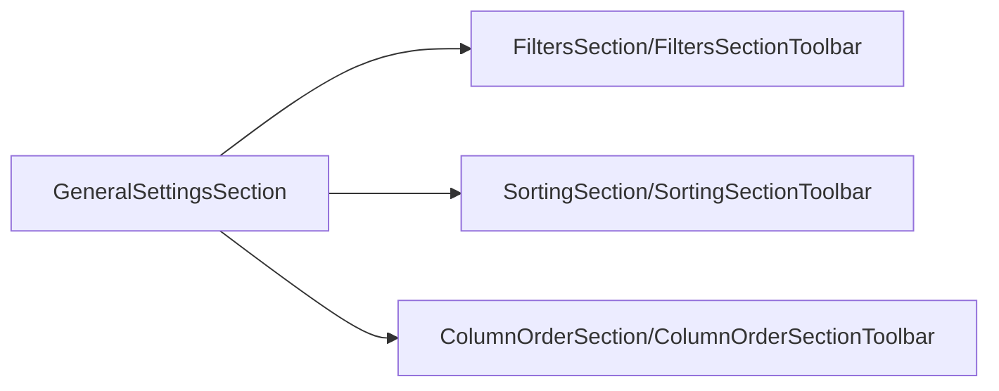

# GeneralSettingsSection Architecture

Centralized control panel with column width presets and quick access to
clear/reset actions from all other sections (Filters, Sorting, Columns).

## File Structure

```
GeneralSettingsSection/
├── index.ts                                → Barrel export
├── GeneralSettingsSection.component.tsx     → Width presets + section toolbars + all settings
├── GeneralSettingsSection.types.ts          → Props + WidthPreset type
└── GeneralSettingsSection.stylex.ts         → Section-specific styles
```

## Dependencies



## Render Flow



## Sections Rendered

| Section       | Header          | Controls                                           |
| ------------- | --------------- | -------------------------------------------------- |
| Column Widths | "Column Widths" | Set to Min, Set to Max, Reset to Default (toggles) |
| _(InfoBox)_   | —               | Explanatory text about presets                     |
| Filters       | "Filters"       | `FiltersSectionToolbar` (clear/reset filters)      |
| Sorting       | "Sorting"       | `SortingSectionToolbar` (sort/clear/reset sorting) |
| Columns       | "Columns"       | `ColumnOrderSectionToolbar` (order/clear/reset)    |
| All Settings  | "All Settings"  | Clear All Settings, Reset All Settings             |

## Local State

| State            | Type                                                       | Purpose                                              |
| ---------------- | ---------------------------------------------------------- | ---------------------------------------------------- |
| `selectedPreset` | `WidthPreset` (`'min' \| 'max' \| 'default' \| undefined`) | Track which width button is active (toggle behavior) |

## Cross-Section Toolbar Reuse

GeneralSettingsSection reuses toolbar components from other sections as footer variants:



All three are rendered without a `variant` prop, defaulting to `'footer'` (full-width buttons with labels).
