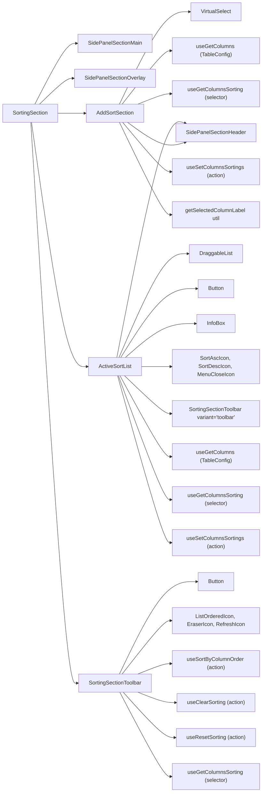
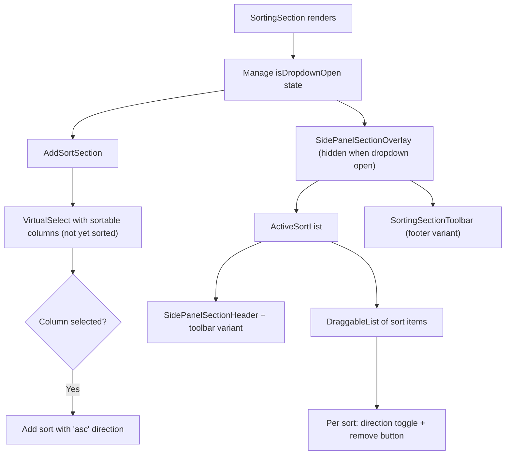

# SortingSection Architecture

Multi-sort management with add/remove/reorder and toolbar actions.
Orchestrates AddSortSection, ActiveSortList, and SortingSectionToolbar.

## File Structure

```
SortingSection/
├── index.ts                          → Barrel export
├── SortingSection.component.tsx       → Orchestrator: manages isDropdownOpen state
├── SortingSection.types.ts            → SortItem type
│
├── AddSortSection/                   → Dropdown to add new sort columns
│   ├── index.ts
│   ├── AddSortSection.component.tsx   → VirtualSelect for column selection
│   ├── AddSortSection.types.ts        → Props: onDropdownOpenChange
│   └── AddSortSection.stylex.ts
│
├── ActiveSortList/                   → Draggable list of active sorts
│   ├── index.ts
│   ├── ActiveSortList.component.tsx   → DraggableList with direction toggles
│   └── ActiveSortList.stylex.ts
│
├── SortingSectionToolbar/            → Sort actions toolbar
│   ├── index.ts
│   ├── SortingSectionToolbar.component.tsx  → Dual-variant sort actions
│   ├── SortingSectionToolbar.types.ts       → { variant? }
│   └── SortingSectionToolbar.stylex.ts
│
└── utils/
    ├── index.ts
    └── getSelectedColumnLabel.util.ts → Label for selected sortable column
```

## Dependencies



## Render Flow



## Component Responsibilities

| Component               | Manages                   | Uses From Context                                            |
| ----------------------- | ------------------------- | ------------------------------------------------------------ |
| `SortingSection`        | `isDropdownOpen`          | —                                                            |
| `AddSortSection`        | Column selection dropdown | `useGetColumnsSorting`, `useSetColumnsSortings`              |
| `ActiveSortList`        | Drag-reorder, remove      | `useGetColumnsSorting`, `useSetColumnsSortings`              |
| `SortingSectionToolbar` | Sort/clear/reset actions  | `useSortByColumnOrder`, `useClearSorting`, `useResetSorting` |

## Toolbar Dual-Variant Pattern

| Variant     | Placement             | Button Style            | Labels?        |
| ----------- | --------------------- | ----------------------- | -------------- |
| `'toolbar'` | ActiveSortList header | `ghost`, `mini`, `auto` | No (icon only) |
| `'footer'`  | Below sort list       | `outline`, `sm`, `full` | Yes            |

| Button               | Action                        | Disabled When     |
| -------------------- | ----------------------------- | ----------------- |
| Sort by Column Order | `sortByColumnOrder()`         | Never             |
| Clear Sorting        | `clearSorting()`              | No sorting exists |
| Reset Sorting        | `resetSorting()` (from table) | Never             |
