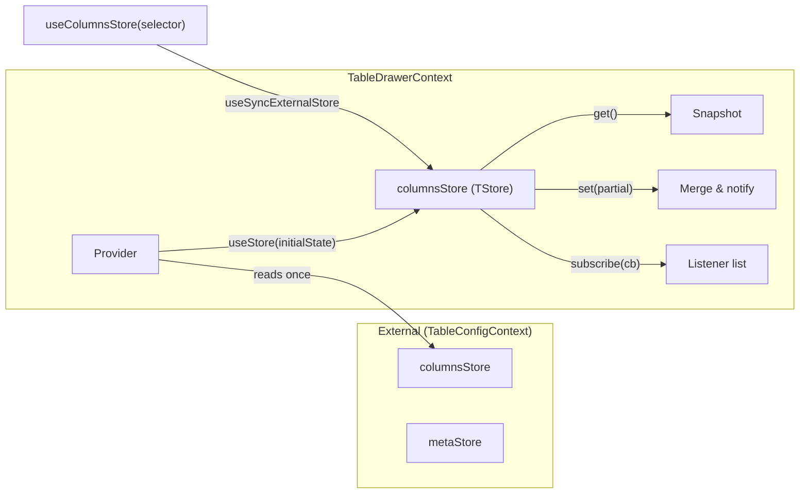
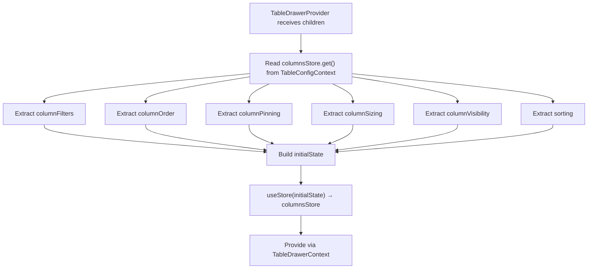

# TableDrawerContext Architecture

Store-based context that manages local table settings state within the drawer.
Changes are held locally until the user explicitly accepts or cancels.

## File Structure

```
TableDrawerContext/
├── TableDrawerContext.context.ts           → createContext with empty initial store
├── TableDrawerContext.provider.tsx          → Provider: reads table state → creates store
├── TableDrawerContext.types.ts             → TableDrawerColumnsState, ContextValue
├── useTableDrawerContextValue.hook.ts      → use(TableDrawerContext)
├── useColumnsStore.hook.ts                 → useSyncExternalStore + selector
│
├── actions/                                → 17 hooks that write to the store
│   ├── buildBatchTableSettingsUpdate.util.ts → Normalize drawer snapshot into the table batch-update payload
│   ├── useBatchSetTableDrawerSettings      → Push all drawer state to table
│   ├── useClearAllSettings                 → Clear all fields
│   ├── useClearColumnOrderSection          → Clear visibility + pinning
│   ├── useClearFilters                     → Clear all filters
│   ├── useClearSorting                     → Clear all sorting
│   ├── useOrderColumnsBySorting            → Reorder columns by current sorting
│   ├── useResetColumnOrderAndVisibility    → Reset order + visibility from table
│   ├── useResetFilters                     → Reset filters from table
│   ├── useResetSorting                     → Reset sorting from table
│   ├── useResetTableSettings               → Reset all from table
│   ├── useSetColumnFilters                 → Set filters object
│   ├── useSetColumnPinning                 → Set pinning state
│   ├── useSetColumnsOrder                  → Set column order array
│   ├── useSetColumnsSizing                 → Set column widths
│   ├── useSetColumnsSortings               → Set sorting array
│   ├── useSetColumnsVisibility             → Set visibility set
│   └── useSortByColumnOrder                → Create sorts from column order
│
└── selectors/                              → 5 hooks that read from the store
    ├── useGetColumnFilters
    ├── useGetColumnOrder
    ├── useGetColumnPinning
    ├── useGetColumnsSorting
    └── useGetColumnVisibility
```

## Store Pattern



The `useStore` hook (from `@/hooks`) creates a store with `get`, `set`, `subscribe`, and
`getServerSnapshot`. The store holds a flat object; `set()` does a shallow merge
(`{ ...prev, ...partial }`), then notifies all subscribers.

## State Shape

```typescript
TableDrawerColumnsState<TData> = Pick<
  TableColumnsState<TData>,
  | 'columnFilters' // Record<string, ColumnFilter>
  | 'columnOrder' // string[]
  | 'columnPinning' // { left: string[], right: string[] }
  | 'columnSizing' // Record<string, number>
  | 'columnVisibility' // Set<string> (hidden columns)
  | 'sorting' // SortingState[]
>;
```

## Provider Initialization



## Actions

Actions are hooks that return a callback. Each callback reads the store and
calls `columnsStore.set(partial)`.

| Hook                               | Reads From           | Writes To      | Side Effect                                                            |
| ---------------------------------- | -------------------- | -------------- | ---------------------------------------------------------------------- |
| `useSetColumnFilters`              | —                    | `columnsStore` | —                                                                      |
| `useSetColumnsOrder`               | —                    | `columnsStore` | —                                                                      |
| `useSetColumnsSortings`            | —                    | `columnsStore` | —                                                                      |
| `useSetColumnPinning`              | —                    | `columnsStore` | —                                                                      |
| `useSetColumnsSizing`              | —                    | `columnsStore` | —                                                                      |
| `useSetColumnsVisibility`          | —                    | `columnsStore` | —                                                                      |
| `useClearFilters`                  | —                    | `columnsStore` | Sets `columnFilters` to `{}`                                           |
| `useClearSorting`                  | —                    | `columnsStore` | Sets `sorting` to `[]`                                                 |
| `useClearColumnOrderSection`       | —                    | `columnsStore` | Clears visibility + pinning                                            |
| `useClearAllSettings`              | —                    | `columnsStore` | Clears all fields                                                      |
| `useResetFilters`                  | `TableConfigContext` | `columnsStore` | Restores filters from table                                            |
| `useResetSorting`                  | `TableConfigContext` | `columnsStore` | Restores sorting from table                                            |
| `useResetColumnOrderAndVisibility` | `TableConfigContext` | `columnsStore` | Restores order + visibility from table                                 |
| `useResetTableSettings`            | `TableConfigContext` | `columnsStore` | Restores all fields from table                                         |
| `useOrderColumnsBySorting`         | `columnsStore`       | `columnsStore` | Reorders columns by current sorting                                    |
| `useSortByColumnOrder`             | `columnsStore`       | `columnsStore` | Creates asc sorts from column order                                    |
| `useBatchSetTableDrawerSettings`   | `columnsStore`       | `TableConfig`  | Pushes all drawer state to table via `buildBatchTableSettingsUpdate()` |

## Selectors

| Hook                     | Returns              | Description                       |
| ------------------------ | -------------------- | --------------------------------- |
| `useGetColumnFilters`    | `ColumnFilters`      | Current filter map                |
| `useGetColumnOrder`      | `ColumnOrderState`   | Current column order array        |
| `useGetColumnPinning`    | `ColumnPinningState` | Current pinning `{ left, right }` |
| `useGetColumnsSorting`   | `SortingState[]`     | Current sorting array             |
| `useGetColumnVisibility` | `Set<string>`        | Set of hidden column keys         |
