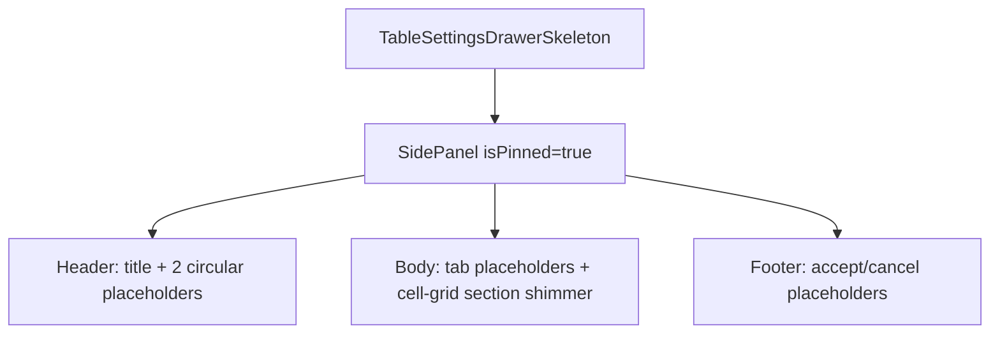

# TableSettingsDrawerSkeleton Architecture

Pinned loading shell for the table settings drawer. Used only while the table
is in its loading fallback and the persisted UI state says the table settings
drawer was open and pinned.

## File Structure

```
TableSettingsDrawerSkeleton/
├── TableSettingsDrawerSkeleton.component.tsx   → Pinned SidePanel skeleton shell
├── TableSettingsDrawerSkeleton.stylex.ts       → Shimmer layout styles using shared skeleton tokens
├── TableSettingsDrawerSkeleton.test.tsx        → Unit test for pinned shell rendering
└── index.ts                                    → Barrel export
```

## Render Flow



## Notes

- Uses the shared `skeleton.placeholderBar` and `skeleton.shimmerWave` tokens.
- Middle section is rendered as a table-like header+rows cell grid so shimmer
  aligns visually with the main table loading behavior.
- Keeps the real drawer width and pinned layout stable during refresh.
- Does not mount `TableDrawerProvider` or section logic while loading.
