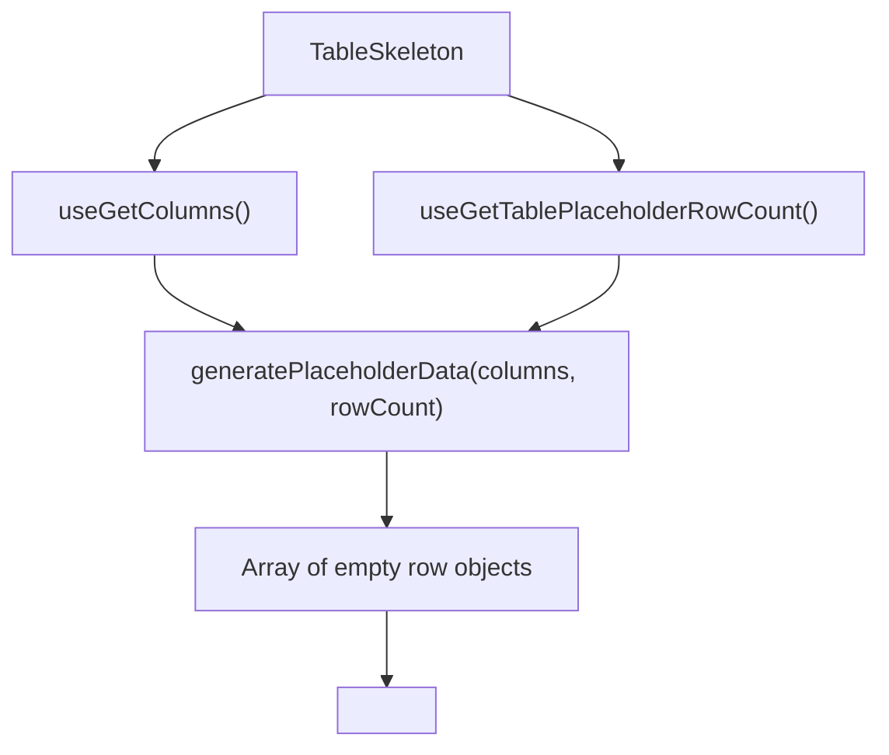

# TableSkeleton Architecture

Loading placeholder that renders a full table with empty rows while
data is being fetched inside the Suspense boundary.

## File Structure

```
TableSkeleton/
├── TableSkeleton.component.tsx   → Generates placeholder data → renders Table
├── TableSkeleton.types.ts        → SkeletonResponse type
└── index.ts                      → Barrel export
```

## How It Works



Reuses the actual `Table` component with `isLoading=true`, which triggers
shimmer overlays in `TableBodyCell` and `TableHeaderCell`.

## Context Dependencies

| Selector                         | Purpose                     |
| -------------------------------- | --------------------------- |
| `useGetColumns`                  | Column definitions for keys |
| `useGetTablePlaceholderRowCount` | Number of skeleton rows     |
