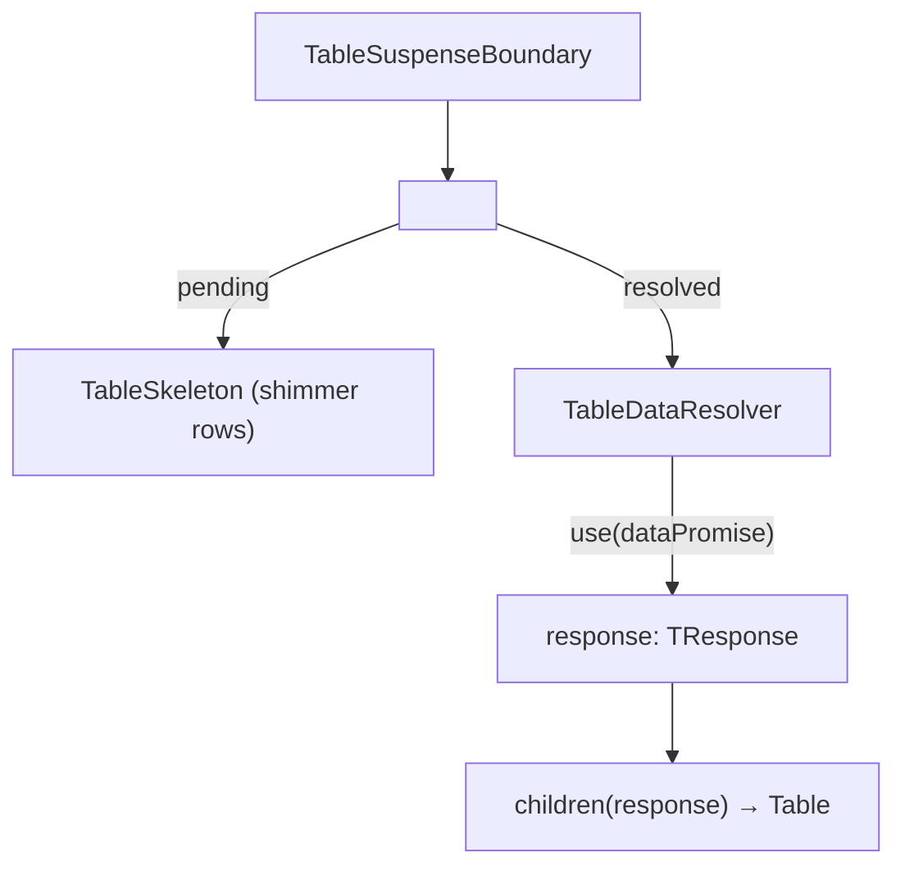

# TableSuspenseBoundary Architecture

Wraps the data-fetching layer in React `<Suspense>` with a `TableSkeleton`
fallback. Delegates promise resolution to `TableDataResolver`.

## File Structure

```
TableSuspenseBoundary/
├── TableSuspenseBoundary.component.tsx   → <Suspense fallback={TableSkeleton}>
├── TableSuspenseBoundary.test.tsx        → Unit tests for fallback and resolved render states
├── TableSuspenseBoundary.types.ts        → Props (dataPromise, children render fn)
└── index.ts                              → Barrel export
```

## Render Flow



## Props

| Prop          | Type                                 | Description                        |
| ------------- | ------------------------------------ | ---------------------------------- |
| `dataPromise` | `Promise<TResponse>`                 | Promise resolved via `use()`       |
| `children`    | `(response: TResponse) => ReactNode` | Render function with resolved data |

## Key Behavior

The `key={suspenseKey}` on this component (set by `TableLayout`) controls
when the Suspense boundary remounts. Changing the key discards the old
promise and triggers the skeleton fallback again — without destroying
the `TableConfigProvider` or `FiltersDataProvider` above it.
