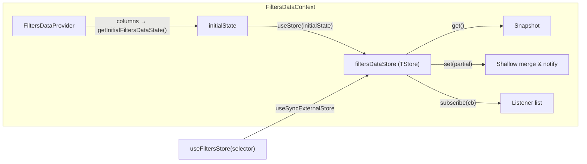
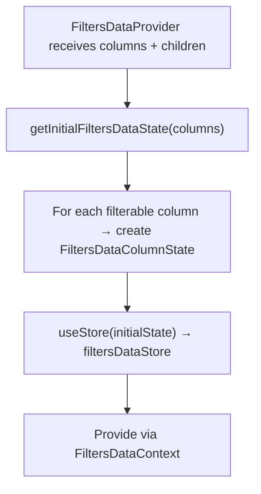

# FiltersData Context Architecture

Manages filter lookup data per column. Placed **above** the Suspense boundary so
dropdown options survive loading transitions when the table re-fetches.

## File Structure

```
FiltersData/
├── FiltersDataContext.context.ts            → createContext (undefined default)
├── FiltersDataContext.provider.tsx           → Provider: builds store from columns
├── FiltersDataContext.types.ts              → FiltersDataState, ContextValue
├── useFiltersDataContextValue.hook.ts       → use(FiltersDataContext) with guard
├── index.ts                                 → Barrel: FiltersDataProvider
│
└── filters/
    ├── useFiltersStore.hook.ts              → useSyncExternalStore + selector
    │
    ├── actions/
    │   ├── useFetchFilterData.hook.ts        → Lightweight orchestrator that composes initial + paginated fetch actions
    │   ├── useFetchInitialFilterData.hook.ts → Initial filter options load + optional prefetch trigger
    │   └── useFetchMoreFilterData.hook.ts    → Paginated filter options append + cache/prefetch handling
    │
    ├── selectors/
    │   └── useGetFilterData.hook.ts         → Read filter data for a column
    │
    └── utils/
        └── getInitialFiltersDataState.util.ts → Build initial per-column state
```

## Store Pattern



## State Shape

```typescript
// Per-column filter data
FiltersDataColumnState = {
  data: unknown[];       // Available filter options
  hasMore: boolean;      // More pages available
  isLoading: boolean;    // Currently fetching
  isLoadingMore: boolean; // Fetching next page
  searchText: string;    // Current search filter
};

// Top-level state: keyed by column accessor
FiltersDataState = Record<string, FiltersDataColumnState>;
```

## Provider Initialization



## Actions

| Hook                        | Reads From         | Writes To          | Description                                                                       |
| --------------------------- | ------------------ | ------------------ | --------------------------------------------------------------------------------- |
| `useFetchFilterData`        | `filtersDataStore` | `filtersDataStore` | Composes and returns the initial and paginated filter data actions for one column |
| `useFetchInitialFilterData` | `filtersDataStore` | `filtersDataStore` | Loads the first page, computes `hasMore`, and optionally triggers prefetch        |
| `useFetchMoreFilterData`    | `filtersDataStore` | `filtersDataStore` | Appends next page from cache/network, updates totals, and optionally prefetches   |

## Selectors

| Hook               | Returns                  | Description                               |
| ------------------ | ------------------------ | ----------------------------------------- |
| `useGetFilterData` | `FiltersDataColumnState` | Returns filter data for a specific column |
