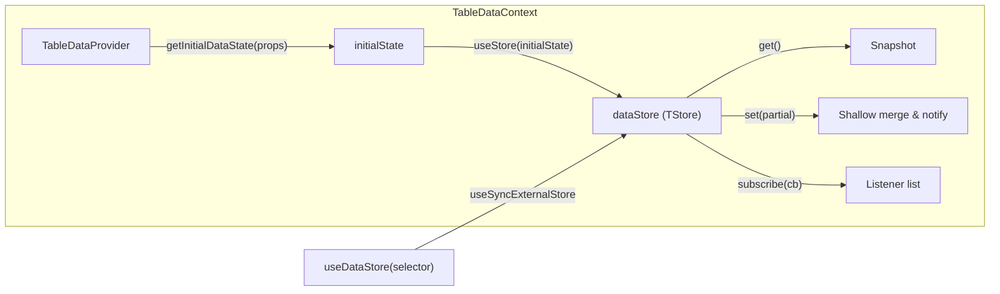
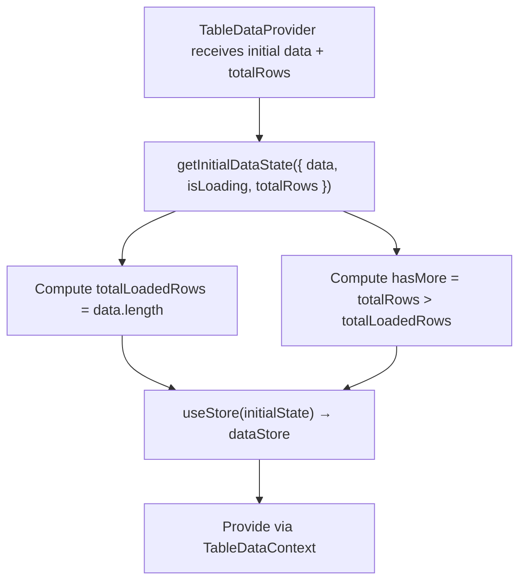

# TableData Context Architecture

Manages the actual table row data, loading states, and pagination. Lives inside
the Suspense boundary so loading/error states are handled by React transitions.

## File Structure

```
TableData/
├── TableDataContext.context.ts              → createContext (undefined default)
├── TableDataContext.provider.tsx             → Provider: creates store from initial data
├── TableDataContext.types.ts                → TableDataState, ContextValue
├── index.ts                                 → Barrel: TableDataProvider, hooks
│
├── data/
│   ├── useDataStore.hook.ts                 → useSyncExternalStore + selector
│   ├── useTableDataContextValue.hook.ts     → use(TableDataContext) with guard
│   │
│   ├── actions/
│   │   └── useFetchMoreData.hook.ts         → Fetch next page of table data
│   │
│   └── selectors/
│       ├── useGetTableData.hook.ts          → Full data array
│       ├── useGetTableHasMore.hook.ts       → Whether more pages exist
│       ├── useGetTableIsLoading.hook.ts     → Initial loading state
│       └── useGetTableIsLoadingMore.hook.ts → Pagination loading state
│
└── utils/
    ├── getInitialDataState.util.ts          → Build initial state with derived fields
    └── index.ts                             → Barrel: utils
```

## Store Pattern



## State Shape

```typescript
TableDataState<TData> = {
  data: TData[];           // Current loaded rows
  hasMore: boolean;        // More pages available (derived: totalRows > totalLoadedRows)
  isLoading: boolean;      // Initial fetch in progress
  isLoadingMore: boolean;  // Subsequent page fetch in progress
  totalLoadedRows: number; // data.length (derived)
  totalRows: number;       // Total row count from server
};
```

## Provider Initialization



## Actions

| Hook               | Reads From               | Writes To   | Description                                                                                       |
| ------------------ | ------------------------ | ----------- | ------------------------------------------------------------------------------------------------- |
| `useFetchMoreData` | `dataStore`, `metaStore` | `dataStore` | Appends next page; configurable page size; opt-in prefetch buffer; direct `dataStore.set()` calls |

### Prefetch Buffer (ADR-006)

When `enablePrefetch` is true in `metaStore`, `useFetchMoreData` silently fetches the next page
after each load-more completes using the shared `firePrefetch` utility from `@/utils/prefetch`.
On the next scroll trigger, cached data is consumed via `resolveFromCacheOrFetch` — instantly (cache hit)
or by awaiting the in-flight request (cache in-flight). Stale cache is automatically invalidated when
sort/filter changes reset data (skip mismatch → cache miss).

```
Scroll trigger
  ├─ prefetchRef.skip matches? ──► YES: data exists? ──► HIT (instant)
  │                                                   └──► IN-FLIGHT (await promise)
  └─ NO: MISS ──► normal onLoadMore() call

After fetch:
  └─ enablePrefetch && hasMore? ──► fire background onLoadMore() ──► store in prefetchRef
```

## Selectors

| Hook                       | Returns   | Description                       |
| -------------------------- | --------- | --------------------------------- |
| `useGetTableData`          | `TData[]` | Full array of loaded rows         |
| `useGetTableHasMore`       | `boolean` | Whether more pages can be fetched |
| `useGetTableIsLoading`     | `boolean` | Initial loading state             |
| `useGetTableIsLoadingMore` | `boolean` | Pagination loading state          |
