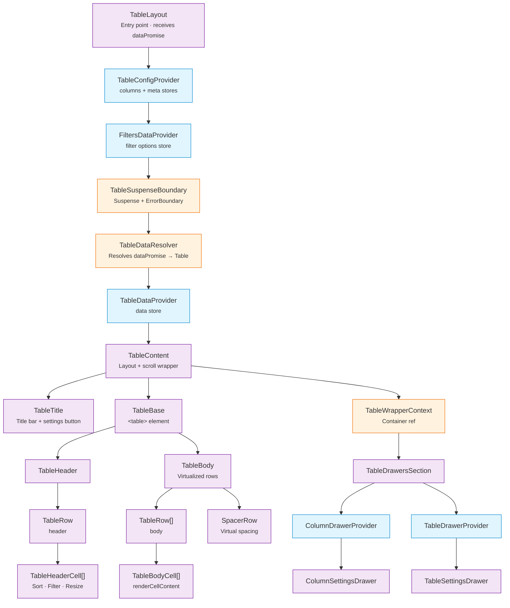

# Table Component Hierarchy

```mermaid
graph TD
    TL["TableLayout<br/><small>Entry point · receives dataPromise</small>"]
    TCP["TableConfigProvider<br/><small>columns + meta stores</small>"]
    FDP["FiltersDataProvider<br/><small>filter options store</small>"]
    TSB["TableSuspenseBoundary<br/><small>Suspense + ErrorBoundary</small>"]
    TDR["TableDataResolver<br/><small>Resolves dataPromise → Table</small>"]
    TDP["TableDataProvider<br/><small>data store</small>"]
    TC["TableContent<br/><small>Layout + scroll wrapper</small>"]
    TT["TableTitle<br/><small>Title bar + settings button</small>"]
    TB2["TableBase<br/><small>&lt;table&gt; element</small>"]
    TH["TableHeader"]
    TBody["TableBody<br/><small>Virtualized rows</small>"]
    THC["TableHeaderCell[]<br/><small>Sort · Filter · Resize</small>"]
    TR_H["TableRow<br/><small>header</small>"]
    TR_B["TableRow[]<br/><small>body</small>"]
    TBC["TableBodyCell[]<br/><small>renderCellContent</small>"]
    SR["SpacerRow<br/><small>Virtual spacing</small>"]
    TWC["TableWrapperContext<br/><small>Container ref</small>"]
    TDS["TableDrawersSection"]
    CDP["ColumnDrawerProvider"]
    CSD["ColumnSettingsDrawer"]
    TDP2["TableDrawerProvider"]
    TSD["TableSettingsDrawer"]

    TL --> TCP --> FDP --> TSB --> TDR --> TDP --> TC
    TC --> TT
    TC --> TB2
    TC --> TWC --> TDS
    TB2 --> TH --> TR_H --> THC
    TB2 --> TBody --> SR
    TBody --> TR_B --> TBC
    TDS --> CDP --> CSD
    TDS --> TDP2 --> TSD

    classDef provider fill:#e1f5fe,stroke:#0288d1
    classDef component fill:#f3e5f5,stroke:#7b1fa2
    classDef wrapper fill:#fff3e0,stroke:#ef6c00

    class TCP,FDP,TDP,CDP,TDP2 provider
    class TL,TC,TT,TB2,TH,TBody,THC,TR_H,TR_B,TBC,SR,TDS,CSD,TSD component
    class TSB,TDR,TWC wrapper
```

## Legend

- 🔵 **Blue** — Context Providers
- 🟣 **Purple** — Components
- 🟠 **Orange** — Wrappers (Suspense, Resolver, Ref context)
