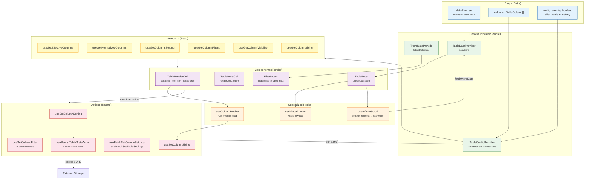

# Table Data Flow — Props → Providers → Selectors → Components → Actions

## Legend

- 🔵 **Blue** — Props (entry data)
- 🟢 **Green** — Context Providers (write layer)
- 🟡 **Yellow** — Selectors (read layer)
- 🔴 **Red** — Actions (mutation layer)
- 🟣 **Purple** — Components (render layer)
- 🟠 **Orange** — Specialized Hooks
