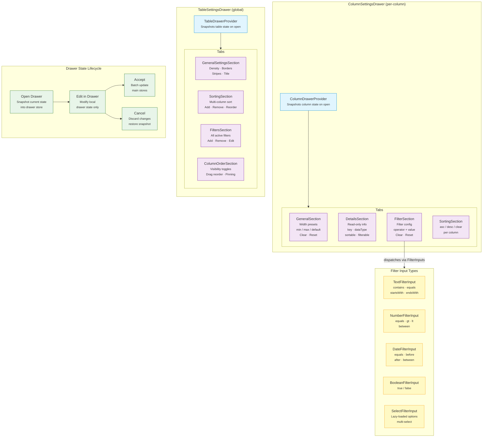

# Drawer Architecture — Column Settings + Table Settings + Filter Types

## Legend

- 🔵 **Blue** — Drawer Providers
- 🟣 **Purple** — Drawer Tabs/Sections
- 🟢 **Green** — Lifecycle States
- 🟡 **Yellow** — Filter Input Types
