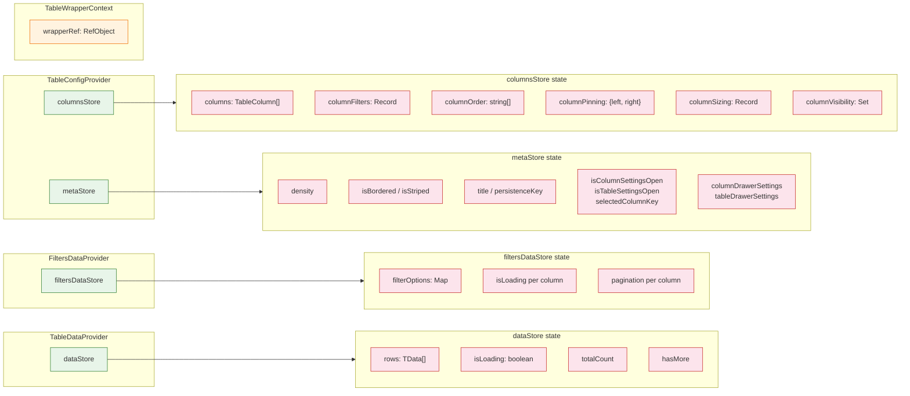

# Table State Management — 4 Context Stores

```mermaid
graph LR
    subgraph TableConfigProvider
        direction TB
        CS["columnsStore"]
        MS["metaStore"]
    end

    subgraph columnsStore["columnsStore state"]
        direction TB
        cols["columns: TableColumn[]"]
        cf["columnFilters: Record"]
        co["columnOrder: string[]"]
        cp["columnPinning: {left, right}"]
        csz["columnSizing: Record"]
        cv["columnVisibility: Set"]
    end

    subgraph metaStore["metaStore state"]
        direction TB
        density["density"]
        bordered["isBordered / isStriped"]
        title["title / persistenceKey"]
        uiState["isColumnSettingsOpen<br/>isTableSettingsOpen<br/>selectedColumnKey"]
        drawerState["columnDrawerSettings<br/>tableDrawerSettings"]
    end

    subgraph FiltersDataProvider
        FDS["filtersDataStore"]
    end

    subgraph filtersState["filtersDataStore state"]
        fOpts["filterOptions: Map"]
        fLoading["isLoading per column"]
        fPagination["pagination per column"]
    end

    subgraph TableDataProvider
        DS["dataStore"]
    end

    subgraph dataState["dataStore state"]
        rows["rows: TData[]"]
        loading["isLoading: boolean"]
        totalCount["totalCount"]
        hasMore["hasMore"]
    end

    subgraph TableWrapperContext
        WR["wrapperRef: RefObject"]
    end

    CS --> columnsStore
    MS --> metaStore
    FDS --> filtersState
    DS --> dataState

    classDef store fill:#e8f5e9,stroke:#2e7d32
    classDef state fill:#fce4ec,stroke:#c62828
    classDef ref fill:#fff3e0,stroke:#ef6c00

    class CS,MS,FDS,DS store
    class cols,cf,co,cp,csz,cv,density,bordered,title,uiState,drawerState,fOpts,fLoading,fPagination,rows,loading,totalCount,hasMore state
    class WR ref
```

## Legend

- 🟢 **Green** — Stores
- 🔴 **Red** — State slices
- 🟠 **Orange** — Ref values
