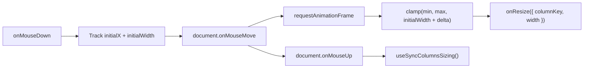
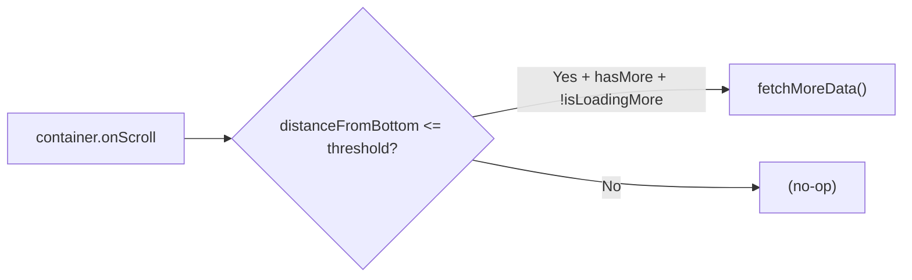
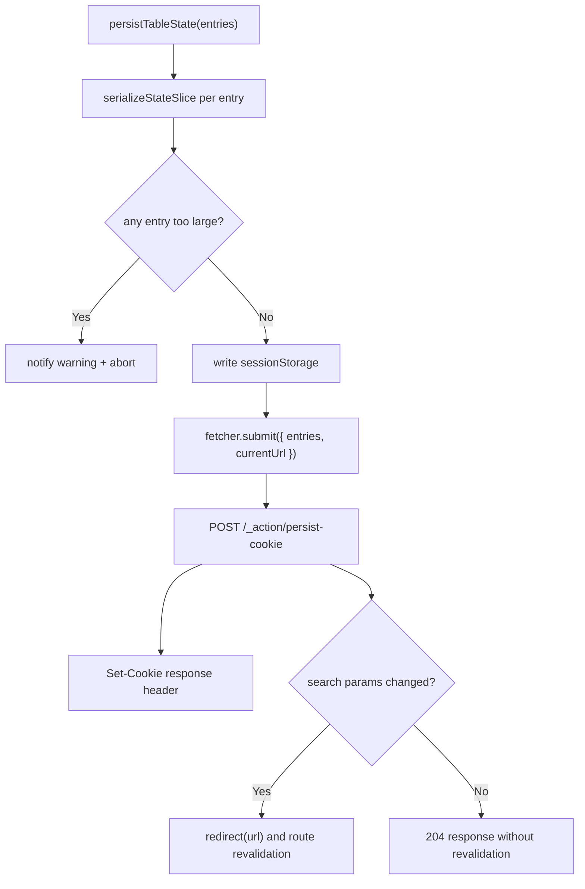

# hooks/ Architecture

Table-specific hooks for column resizing, infinite scroll, and state persistence.

## File Structure

```
hooks/
├── useColumnResize.hook.ts              → RAF-throttled drag resize
├── useInfiniteScroll.hook.ts            → Scroll threshold detection
├── usePersistCookieAction.hook.ts       → Server action cookie persistence for column state
└── index.ts                             → Barrel export
```

## useColumnResize

RAF-throttled mouse drag handler for column width adjustment.



| Feature              | Detail                                 |
| -------------------- | -------------------------------------- |
| Throttling           | `requestAnimationFrame` per move event |
| Constraints          | `minWidth` / `maxWidth` clamping       |
| Double-click         | Resets column to auto width            |
| Selection prevention | Disables text selection during drag    |
| Cleanup              | Global mouse listeners on document     |

## useInfiniteScroll

Monitors a scroll container and triggers data fetching when near bottom.



| Param                       | Purpose                               |
| --------------------------- | ------------------------------------- |
| `scrollContainerRef`        | Element to watch scroll events on     |
| `threshold`                 | Pixel distance from bottom to trigger |
| `hasMore` / `isLoadingMore` | Guard against duplicate fetches       |
| `fetchMoreData`             | Async function to append next page    |

Table state hydration is now handled by route `clientLoader`s and passed into
`TableLayout` as initial state. Keep new loader-seeded merge logic in the
TableConfig utils layer rather than adding post-mount effects back into hooks.
| Guard | No-op when persistenceKey is empty |

## usePersistTableStateAction

Persists column-oriented table state slices through the dual-channel flow: write
sessionStorage immediately, then submit the cookie update through a React Router
server action.



Supports both single entries and batch submissions. Each entry specifies:

- `persistenceKey` — cookie name namespace
- `slice` — which state slice (columnFilters, sorting, etc.)
- `valueSlice` — the data to persist
- `searchParamKey/Value` — optional URL search param sync
- Revalidation happens only when persisted `searchParamKey/Value` produce an
  effective URL search-param change; otherwise the action returns `204` and
  only cookie/session persistence occurs.
- Oversized entries block the entire apply flow before sessionStorage, URL sync, or cookie persistence to avoid partial restored state
