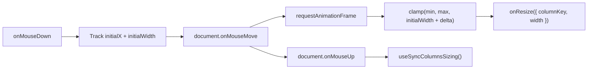
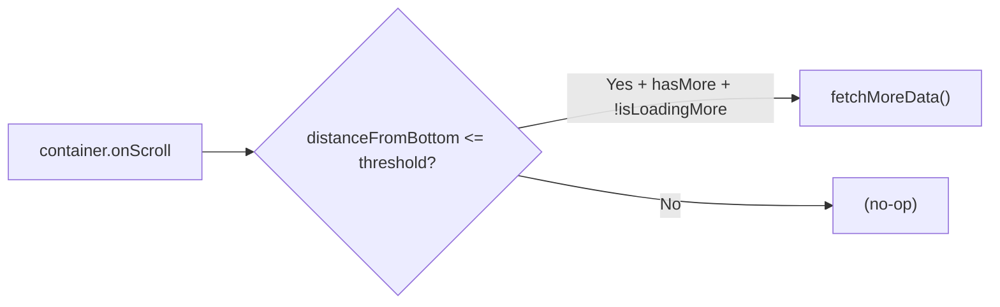
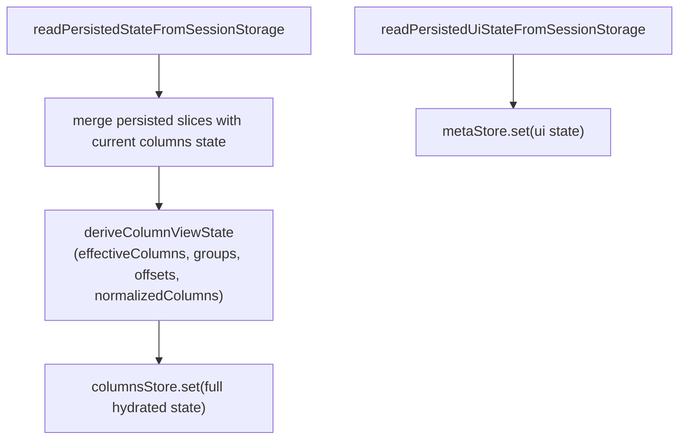
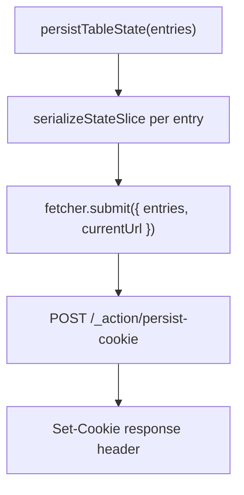

# hooks/ Architecture

Table-specific hooks for column resizing, infinite scroll, and state persistence.

## File Structure

```
hooks/
├── persistCookieAction.constants.ts   → Cookie persistence action route constant
├── useColumnResize.hook.ts          → RAF-throttled drag resize
├── useHydrateTableSessionState.hook.ts → Restores tab-scoped table + UI state after mount
├── useInfiniteScroll.hook.ts        → Scroll threshold detection
├── usePersistCookieAction.hook.ts   → Server action cookie persistence
└── index.ts                         → Barrel export
```

## useColumnResize

RAF-throttled mouse drag handler for column width adjustment.



| Feature              | Detail                                 |
| -------------------- | -------------------------------------- |
| Throttling           | `requestAnimationFrame` per move event |
| Constraints          | `minWidth` / `maxWidth` clamping       |
| Double-click         | Resets column to auto width            |
| Selection prevention | Disables text selection during drag    |
| Cleanup              | Global mouse listeners on document     |

## useInfiniteScroll

Monitors a scroll container and triggers data fetching when near bottom.



| Param                       | Purpose                               |
| --------------------------- | ------------------------------------- |
| `scrollContainerRef`        | Element to watch scroll events on     |
| `threshold`                 | Pixel distance from bottom to trigger |
| `hasMore` / `isLoadingMore` | Guard against duplicate fetches       |
| `fetchMoreData`             | Async function to append next page    |

## useHydrateTableSessionState

Restores tab-scoped session state after mount and recomputes derived column slices
before committing to the main columns store.



| Behavior          | Detail                                                                          |
| ----------------- | ------------------------------------------------------------------------------- |
| Scope             | Runs once after mount inside TableConfigProvider                                |
| Restored slices   | sorting, filters, order, pinning, sizing, visibility                            |
| Derived recompute | Rebuilds effectiveColumns, columnGroups, pinnedColumnOffsets, normalizedColumns |
| Static keys       | Recomputes staticKeys from current columns                                      |
| Guard             | No-op when persistenceKey is empty                                              |

## usePersistTableStateAction

Persists table state slices to cookies via a server action (React Router `useFetcher`).



Supports both single entries and batch submissions. Each entry specifies:

- `persistenceKey` — cookie name namespace
- `slice` — which state slice (columnFilters, sorting, etc.)
- `valueSlice` — the data to persist
- `searchParamKey/Value` — optional URL search param sync
