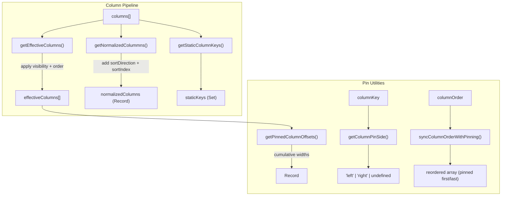

# utils/ Architecture

Pure utility functions for column processing and state persistence.

## File Structure

```
utils/
├── getColumnPinSide.util.ts             → Detect which side a column is pinned to
├── getEffectiveColumns.util.ts          → Apply visibility + order + pinning
├── getNormalizedColummns.util.ts         → Enrich columns with sort metadata
├── getPinnedColumnOffsets.util.ts        → Compute sticky offsets for pinned columns
├── getStaticColumnKeys.util.ts          → Extract non-reorderable column keys
├── getStorageKey.util.ts                → Build namespaced storage key
├── readPersistedStateFromCookie.util.ts  → SSR-safe cookie state read
├── serializeStateSlice.util.ts          → JSON serialize a state slice
├── splitColumnsByPinning.util.ts        → Split columns into left/center/right groups
├── syncColumnOrderWithPinning.util.ts    → Pin-aware column reordering
├── writeStateSlice.util.ts              → Write to cookie/localStorage
├── persistence.constants.ts             → Storage key constants
├── persistence.types.ts                 → Persistence config types
└── index.ts                             → Barrel export
```

## Column Utilities



| Function                     | Input                      | Output                          | Purpose                                                                              |
| ---------------------------- | -------------------------- | ------------------------------- | ------------------------------------------------------------------------------------ |
| `getEffectiveColumns`        | columns, order, visibility | `TableColumn[]`                 | Visible columns in display order; pinned columns follow the reconciled display order |
| `getNormalizedColummns`      | columns, sorting           | `NormalizedColumnsState`        | Columns enriched with sort metadata                                                  |
| `getStaticColumnKeys`        | columns                    | `Set<string>`                   | Keys of locked/static columns                                                        |
| `getPinnedColumnOffsets`     | pinning, sizing, columns   | `Record<key, PinnedColumnInfo>` | Sticky positions for pinned columns                                                  |
| `getColumnPinSide`           | columnKey, pinning         | `PinSide \| undefined`          | Which side a column is pinned to                                                     |
| `splitColumnsByPinning`      | pinning, effectiveColumns  | `ColumnGroupsState`             | Split columns into left/center/right                                                 |
| `syncColumnOrderWithPinning` | order, pinning             | `string[]`                      | Reorder to keep pinned columns grouped and keep the order slice in sync              |

`getPinnedColumnOffsets` computes offsets and boundary markers (`isLastPinnedLeft`, `isFirstPinnedRight`) from effective column order so shadow boundaries stay aligned with rendered sticky positions even if pinning arrays are out of order.

## Persistence Utilities

```mermaid
graph LR
  subgraph "Read"
    Cookie["document.cookie / request headers"] --> Read["readPersistedStateFromCookie()"]
    Read --> State["{ columnFilters, sorting, columnOrder, ... }"]
  end

  subgraph "Write"
    Slice["state slice"] --> Serialize["serializeStateSlice()"]
    Serialize --> KV["{ key, value }"]
    KV --> Write["writeStateSlice()"]
    Write --> Storage["cookie or localStorage"]
  end
```

| Function                       | Purpose                                       |
| ------------------------------ | --------------------------------------------- |
| `readPersistedStateFromCookie` | Parse persisted state from cookies (SSR-safe) |
| `serializeStateSlice`          | Convert a state slice to `{ key, value }`     |
| `writeStateSlice`              | Write to cookie or localStorage               |
| `getStorageKey`                | Build `persistenceKey:slice` key string       |
