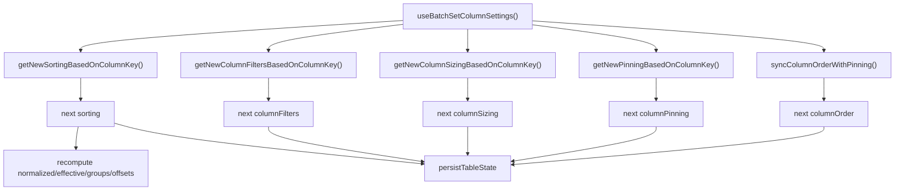
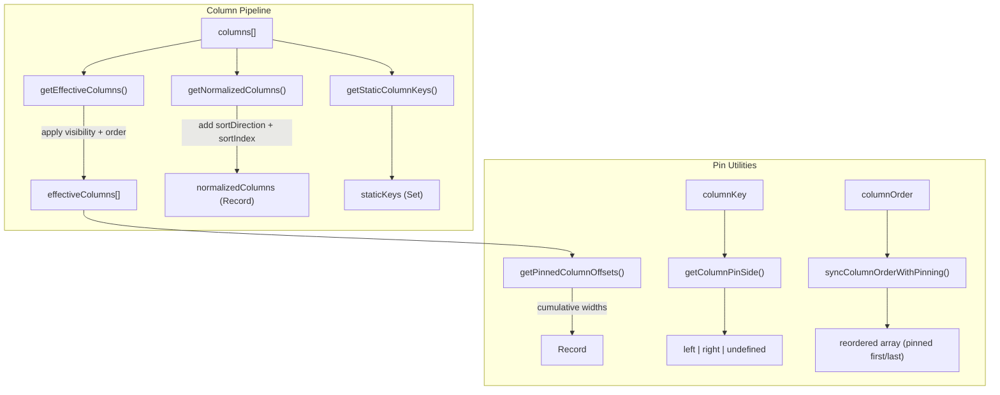

# utils/ Architecture

Pure utility functions for column processing and state persistence.

## File Structure

```
utils/
├── getColumnPinSide.util.ts                      → Detect which side a column is pinned to
├── getEffectiveColumns.util.ts                   → Apply visibility + order + pinning
├── getNewColumnFiltersBasedOnColumnKey.util.ts   → Build next filter map for one column change
├── getNewColumnSizingBasedOnColumnKey.util.ts    → Build next sizing map for one column change
├── getNewPinningBasedOnColumnKey.util.ts         → Build next pinning state for one column change
├── getNewSortingBasedOnColumnKey.util.ts         → Build next sorting array for one column change
├── getNormalizedColumns.util.ts                  → Enrich columns with sort metadata
├── getPinnedColumnOffsets.util.ts                → Compute sticky offsets for pinned columns
├── getPinnedDerivedColumnsState.util.ts          → Build effective columns, groups, and pinned offsets
├── getStaticColumnKeys.util.ts                   → Extract non-reorderable column keys
├── getStorageKey.util.ts                         → Build namespaced storage key
├── readPersistedStateFromCookie.util.ts          → SSR-safe cookie state read
├── serializeStateSlice.util.ts                   → JSON serialize a state slice
├── splitColumnsByPinning.util.ts                 → Split columns into left/center/right groups
├── syncColumnOrderWithPinning.util.ts            → Pin-aware column reordering
├── writeStateSlice.util.ts                       → Write to cookie/localStorage
├── persistence.constants.ts                      → Storage key constants
├── persistence.types.ts                          → Persistence config types
└── index.ts                                      → Barrel export for shared table utils
```

## Batch Column Settings Decomposition

The batch update action in TableConfig now delegates per-slice state transitions to focused pure utilities.
This removes heavy branch logic from the hook and makes each rule testable in isolation.



| Function                            | Input                                                    | Output             | Purpose                                                                       |
| ----------------------------------- | -------------------------------------------------------- | ------------------ | ----------------------------------------------------------------------------- |
| getNewSortingBasedOnColumnKey       | columnKey, sorting, existingSorting                      | SortingState       | Update/remove one column sort while preserving order                          |
| getNewColumnFiltersBasedOnColumnKey | columnKey, columnFilter, columnFiltersState              | ColumnFiltersState | Replace one column filter entry without mutating state                        |
| getNewColumnSizingBasedOnColumnKey  | columnKey, columnSizing, columnSizesState                | ColumnSizingState  | Replace/remove one width entry for a column                                   |
| getNewPinningBasedOnColumnKey       | columnKey, columnPinning, existingPinning, staticKeys    | ColumnPinningState | Pin/unpin one column while honoring static key constraints                    |
| syncColumnOrderWithPinning          | columnKey, columnPinning, columns, currentOrder, pinning | ColumnOrderState   | Keep order consistent with pinning groups; now tolerates missing currentOrder |

## Column Utilities



| Function                     | Input                                       | Output                                                  | Purpose                                                                          |
| ---------------------------- | ------------------------------------------- | ------------------------------------------------------- | -------------------------------------------------------------------------------- |
| getEffectiveColumns          | columns, order, visibility                  | TableColumn[]                                           | Visible columns in display order; pinned columns follow reconciled display order |
| getPinnedDerivedColumnsState | columns, order, pinning, sizing, visibility | { effectiveColumns, columnGroups, pinnedColumnOffsets } | Recompute all pinning-dependent derived slices in one call                       |
| getNormalizedColumns         | columns, sorting                            | NormalizedColumnsState                                  | Columns enriched with sort metadata                                              |
| getStaticColumnKeys          | columns                                     | Set<string>                                             | Keys of locked/static columns                                                    |
| getPinnedColumnOffsets       | pinning, sizing, columns                    | Record<key, PinnedColumnInfo>                           | Sticky positions for pinned columns                                              |
| getColumnPinSide             | columnKey, pinning                          | PinSide or undefined                                    | Which side a column is pinned to                                                 |
| splitColumnsByPinning        | pinning, effectiveColumns                   | ColumnGroupsState                                       | Split columns into left/center/right                                             |
| syncColumnOrderWithPinning   | order, pinning                              | string[]                                                | Reorder to keep pinned columns grouped and keep order slice in sync              |

getPinnedColumnOffsets computes offsets and boundary markers (isLastPinnedLeft, isFirstPinnedRight) from effective column order so shadow boundaries stay aligned with rendered sticky positions even if pinning arrays are out of order.

## Persistence Utilities

```mermaid
graph LR
  subgraph "Read"
    Cookie["document.cookie / request headers"] --> Read["readPersistedStateFromCookie()"]
    Read --> State["{ columnFilters, sorting, columnOrder, ... }"]
  end

  subgraph "Write"
    Slice["state slice"] --> Serialize["serializeStateSlice()"]
    Serialize --> KV["{ key, value }"]
    KV --> Write["writeStateSlice()"]
    Write --> Storage["cookie or localStorage"]
  end
```

| Function                     | Purpose                                       |
| ---------------------------- | --------------------------------------------- |
| readPersistedStateFromCookie | Parse persisted state from cookies (SSR-safe) |
| serializeStateSlice          | Convert a state slice to key/value payload    |
| writeStateSlice              | Write to cookie or localStorage               |
| getStorageKey                | Build persistenceKey:slice key string         |
