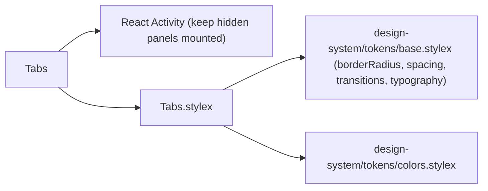
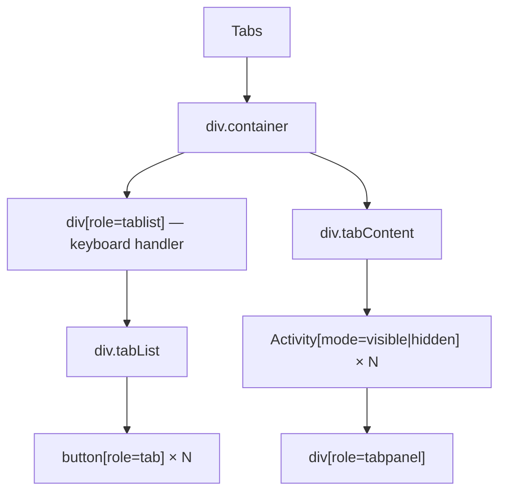

# Tabs Architecture

Accessible, keyboard-navigable tab strip using React's `Activity` component for hidden-but-mounted panels.

## File Structure

```
Tabs/
├── index.ts              → Barrel export
├── Tabs.component.tsx    → Tab list + panels with keyboard navigation
├── Tabs.types.ts         → TabsProps, TabItem
└── Tabs.stylex.ts        → All visual styles (container, tabList, tabButton, tabPanel)
```

## Dependencies



## Render Structure



## State & Initialisation

| State                   | Type     | Initial value                               |
| ----------------------- | -------- | ------------------------------------------- |
| `uncontrolledActiveTab` | `string` | `defaultSelectedTab` → first tab key → `''` |

`tabRefs` holds a `Map<string, HTMLButtonElement>` so keyboard navigation can imperatively focus the target tab button.

`activeTab` is derived as:

- controlled mode: `selectedTab`
- uncontrolled mode: `uncontrolledActiveTab`

## Keyboard Navigation

Handled by `onKeyDown` on the `role="tablist"` wrapper:

| Key          | Action                               |
| ------------ | ------------------------------------ |
| `ArrowLeft`  | Move to previous tab (wraps to last) |
| `ArrowRight` | Move to next tab (wraps to first)    |
| `Home`       | Move to first tab                    |
| `End`        | Move to last tab                     |

On navigation: `setActiveTab(newKey)` + `tabRefs.get(newKey)?.focus()`.

## Activity-Based Panel Rendering

All panels are always rendered via React's `<Activity>` component:

| `mode`      | Behaviour                                           |
| ----------- | --------------------------------------------------- |
| `'visible'` | Panel is rendered and visible                       |
| `'hidden'`  | Panel stays mounted but is hidden (preserves state) |

This avoids unmounting/remounting panel content when switching tabs.

## Accessibility (ARIA)

| Element          | Attributes                                                                              |
| ---------------- | --------------------------------------------------------------------------------------- |
| Tab list wrapper | `role="tablist"`, `aria-label="Settings tabs"`                                          |
| Tab button       | `role="tab"`, `aria-selected`, `aria-controls="tabpanel-{key}"`, `id="tab-{key}"`       |
| Active tab       | `tabIndex={0}`; inactive tabs `tabIndex={-1}` (roving tabindex)                         |
| Tab panel        | `role="tabpanel"`, `id="tabpanel-{key}"`, `aria-labelledby="tab-{key}"`, `tabIndex={0}` |

## Props

### `TabsProps`

Extends `ComponentPropsWithoutRef<'div'>` (all native `div` attributes are forwarded via `...props`).

| Prop                 | Type            | Default       | Description                                   |
| -------------------- | --------------- | ------------- | --------------------------------------------- |
| `tabs`               | `TabItem[]`     | —             | Ordered list of tab configurations (required) |
| `defaultSelectedTab` | `string`        | `tabs[0].key` | Initially active tab key                      |
| `selectedTab`        | `string`        | —             | Controlled active tab key                     |
| `onSelectTab`        | `(key) => void` | —             | Callback fired when tab selection changes     |

### `TabItem`

| Field      | Type        | Description                              |
| ---------- | ----------- | ---------------------------------------- |
| `key`      | `string`    | Unique identifier used in ARIA and state |
| `header`   | `ReactNode` | Tab button label (text or element)       |
| `children` | `ReactNode` | Panel content shown when tab is active   |
