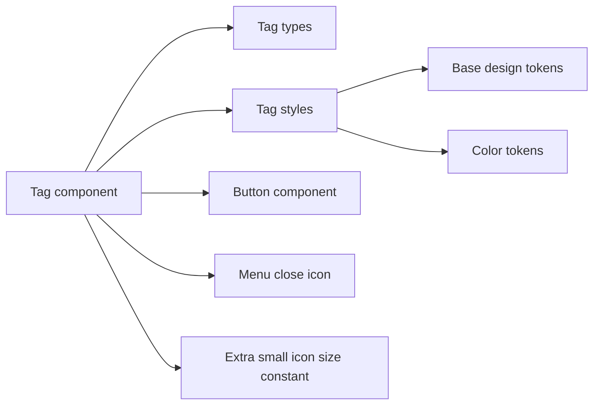
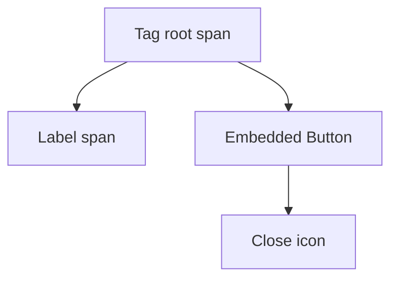
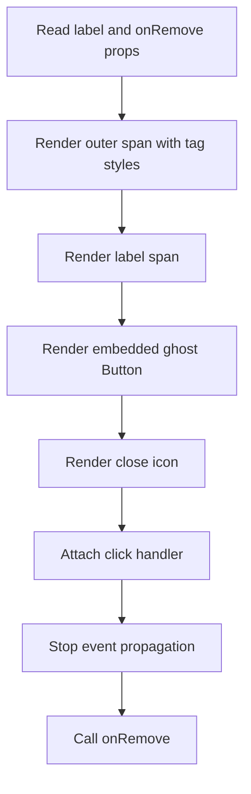
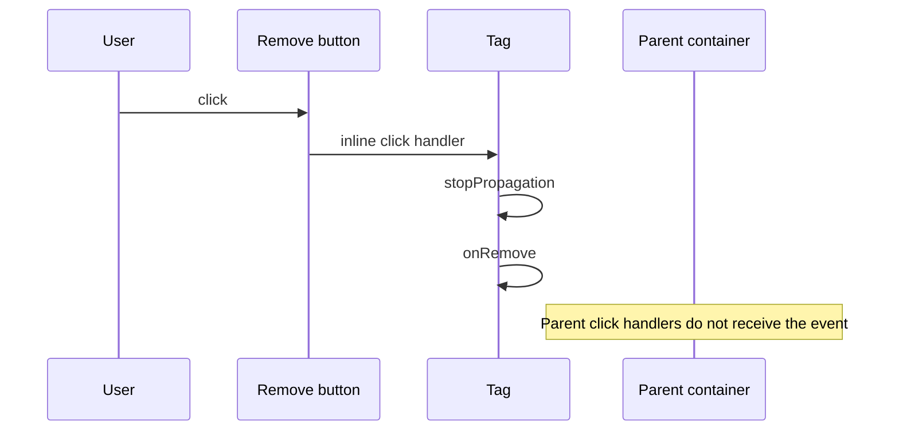
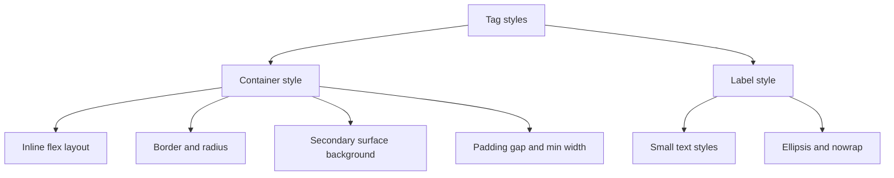

# Tag Component Architecture

Small removable label component composed from a styled container, text label,
and an embedded ghost Button with a close icon.

## File Structure

```
Tag/
├── ARCHITECTURE.md         -> This documentation
├── index.ts                -> Barrel export: Tag + TagProps
├── Tag.component.tsx       -> Component render and remove interaction
├── Tag.stylex.ts           -> Container and label styles
└── Tag.types.ts            -> TagProps
```

## Dependencies



## Public API

`TagProps`:

| Prop       | Type         | Description                              |
| ---------- | ------------ | ---------------------------------------- |
| `label`    | `string`     | Visible tag text                         |
| `onRemove` | `() => void` | Called when the remove button is clicked |

## Render Structure



## Render Flow



## Interaction Model

The remove button click handler performs two steps:

1. Stops event propagation.
2. Calls `onRemove`.

This prevents parent click handlers from firing when the user removes a tag.



## Style Composition

`Tag.stylex.ts` exposes two style groups:

- `tag`: outer inline-flex container
- `label`: text truncation and typography styles



### Container behavior

The root tag container:

- uses `display: inline-flex`
- aligns content center
- distributes label and remove button with `space-between`
- preserves compact width with a small `minWidth`
- truncates overflow cleanly

### Label behavior

The label:

- uses small typography tokens
- truncates long values with ellipsis
- keeps a single-line layout via `whiteSpace: nowrap`

## Accessibility and Semantics

- Uses a plain `span` wrapper because the component itself is not interactive.
- Delegates actual interaction and accessibility labeling to the embedded Button.
- The remove button uses `aria-label` in the format `Remove <label>`.

## Design Tradeoffs

- The component is intentionally minimal and stateless.
- It does not own selection, focus, or hover state.
- Removal logic is delegated entirely to the parent through `onRemove`.
- The current implementation uses an inline click handler because it needs access
  to the event object for `stopPropagation` and to call `onRemove` immediately.

## Consumers

Tag is intended for compact removable chips in filtering, selection, and tokenized
input interfaces.
