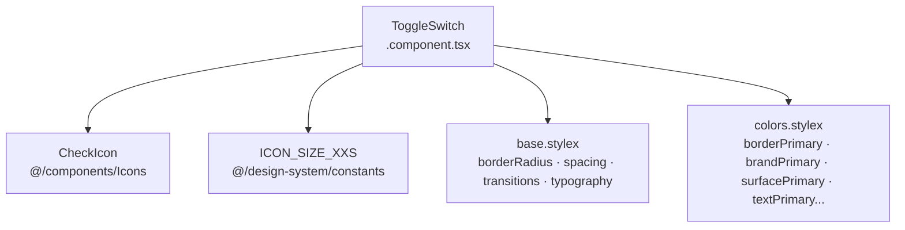
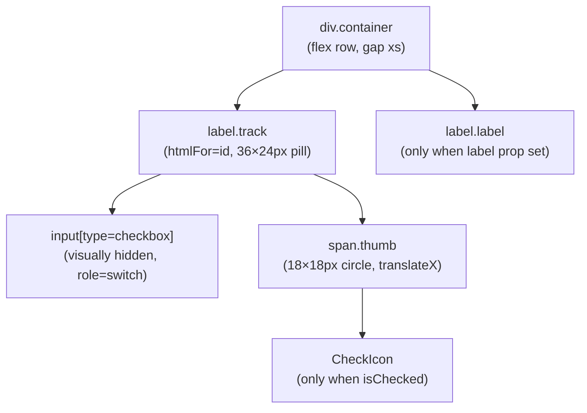
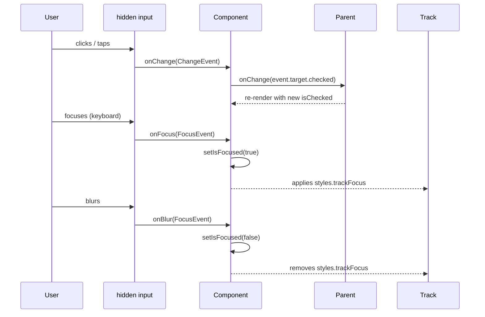

# ToggleSwitch — Architecture Documentation

## Overview

A fully controlled, accessible toggle switch built on a visually hidden `<input type="checkbox">`. The track and thumb are pure CSS — no JS animation — using CSS `transform` and `transition` for the slide effect. Focus state is tracked locally so the focus ring can be applied to the visible track (not the hidden input).

---

## File Structure

```
ToggleSwitch/
├── index.ts                        → barrel export
├── ToggleSwitch.component.tsx      → single component
├── ToggleSwitch.types.ts           → ToggleSwitchProps
├── ToggleSwitch.stylex.ts          → all styles
└── ARCHITECTURE.md                 → this file
```

---

## Component Dependencies



---

## Props

| Prop         | Type                                                           | Required | Default     | Description                                            |
| ------------ | -------------------------------------------------------------- | -------- | ----------- | ------------------------------------------------------ |
| `isChecked`  | `boolean`                                                      | ✅       | —           | Controlled checked state                               |
| `onChange`   | `(isChecked: boolean) => void`                                 | ✅       | —           | Called with the new boolean value on change            |
| `isBusy`     | `boolean`                                                      | ❌       | `false`     | Shows loading shimmer and disables interaction         |
| `isDisabled` | `boolean`                                                      | ❌       | `false`     | Disables interaction; applies opacity + cursor         |
| `label`      | `string`                                                       | ❌       | `undefined` | Optional text label rendered beside the track          |
| `id`         | `string` (via `...props`)                                      | ❌       | `useId()`   | Associates label `htmlFor`; auto-generated if omitted  |
| `onFocus`    | `FocusEventHandler<HTMLInputElement>`                          | ❌       | —           | Forwarded to the hidden input; also sets `isFocused`   |
| `onBlur`     | `FocusEventHandler<HTMLInputElement>`                          | ❌       | —           | Forwarded to the hidden input; also clears `isFocused` |
| `...rest`    | `ComponentPropsWithoutRef<'input'>` (minus `onChange`, `type`) | ❌       | —           | All other native input attributes                      |

> `onChange` and `type` are omitted from the spread — `onChange` is replaced with the simplified `(isChecked: boolean) => void` signature; `type` is hardcoded to `'checkbox'`.

---

## Internal State

| State       | Type      | Description                                                                        |
| ----------- | --------- | ---------------------------------------------------------------------------------- |
| `isFocused` | `boolean` | Tracks keyboard focus on the hidden input so the visible track gets the focus ring |

---

## Render Structure



---

## Interaction Flow



---

## Visual States

| State             | Track background   | Track border                           | Thumb position                  | Opacity |
| ----------------- | ------------------ | -------------------------------------- | ------------------------------- | ------- |
| Unchecked         | `surfaceSecondary` | `borderPrimary`                        | `translateX(0)`                 | 1       |
| Unchecked + hover | `surfaceSecondary` | `borderSecondary`                      | `translateX(0)`                 | 1       |
| Checked           | `brandPrimary`     | `brandPrimary`                         | `translateX(spacing.sm / 12px)` | 1       |
| Focused           | (current state)    | (current) + 1px `brandPrimary` outline | (current)                       | 1       |
| Disabled          | (current state)    | (current state)                        | (current)                       | 0.5     |

The thumb slide uses `transform: translateX(spacing.sm)` (12px) with `transition: transform transitions.fast` — pure CSS, no JS animation.

When checked, a `CheckIcon` (size `ICON_SIZE_XXS`) appears inside the thumb, coloured `textPrimary`.

---

## Accessibility

- `<input type="checkbox">` is the real interactive element — keyboard, screen reader, and form semantics are native.
- `role="switch"` added to express toggle semantics to assistive technology.
- `aria-checked={isChecked}` explicitly mirrors the visual state.
- The input is **visually hidden** (clip + absolute position), not `display:none` or `visibility:hidden` — it remains in the tab order and is operable via keyboard.
- Both the track `<label>` and the optional text `<label>` share the same `htmlFor={id}` — clicking either activates the input.
- `aria-hidden="true"` on the thumb span prevents screen readers from announcing decorative SVG content.
- `useId()` generates a stable, unique id per instance when none is provided, preventing duplicate-id issues when multiple toggles appear on one page.

---

## StyleX Composition

```
styles.track
  + isChecked   → styles.trackChecked   (brandPrimary bg + border)
  + isDisabled  → styles.trackDisabled  (opacity 0.5, cursor not-allowed)
  + isFocused   → styles.trackFocus     (brandPrimary outline)

styles.thumb
  + isChecked   → styles.thumbChecked   (translateX 12px)

styles.label
  + isDisabled  → styles.labelDisabled  (opacity 0.5, cursor not-allowed)
```

All transitions use `transitions.fast` from `base.stylex` for the `background-color`, `border-color`, and `transform` animations.

---

## Design Notes

- **No `value` or `name` prop override** — the component is designed for controlled boolean UI toggles, not form submissions. If form integration is needed, pass `name` via `...rest`.
- **Label is optional** — the component is usable as an icon-only toggle (e.g. inside a toolbar row that already has a row label).
- **Fixed dimensions** — the track is `36px × spacing.lg (24px)` and the thumb is `18×18px`. These are not variant-driven; the component has a single size.
- **No `size` prop** — unlike Button or NavLink, ToggleSwitch has one canonical size. If multiple sizes are needed in the future, add `sizeVariants` following the `commons.stylex` pattern.
