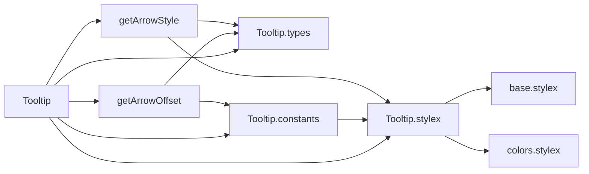
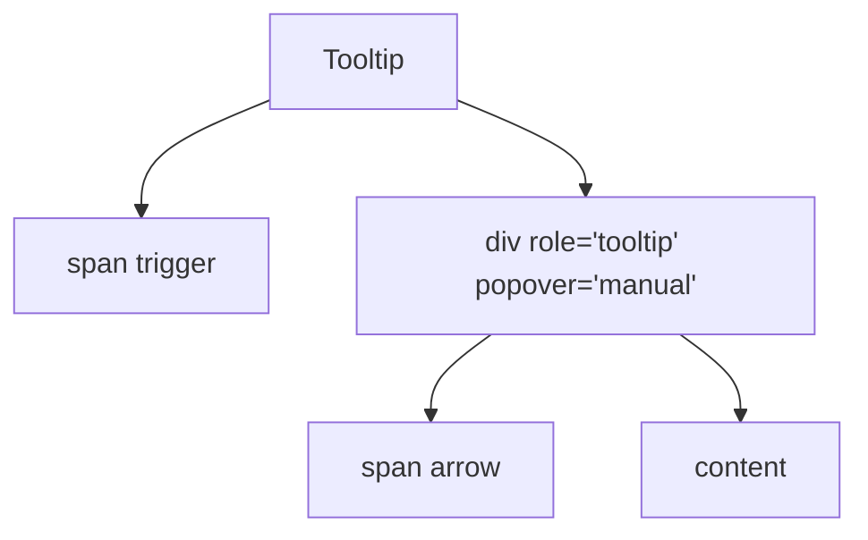
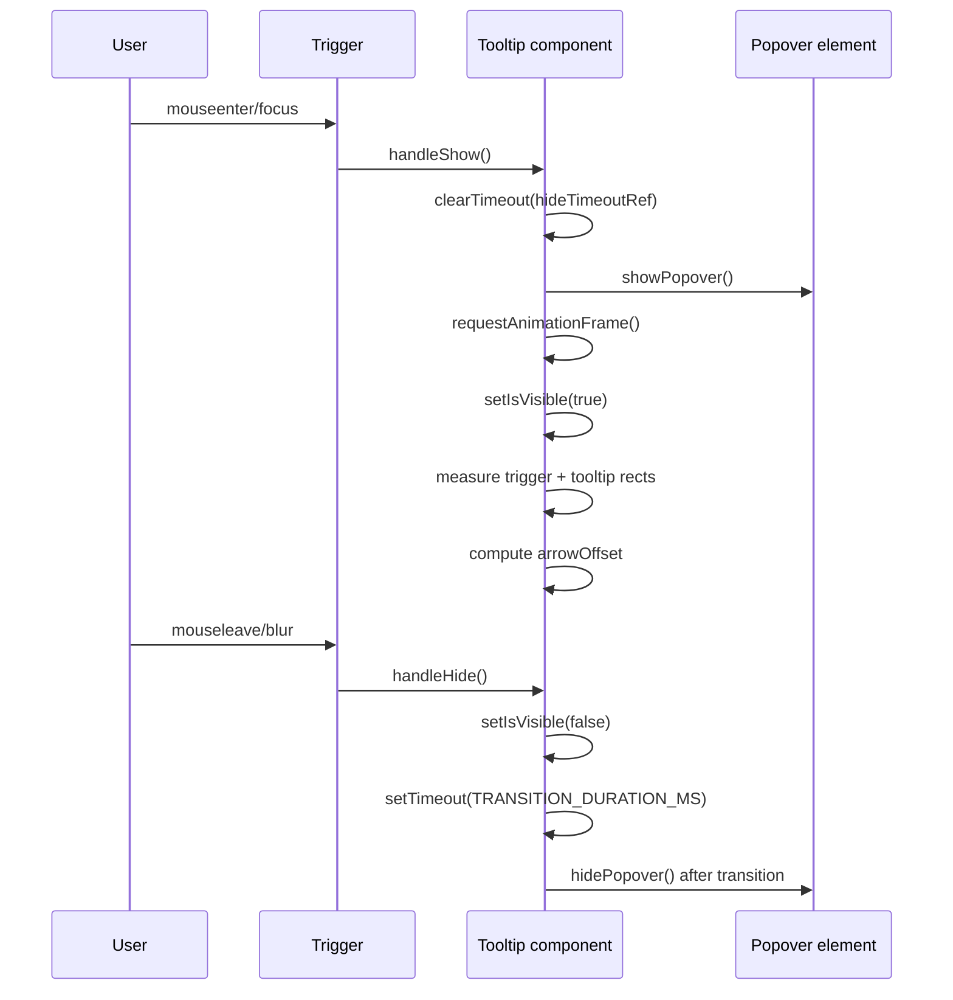

# Tooltip Component Architecture

## Overview

The Tooltip component provides hover and focus driven contextual help using the
native Popover API (`popover='manual'`) with StyleX-based styling and a
positioned arrow that tracks trigger alignment.

It is implemented as an uncontrolled UI primitive with local state for
visibility and arrow offset.

## File Structure

```
Tooltip/
├── index.ts                    -> Barrel export: Tooltip + Tooltip types
├── Tooltip.component.tsx       -> Component behavior and render
├── Tooltip.types.ts            -> TooltipProps, TooltipPlacement, ArrowOffsetParams
├── Tooltip.constants.ts        -> Transition duration + arrow style map
├── Tooltip.stylex.ts           -> Trigger, popover, placement, and arrow styles
├── ARCHITECTURE.md             -> This documentation
└── utils/
    ├── index.ts                -> Utility barrel export
    ├── getArrowOffset.util.ts  -> Computes arrow position from geometry
    └── getArrowStyle.util.ts   -> Maps placement to dynamic arrow style
```

## Dependencies



## Public API

`TooltipProps`:

| Prop        | Type        | Default  | Description             |
| ----------- | ----------- | -------- | ----------------------- | -------- | ------- | --------------------------- |
| `children`  | `ReactNode` | -        | Trigger element content |
| `content`   | `ReactNode` | -        | Tooltip body content    |
| `placement` | `'top'      | 'bottom' | 'left'                  | 'right'` | `'top'` | Preferred tooltip placement |

The component also exports `TooltipPlacement` for reuse by consumers.

## Internal State and Refs

The component owns the following runtime state:

- `isVisible`: controls fade/slide transition classes.
- `arrowOffset`: optional computed pixel offset to align arrow to trigger center.

The component uses these refs:

- `triggerRef`: DOM reference for anchor geometry (`getBoundingClientRect`).
- `tooltipRef`: DOM reference for Popover API calls (`showPopover/hidePopover`).
- `hideTimeoutRef`: timeout id used to defer hide until transition completes.

## Render Structure



### Trigger Element

The trigger is a `span` with:

- `aria-describedby={id}` for accessibility linkage.
- Mouse/focus handlers (`onMouseEnter`, `onMouseLeave`, `onFocus`, `onBlur`).
- `popoverTarget={id}` and anchor style data for placement support.

### Tooltip Element

The tooltip body is a `div` with:

- `id={id}` generated via `useId()`.
- `popover='manual'` for explicit open/close control.
- `role='tooltip'` for semantics.
- Placement style (`top`, `bottom`, `left`, `right`).
- Visibility style toggled by `isVisible`.

## Interaction Flow



## Arrow Positioning Strategy

Arrow alignment is computed from geometry each time the tooltip opens.

1. Determine axis by placement:
   - Vertical placements (`top`, `bottom`) use horizontal axis.
   - Horizontal placements (`left`, `right`) use vertical axis.
2. Compute trigger center on the chosen axis.
3. Compute offset:

$$
arrowOffset = triggerCenter - tooltipStart - halfArrow
$$

4. Apply placement-aware style:
   - `top/bottom` -> `arrowPositionHorizontal(offset)`.
   - `left/right` -> `arrowPositionVertical(offset)`.

## Styling Model

Tooltip styling is fully StyleX-driven and tokenized:

- Trigger styles use `anchorName` to bind tooltip anchoring.
- Tooltip surface uses elevated tokens (blur, shadow, radius, typography).
- Visibility transition uses opacity + transform.
- Placement styles provide `positionArea` and axis-specific slide transforms.
- Arrow is a rotated square (`45deg`) with per-placement base offsets.

Important constants:

- `TRANSITION_DURATION_MS = 150`.
- Arrow size source of truth is token-driven (`tooltip.arrowSize`).
- `HALF_ARROW` is derived from the local constant used in offset math.

## Accessibility

Current accessibility support includes:

- `role='tooltip'` on the content node.
- `aria-describedby` from trigger to tooltip id.
- Keyboard parity via `onFocus` and `onBlur`.

## Usage Notes

- Best for short helper text or compact rich content.
- The trigger should remain an inline element or inline-flex compatible element.
- Tooltip visibility is controlled internally; consumers pass content only.

## Known Tradeoffs

- Arrow offset is measured on open, so dynamic trigger size changes during an
  open state are not continuously tracked.
- Hide uses timeout synchronization with transition duration, which requires
  keeping style transition timing and `TRANSITION_DURATION_MS` in sync.

## Current Consumer

- Used by Button to render optional help text (`tooltipContent` +
  `tooltipPlacement`).
