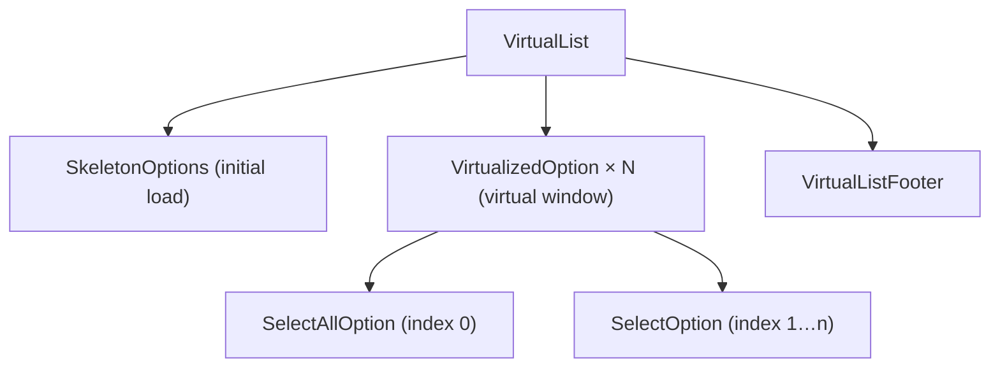
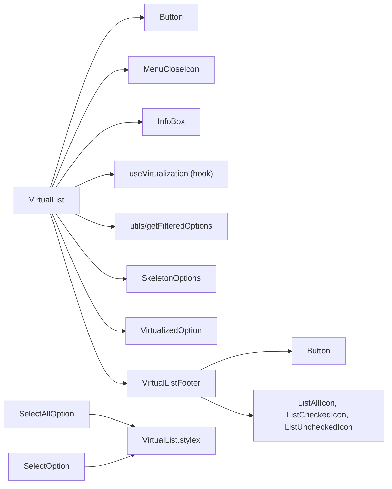
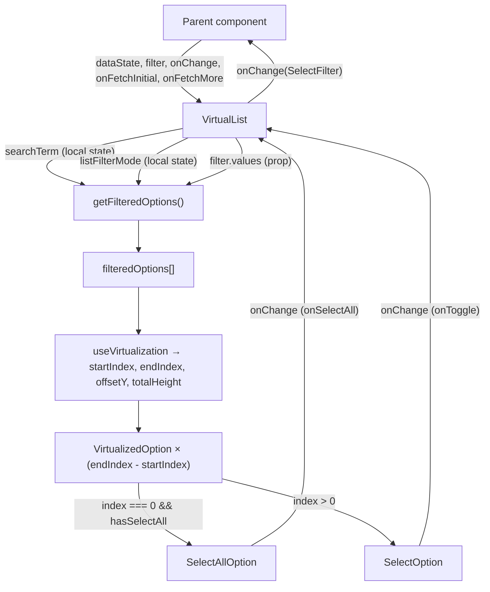
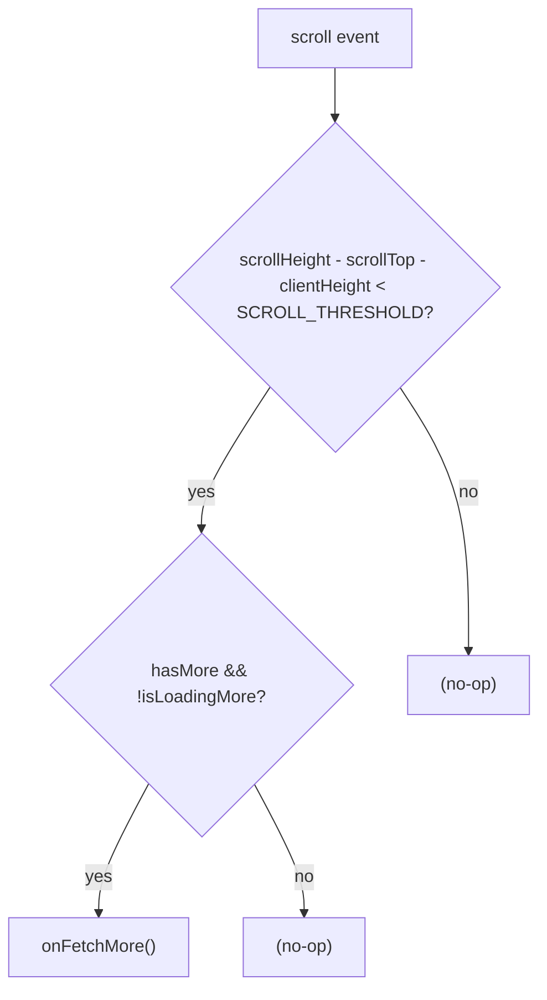

# VirtualList Architecture

Virtualized, searchable, multi-select list with infinite scroll, skeleton loading, and filter-mode toolbar.

## File Structure

```
VirtualList/
├── index.ts                         → Barrel export (VirtualList, VirtualListDataState, VirtualListProps)
├── VirtualList.component.tsx        → Orchestrator: search, virtualization, scroll, state
├── VirtualList.types.ts             → VirtualListProps, VirtualListDataState, ListFilterMode
├── VirtualList.constants.ts         → ITEM_HEIGHT, LIST_MAX_HEIGHT, DEFAULT_CONTAINER_HEIGHT, SCROLL_THRESHOLD
├── VirtualList.stylex.ts            → Shared styles used by SelectAllOption, SelectOption and VirtualList itself
│
├── SelectAllOption/                 → "Select All / Deselect All" checkbox row
│   ├── ARCHITECTURE.md
│   ├── index.ts
│   ├── SelectAllOption.component.tsx
│   └── SelectAllOption.types.ts
│
├── SelectOption/                    → Single option row with optional checkbox
│   ├── ARCHITECTURE.md
│   ├── index.ts
│   ├── SelectOption.component.tsx
│   └── SelectOption.types.ts
│
├── SkeletonOptions/                 → Shimmer placeholder rows during initial load
│   ├── ARCHITECTURE.md
│   ├── index.ts
│   ├── SkeletonOptions.component.tsx
│   ├── SkeletonOptions.stylex.ts
│   └── SkeletonOptions.types.ts
│
├── VirtualListFooter/               → Status bar: loaded count + filter-mode buttons
│   ├── ARCHITECTURE.md
│   ├── index.ts
│   ├── VirtualListFooter.component.tsx
│   ├── VirtualListFooter.stylex.ts
│   └── VirtualListFooter.types.ts
│
├── VirtualizedOption/               → Per-row dispatcher (SelectAllOption or SelectOption)
│   ├── ARCHITECTURE.md
│   ├── index.ts
│   ├── VirtualizedOption.component.tsx
│   └── VirtualizedOption.types.ts
│
└── utils/
    ├── ARCHITECTURE.md
    ├── index.ts
    └── getFilteredOptions.util.ts   → Search + filter-mode filtering
```

## Component Hierarchy



## Dependencies



## Data Flow



## Virtualization Strategy

`useVirtualization` measures the scroll container and computes which rows are inside the visible window. `VirtualList` renders only `endIndex - startIndex` `VirtualizedOption` elements and translates them via a CSS `translateY` to the correct scroll position.

The outer options list is explicitly sized with `border-box`, `width: 100%`,
`max-width: 100%`, and `min-width: 0` so embedded lists stay inside constrained
parents such as drawer filter cards.

| Constant                   | Value       | Role                                             |
| -------------------------- | ----------- | ------------------------------------------------ |
| `ITEM_HEIGHT`              | `32 px`     | Fixed row height (enables O(1) offset math)      |
| `LIST_MAX_HEIGHT`          | `18.75 rem` | Default `max-height` of the scroll container     |
| `DEFAULT_CONTAINER_HEIGHT` | `300 px`    | Fallback before the ref is measured              |
| `SCROLL_THRESHOLD`         | `50 px`     | Distance from bottom that triggers `onFetchMore` |

## Infinite Scroll



## Filter Modes

| Mode           | Visible options                     |
| -------------- | ----------------------------------- |
| `'all'`        | All loaded options (post-search)    |
| `'selected'`   | Only options in `filter.values`     |
| `'unselected'` | Only options NOT in `filter.values` |

## Props

| Prop               | Type                              | Default      | Description                                      |
| ------------------ | --------------------------------- | ------------ | ------------------------------------------------ |
| `dataState`        | `VirtualListDataState`            | —            | Loading flags, data array, optional totalCount   |
| `filter`           | `SelectFilter`                    | —            | Controlled selected values (`filter.values`)     |
| `hasCheckboxes`    | `boolean`                         | `true`       | Show checkboxes next to options                  |
| `hasSelectAll`     | `boolean`                         | `true`       | Show "Select All" row when >1 option exists      |
| `listMaxHeight`    | `string`                          | `'18.75rem'` | CSS max-height of the scrollable list            |
| `name`             | `string`                          | —            | `name` attribute on the search input             |
| `onChange`         | `(filter?: SelectFilter) => void` | —            | Called on every selection change                 |
| `onFetchInitial`   | `() => Promise<void> \| void`     | —            | Fetches data on mount                            |
| `onFetchMore`      | `() => Promise<void> \| void`     | —            | Fetches next page when near bottom               |
| `shouldFillHeight` | `boolean`                         | `false`      | Expand list to fill all available vertical space |
