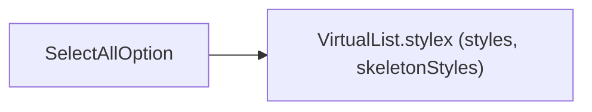
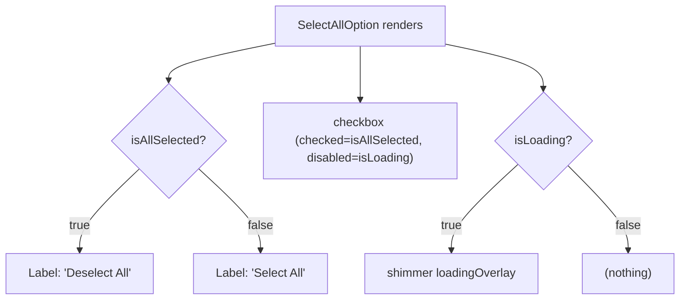

# SelectAllOption Architecture

Checkbox row that toggles all visible/filtered options at once, with shimmer overlay while loading.

## File Structure

```
SelectAllOption/
├── index.ts                          → Barrel export
├── SelectAllOption.component.tsx     → "Select All / Deselect All" checkbox label
└── SelectAllOption.types.ts          → { isAllSelected, isLoading, onSelectAll }
```

## Dependencies



## Render Flow



## Props

| Prop            | Type         | Description                                 |
| --------------- | ------------ | ------------------------------------------- |
| `isAllSelected` | `boolean`    | Whether every visible option is selected    |
| `isLoading`     | `boolean`    | Disables the checkbox and shows shimmer     |
| `onSelectAll`   | `() => void` | Fires `onChange`; parent decides add/remove |

## Notes

- Rendered by `VirtualizedOption` at `index === 0` when `hasSelectAll && filteredOptions.length > 1`.
- Uses shared `styles` and `skeletonStyles` from `VirtualList.stylex` — no own stylex file.
