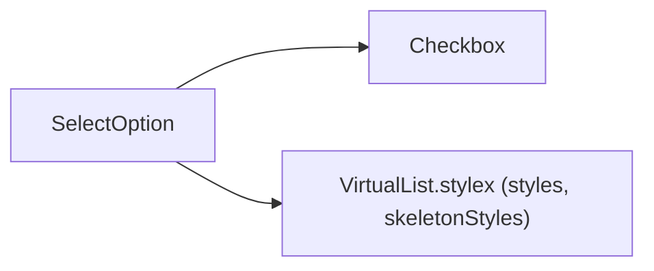
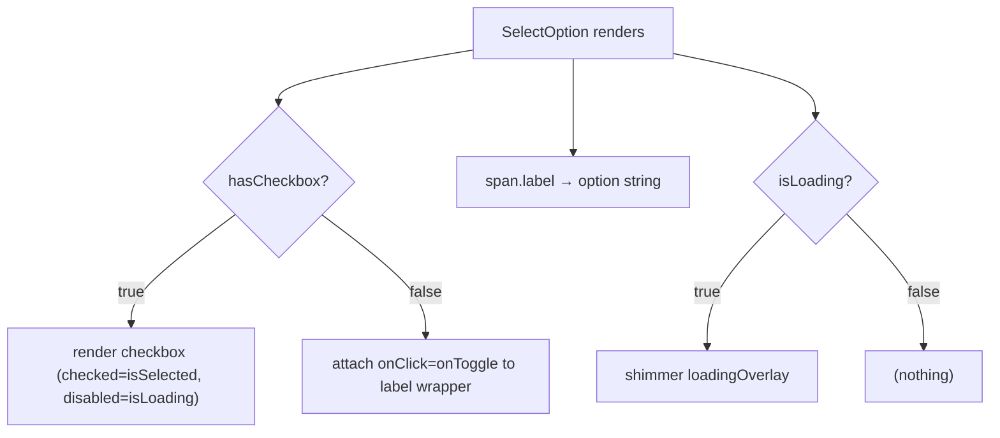

# SelectOption Architecture

Single option row with optional checkbox and shimmer loading overlay.

## File Structure

```
SelectOption/
├── index.ts                      → Barrel export
├── SelectOption.component.tsx    → Label + optional checkbox + shimmer
└── SelectOption.types.ts         → { hasCheckbox?, isLoading, isSelected, onToggle, option }
```

## Dependencies



## Render Flow



## Props

| Prop          | Type         | Default | Description                                      |
| ------------- | ------------ | ------- | ------------------------------------------------ |
| `hasCheckbox` | `boolean`    | `true`  | Whether to render a checkbox input               |
| `isLoading`   | `boolean`    | —       | Disables checkbox and shows shimmer overlay      |
| `isSelected`  | `boolean`    | —       | Controlled checked state                         |
| `onToggle`    | `() => void` | —       | Called on checkbox `onChange` or label `onClick` |
| `option`      | `string`     | —       | Display text of the option                       |

## Notes

- When `hasCheckbox=false` the `onClick` is placed on the `<label>` wrapper and keyboard activation is supported via `Enter`/`Space`.
- Uses shared `Checkbox` for checkbox visuals and behavior.
- Uses shared `styles` and `skeletonStyles` from `VirtualList.stylex` for row and shimmer styles.
