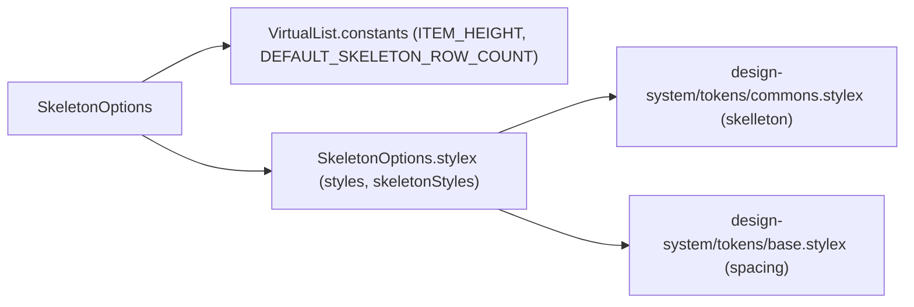
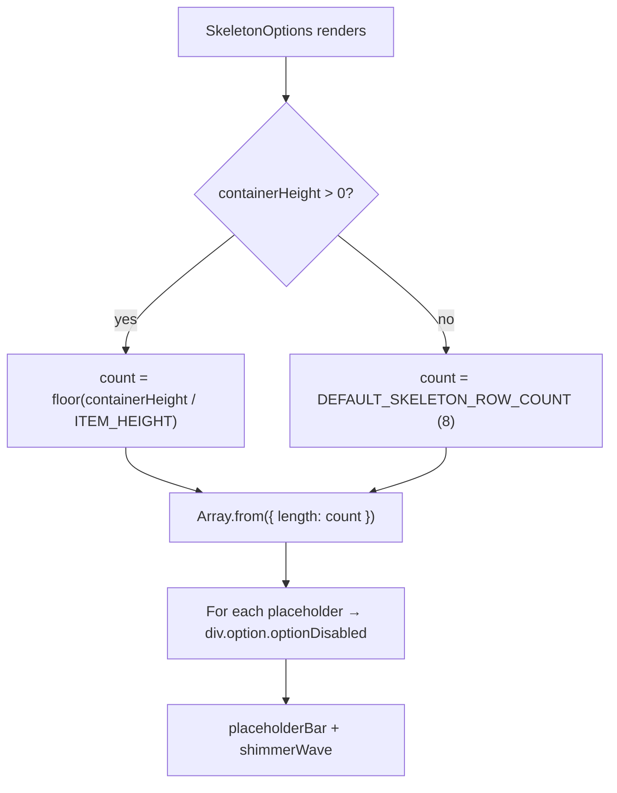

# SkeletonOptions Architecture

Fills the visible list area with placeholder shimmer rows while the initial data load is in progress.

## File Structure

```
SkeletonOptions/
├── index.ts                         → Barrel export
├── SkeletonOptions.component.tsx    → Shimmer placeholder rows
├── SkeletonOptions.stylex.ts        → Row/overlay styles (delegates to skelleton tokens)
└── SkeletonOptions.types.ts         → { containerHeight?: number }
```

## Dependencies



## Render Flow



## Props

| Prop              | Type     | Default | Description                                                        |
| ----------------- | -------- | ------- | ------------------------------------------------------------------ |
| `containerHeight` | `number` | —       | Measured height of the scroll container (from `useVirtualization`) |

## Sizing Logic

| Condition                | Row Count                              |
| ------------------------ | -------------------------------------- |
| `containerHeight > 0`    | `Math.floor(containerHeight / 32)`     |
| `containerHeight` absent | `DEFAULT_SKELETON_ROW_COUNT` (= **8**) |

## Notes

- Rendered by `VirtualList` only when `isInitialLoading` is `true` (first fetch, no data yet).
- Row height matches `ITEM_HEIGHT` (32 px) so skeletons perfectly fill the measured container.
