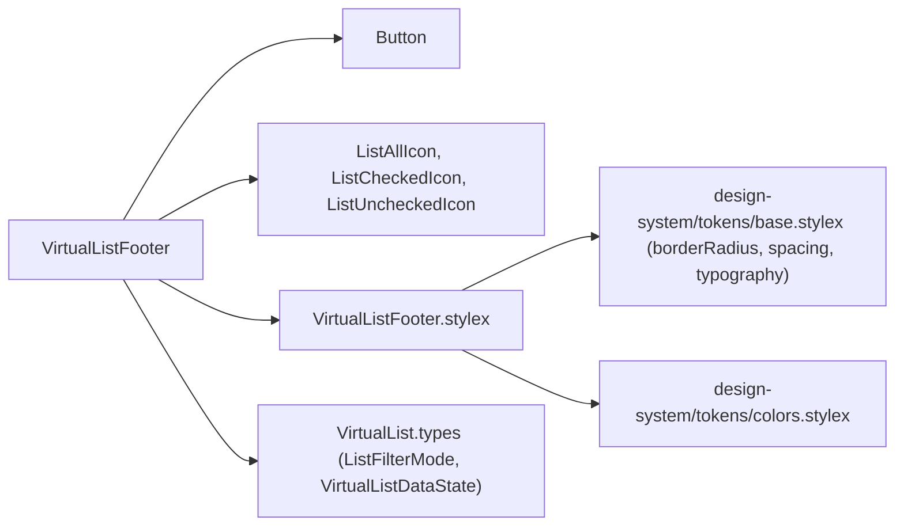
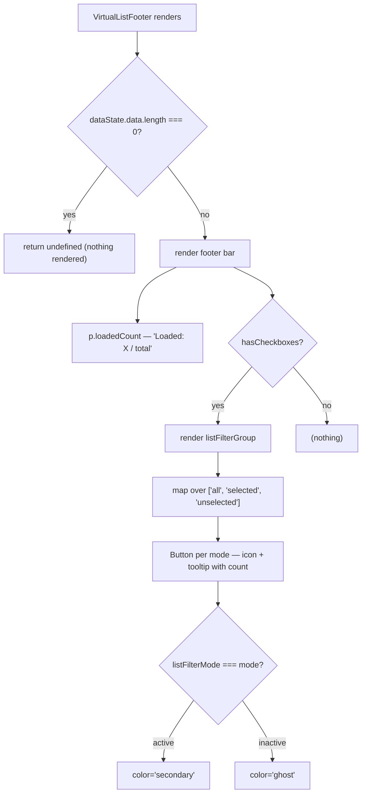

# VirtualListFooter Architecture

Status bar below the virtual list: shows loaded/total count and filter-mode toggle buttons (All / Selected / Unselected).

## File Structure

```
VirtualListFooter/
├── index.ts                            → Barrel export
├── VirtualListFooter.component.tsx     → Count label + filter-mode button group
├── VirtualListFooter.stylex.ts         → Layout styles (footer, loadedCount, listFilterGroup)
└── VirtualListFooter.types.ts          → Props (dataState, effectiveOptions, hasCheckboxes, …)
```

## Dependencies



## Render Flow



## Props

| Prop                | Type                             | Description                               |
| ------------------- | -------------------------------- | ----------------------------------------- | ---------- | -------------- |
| `dataState`         | `VirtualListDataState`           | Loading flags, data array, totalCount     |
| `effectiveOptions`  | `string[]`                       | All currently-loaded options (for counts) |
| `hasCheckboxes`     | `boolean`                        | Whether to show filter-mode buttons       |
| `listFilterMode`    | `ListFilterMode`                 | Active filter mode (`'all'                | 'selected' | 'unselected'`) |
| `selectedValues`    | `string[]`                       | Currently selected option values          |
| `setListFilterMode` | `(mode: ListFilterMode) => void` | Setter lifted from `VirtualList` state    |

## Filter Mode Buttons

| Mode         | Icon                | Tooltip prefix                 | Count                                             |
| ------------ | ------------------- | ------------------------------ | ------------------------------------------------- |
| `all`        | `ListAllIcon`       | "Show all options"             | `effectiveOptions.length`                         |
| `selected`   | `ListCheckedIcon`   | "Show only selected options"   | `selectedValues.length`                           |
| `unselected` | `ListUncheckedIcon` | "Show only unselected options" | `effectiveOptions.length - selectedValues.length` |

## Notes

- The footer is hidden entirely when `dataState.data` is empty (avoids a bare status line before any data loads).
- Filter-mode state lives in `VirtualList` and is passed down; `setListFilterMode` updates it via `useState` setter.
