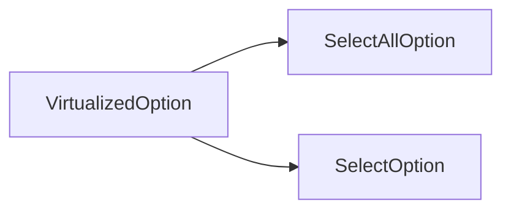
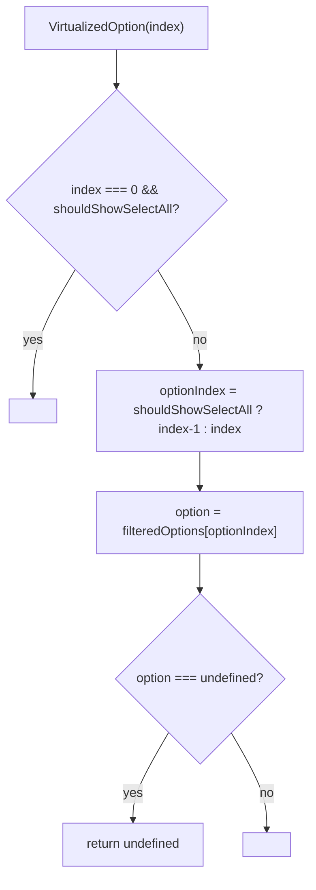

# VirtualizedOption Architecture

Dispatcher that maps a virtual-scroll index to either `SelectAllOption` (index 0, when enabled) or a `SelectOption` row.

## File Structure

```
VirtualizedOption/
├── index.ts                          → Barrel export
├── VirtualizedOption.component.tsx   → Index-based dispatch to SelectAllOption / SelectOption
└── VirtualizedOption.types.ts        → Full prop surface passed from VirtualList
```

## Dependencies



## Render Flow



## Props

| Prop              | Type                       | Description                                              |
| ----------------- | -------------------------- | -------------------------------------------------------- |
| `filteredOptions` | `string[]`                 | Visible options after search + filter                    |
| `hasCheckboxes`   | `boolean`                  | Forwarded to `SelectOption`                              |
| `hasSelectAll`    | `boolean`                  | Whether "Select All" row is enabled                      |
| `index`           | `number`                   | Virtual row index (0-based, includes SelectAll)          |
| `isAllSelected`   | `boolean`                  | Forwarded to `SelectAllOption`                           |
| `isLoading`       | `boolean`                  | Forwarded to both sub-components                         |
| `onSelectAll`     | `() => void`               | Forwarded to `SelectAllOption`                           |
| `onToggle`        | `(option: string) => void` | Wrapped into `() => onToggle(option)` for `SelectOption` |
| `selectedValues`  | `string[]`                 | Used to derive `isSelected` for `SelectOption`           |

## Index Accounting

`VirtualizedOption` is the only place that applies the +1 offset: when `shouldShowSelectAll` is `true`, index `0` → `SelectAllOption` and indices `1…n` map to `filteredOptions[index - 1]`.
