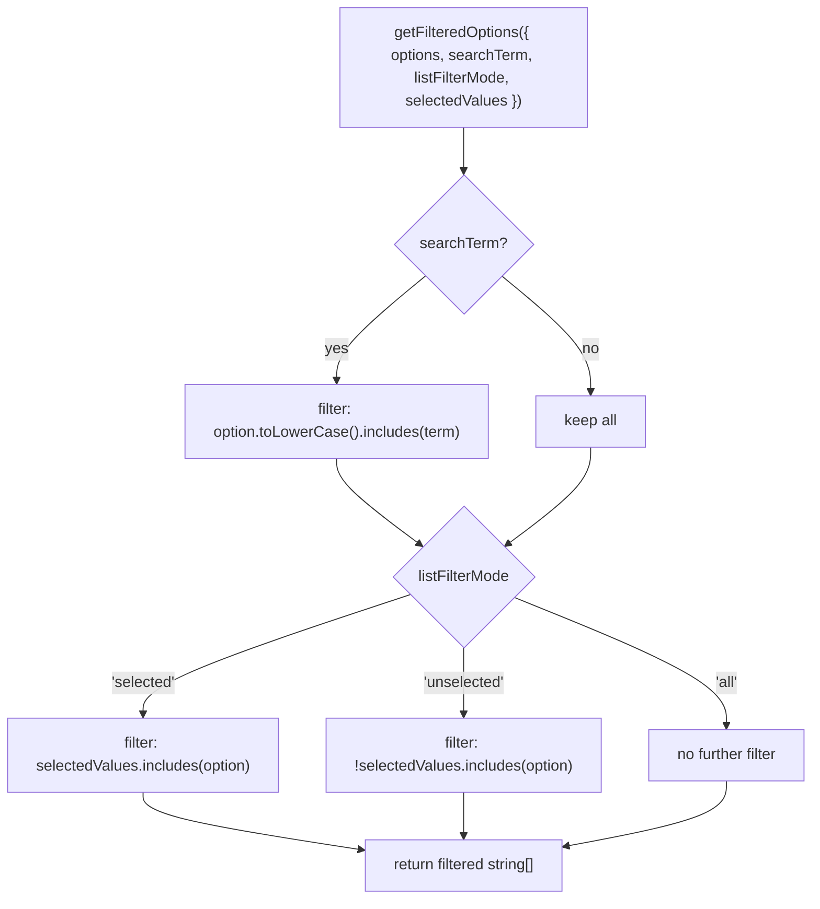

# utils/ Architecture

Pure filtering utility for the VirtualList component.

## File Structure

```
utils/
├── index.ts                      → Barrel export
└── getFilteredOptions.util.ts    → Apply search term + filter mode to options array
```

## Dependencies


## Logic Flow



## Function Reference

| Function             | Input                    | Output     | Purpose                                    |
| -------------------- | ------------------------ | ---------- | ------------------------------------------ |
| `getFilteredOptions` | `GetFilteredOptionsArgs` | `string[]` | Apply search + view-mode filter to options |

### `GetFilteredOptionsArgs`

| Field            | Type             | Description                                           |
| ---------------- | ---------------- | ----------------------------------------------------- |
| `listFilterMode` | `ListFilterMode` | `'all' \| 'selected' \| 'unselected'`                 |
| `options`        | `string[]`       | Raw options from `dataState.data`                     |
| `searchTerm`     | `string`         | Current value of the search input                     |
| `selectedValues` | `string[]`       | Currently selected option values from `filter.values` |

## Notes

- Search is **case-insensitive** substring match.
- Filter modes are applied **after** the search step (search narrows the pool first).
