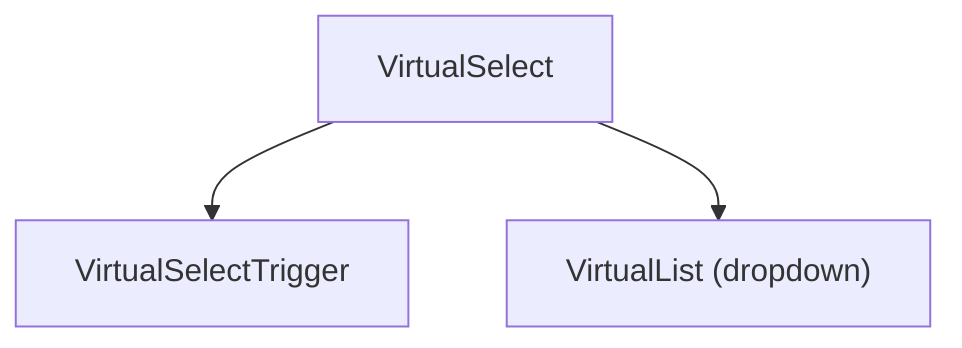
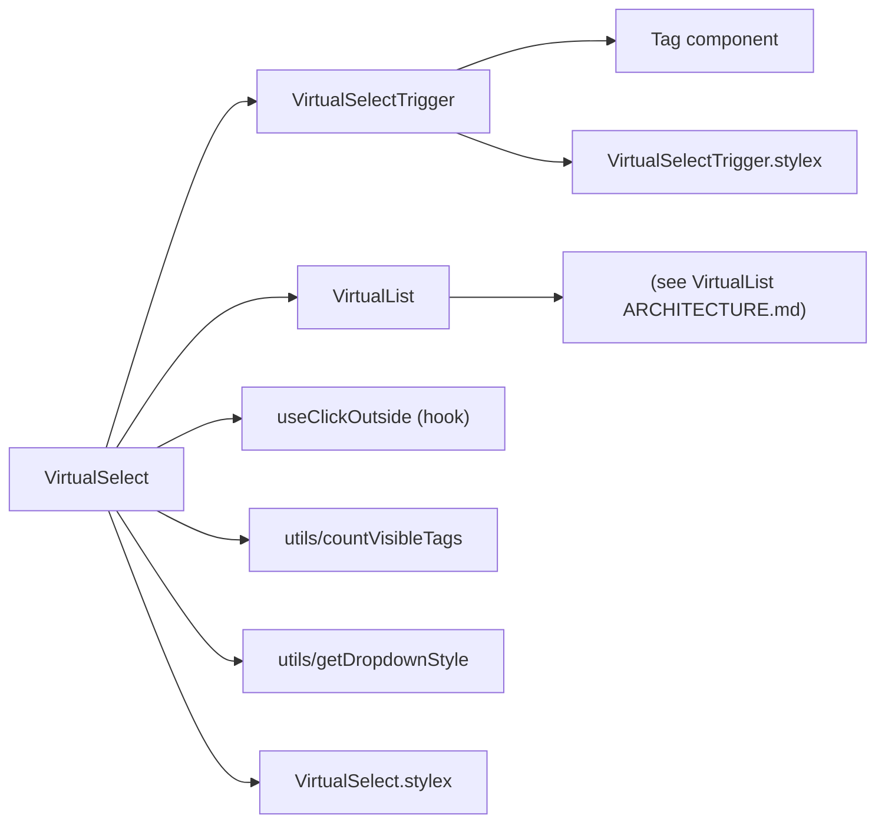
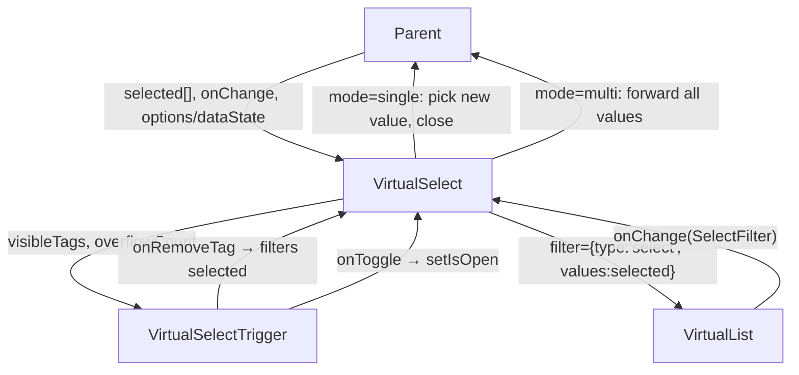
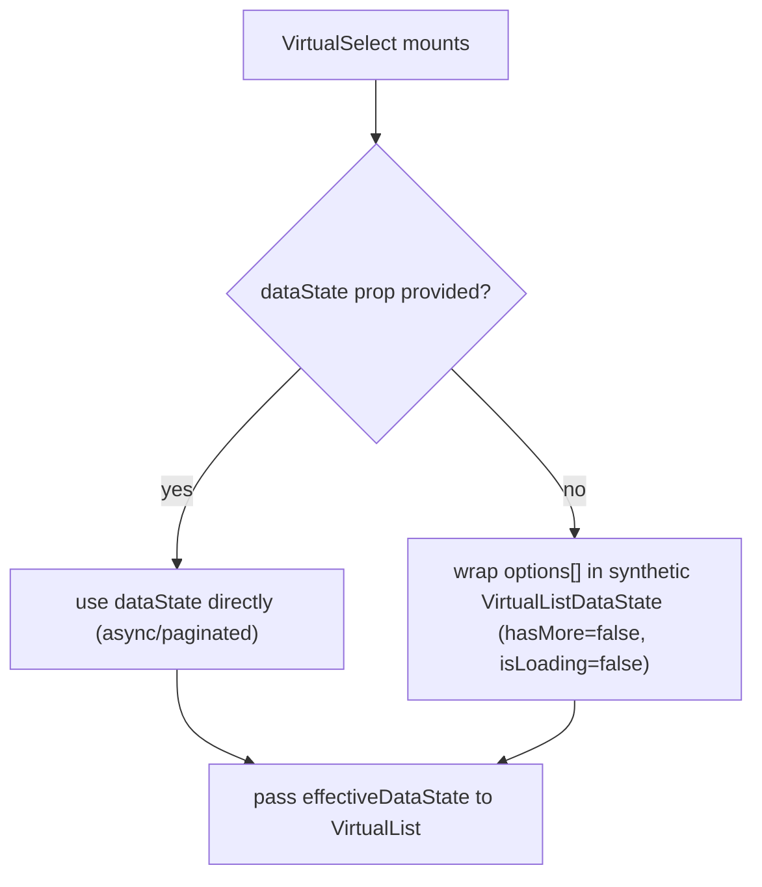
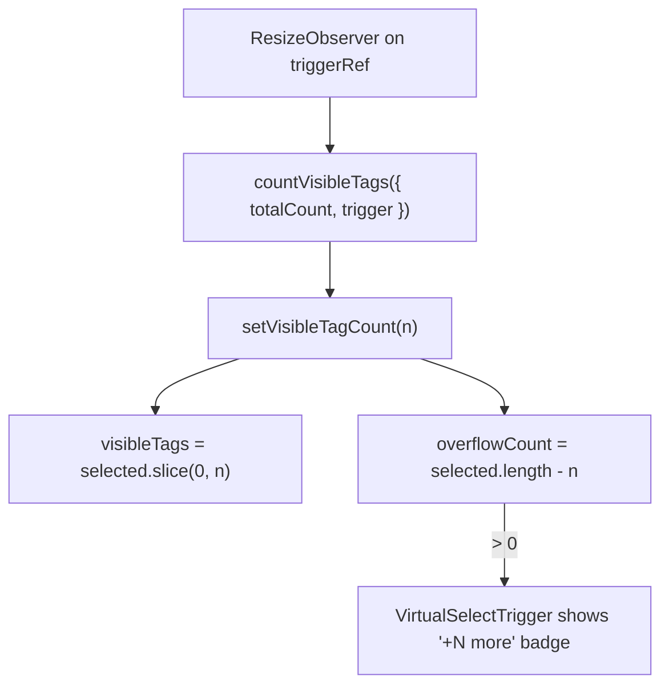

# VirtualSelect Architecture

Dropdown select component (single or multi) backed by a virtualized list, with tag-chip display, overflow counting, and optional async infinite-scroll data loading.

## File Structure

```
VirtualSelect/
├── index.ts                          → Barrel export
├── VirtualSelect.component.tsx       → Orchestrator: open state, tag layout, data bridge
├── VirtualSelect.types.ts            → VirtualSelectProps, VirtualSelectMode
├── VirtualSelect.stylex.ts           → Container + dropdown position styles
│
├── VirtualSelectTrigger/             → Combobox trigger (placeholder / label / tag chips)
│   ├── ARCHITECTURE.md
│   ├── index.ts
│   ├── VirtualSelectTrigger.component.tsx
│   ├── VirtualSelectTrigger.stylex.ts   (exports TRIGGER_MAX_HEIGHT)
│   └── VirtualSelectTrigger.types.ts
│
└── utils/
    ├── ARCHITECTURE.md
    ├── index.ts
    ├── countVisibleTags.util.ts      → DOM-measure visible tag count
    └── getDropdownStyle.util.ts      → Pick dropdown position style
```

## Component Hierarchy



## Dependencies



## Data Flow



## Selection Modes

| Mode     | Trigger display      | VirtualList props                           | On change                              |
| -------- | -------------------- | ------------------------------------------- | -------------------------------------- |
| `single` | Single text label    | `hasCheckboxes=false`, `hasSelectAll=false` | Pick newly added value, close dropdown |
| `multi`  | Tag chips + overflow | `hasCheckboxes=true`, `hasSelectAll=true`   | Forward full values array, stay open   |

## Dropdown Positioning

Controlled by `getDropdownStyle(isAlwaysOpen, shouldFillHeight)`:

| `isAlwaysOpen` | `shouldFillHeight` | Style applied        | Behaviour                           |
| -------------- | ------------------ | -------------------- | ----------------------------------- |
| `false`        | any                | `dropdownAbsolute`   | Floats below trigger, z-elevated    |
| `true`         | `false`            | `dropdownStatic`     | Inline block (e.g. filter panel)    |
| `true`         | `true`             | `dropdownStaticFill` | Flex-fill (e.g. full-height drawer) |

The container and dropdown use explicit `border-box`, `min-width: 0`, and
`max-width: 100%` sizing so both floating and always-open variants remain
contained by drawer/card parents.

## Static vs. Async Data



## Tag Overflow (multi mode)



## Click-Outside Handling

`useClickOutside` listens on `containerRef` (wraps both trigger and dropdown). When a click lands outside the container, `handleClose()` sets `isOpen = false`.

## Props

| Prop               | Type                           | Default       | Description                                        |
| ------------------ | ------------------------------ | ------------- | -------------------------------------------------- |
| `customStylex`     | `StyleXStyles`                 | —             | Style overrides for the dropdown container         |
| `dataState`        | `VirtualListDataState`         | —             | Async data (mutually exclusive with `options`)     |
| `isAlwaysOpen`     | `boolean`                      | `false`       | List is always visible; trigger is non-interactive |
| `listMaxHeight`    | `string`                       | `'18.75rem'`  | CSS max-height for the VirtualList scroll area     |
| `mode`             | `'single' \| 'multi'`          | —             | Selection behaviour (required)                     |
| `onChange`         | `(selected: string[]) => void` | —             | Called on every selection change                   |
| `onFetchInitial`   | `() => Promise<void> \| void`  | —             | Forwarded to VirtualList for initial fetch         |
| `onFetchMore`      | `() => Promise<void> \| void`  | —             | Forwarded to VirtualList for infinite scroll       |
| `onOpenChange`     | `(isOpen: boolean) => void`    | —             | Notifies parent of open/close state                |
| `options`          | `string[]`                     | `[]`          | Static options (used when no `dataState`)          |
| `placeholder`      | `string`                       | `'Select...'` | Shown when nothing is selected                     |
| `selected`         | `string[]`                     | —             | Controlled selected values (required)              |
| `shouldFillHeight` | `boolean`                      | `false`       | Expand to fill available vertical space            |
