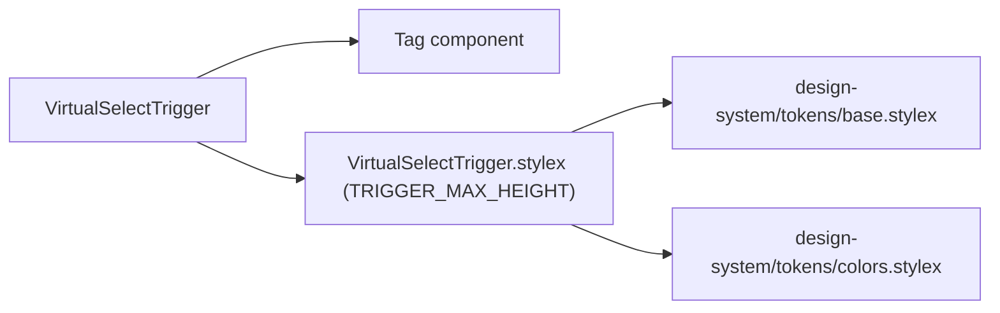

# VirtualSelectTrigger Architecture

Combobox trigger button: shows placeholder, single-value label, or multi-select tag chips with overflow counter and a chevron indicator.

## File Structure

```
VirtualSelectTrigger/
├── index.ts                              → Barrel export
├── VirtualSelectTrigger.component.tsx   → Trigger button (combobox role)
├── VirtualSelectTrigger.stylex.ts       → Styles + TRIGGER_MAX_HEIGHT constant
└── VirtualSelectTrigger.types.ts        → Props
```

## Dependencies



## Render Flow

```mermaid
graph TD
  A["VirtualSelectTrigger renders"] --> B{"hasSelection?"}
  B -->|no| C["span.triggerPlaceholder → placeholder text"]
  B -->|yes| D{"mode === 'single'?"}
  D -->|yes| E["span.triggerLabel → selected[0]"]
  D -->|no (multi)| F["visibleTags.map → Tag chips"]
  F --> G{"overflowCount > 0?"}
  G -->|yes| H["span.overflowTag → '+N more'"]
  G -->|no| I["(nothing extra)"]
  A --> J{"!isAlwaysOpen?"}
  J -->|yes| K["span.chevron (↑ open / ↓ closed)"]
  J -->|no| L["(no chevron)"]
```

## Props

| Prop            | Type                                | Description                                                |
| --------------- | ----------------------------------- | ---------------------------------------------------------- |
| `isAlwaysOpen`  | `boolean`                           | Hides chevron and disables click/focus interaction         |
| `isOpen`        | `boolean`                           | Controls chevron direction and `aria-expanded`             |
| `mode`          | `'single' \| 'multi'`               | Single shows label; multi shows Tag chips                  |
| `onRemoveTag`   | `(option: string) => void`          | Called when a Tag's remove button is clicked               |
| `onToggle`      | `() => void`                        | Opens/closes the dropdown                                  |
| `overflowCount` | `number`                            | Number of tags hidden behind "+N more"                     |
| `placeholder`   | `string`                            | Shown when `selected` is empty                             |
| `selected`      | `string[]`                          | Full selection (used to detect `hasSelection`)             |
| `triggerRef`    | `RefObject<HTMLDivElement \| null>` | Measured by ResizeObserver in `VirtualSelect`              |
| `visibleTags`   | `string[]`                          | Subset of `selected` that fits within `TRIGGER_MAX_HEIGHT` |

## Tag Overflow Behaviour

| Constant             | Value | Role                                           |
| -------------------- | ----- | ---------------------------------------------- |
| `TRIGGER_MAX_HEIGHT` | 88 px | Max pixel height before tags start overflowing |

When `mode === 'multi'` the parent `VirtualSelect` attaches a `ResizeObserver` to `triggerRef` and calls `countVisibleTags` to compute `visibleTags` and `overflowCount` on every resize.

## Accessibility

| Attribute       | Value / Logic                            |
| --------------- | ---------------------------------------- |
| `role`          | `combobox`                               |
| `aria-expanded` | `isOpen`                                 |
| `aria-haspopup` | `listbox`                                |
| `tabIndex`      | `0` (normal) / `undefined` (always-open) |
